# Init Projects Backend (Node.js) connecting with SQL Database, Frontend (React) and Mobile (React Native) using Docker and Docker Compose.

Read this in other languages: [English](README.en.md), [Portuguese](README.md).

This project was based on the `Ecoleta` Project by: rocket: [Rocketseact] (https://github.com/rocketseat-education/nlw-01-omnistack): wave :, project **Show**. Very happily it matches the project of my monograph, which deals with how to use technology, such as Apps, IoT, Big Data to **improve the recycling process in Brazil**, now the idea is improve the process around the world.

# Contribute

Share and contribute, #KnowledgeIsToShare

- Fork this repository;
- Create a branch with your feature: `git checkout -b minha-feature`;
- Commit your changes: `git commit -m 'feat: Minha nova feature'`;
- Push to your branch: `git push origin minha-feature`.

After the merge of your pull request is done, you can delete your branch.

<p align="center">
  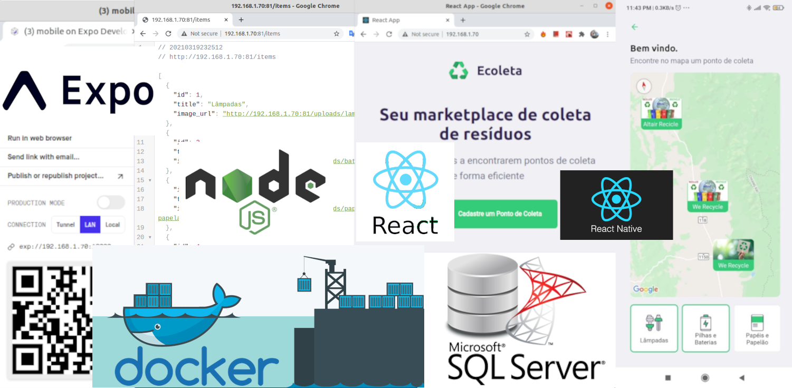
</p>

Project Developed from scratch, with some differences from the initial [Rocketseact](https://github.com/rocketseat-education/nlw-01-omnistack) project.

The objective of the project is to create an environment **Node.js backend connecting with SQL Server database, Web with React, and mobile with React Native**. In order to avoid having to create the complete environment on your machine, such as installing platforms, frameworks and others, we will only use [Docker](https://www.docker.com/) and [Docker-compose](https : //docs.docker.com/compose), assuming you already have it installed on your machine. If not, #EasyPeasy: D, follow the instructions at https://docs.docker.com/get-docker/.

This project is for both Linux, Mac and Windows, although for Windows, if you have any problems with the installation, such as BIOS configuration, you can consult the link:

* https://docs.docker.com/docker-for-windows/troubleshoot/#virtualization

Docker allows us to create compact images of various types of systems with specific functions, see a little more in this other Github article / project [Docker-Sql-Server](https://github.com/lexvieira/Docker-Sql-Server ) that explains more about docker and shows in practice how to upload and restore a SQL Server database using docker. Available in English and Portuguese.

Feel free to test and contribute.

Our project will be created using the following technologies:

* [Docker](https://www.docker.com/) - Create containers and run projects without having to create the entire environment on your machine.
* [Docker-compose](https://docs.docker.com/compose) - Run the entire environment with just one command `docker-compose up`. 
* [Node.js](https://nodejs.org/en/) - Backend of our application, responsible for the business part. See: https://www.pluralsight.com/blog/software-development/front-end-vs-back-end
* [React](https://reactjs.org) - Frontend, responsável pela interação com o usuário. 
* [React Native](https://facebook.github.io/react-native/) - Mobile app developed for multiplatform, Android and IOS.
* [Expo](https://expo.io/), Responsible for compiling(convert) the mobile project with  Javascript/Typescript code and Deploy it to Android and IOS phones.
* [SQL Server](https://hub.docker.com/_/microsoft-mssql-server/) Microsoft's large relational database.
* [KNEX Query Builder for Node.js](http://knexjs.org/) - Technique that is used to build queries. It supports various databases like MSSQL, Postgres, MySQL, SQLite, Oracle, and some others as well.
* [NPM (Package Manager)](https://www.npmjs.com/) - Package manager integrated with Node that allows us to install the necessary packages (libraries) in our 3 applications.

## `Now, hands on.`  

## [Summary](#summary)

1. [Create Dockerfile to run the Backend, Frontend and Mobile projects.](#createdockerfile) `Create Docker File`
2. [Backend Project using Docker](#initiatebackendproject).

    2.1 [Init backend project with NPM](#createbackendwithdocker) 

    2.2. [Create docker-compose.yml and add backend configuration](#createdockercomposebackend). 

    2.3. [Configure Docker with SQL Server](#createdockerwithsqlserver).

    2.4. [Add SQL Server to Docker Compose](#createdockercomposesql). 
  
3. [Start FrontEnd with React using Dockerfile](#initiatefrontendproject)
   
    3.1. [Adding Frontend configuration in the docker-compose.yml.](#createdockercomposefrontend). 

4. [Start Mobile Project with Expo](#initiatemobileproject), 
    
    4.1. [Adding Mobile configuration to docker-compose.yml and Run all projects together](#createdockercomposemobile).     

5. [Connect Project Backend (server) with SQL Server and return Data to Frontend (web)](#connectallprojects)
 
    5.1. [Configuring a database connection using Knex](#configureconectionusingknex).   
    
    5.2. [Return database data using an API ](#returndatausingapi)
    
    5.3. [Accessing API with the Front End](#acessingapiwithfrontend)
    
    5.4. [Accessing API with the Mobile App](#acessingapiwithmobile)

<br>

---
## 1 - <a id="createdockerfile">Create Dockerfile and Build the Image for initiate the Backend, FrontEnd and Mobile</a> 
[Comeback](#summary)

Create a file in the root folder of your project with the name `Dockerfile` and enter the code below.

* Note: The Dockerfile will be used at first to create the image `nlw1ecoleta:v01` that will be used to run the 3 projects, because it is easier to execute the commands and both projects use **Node.js** and **NPM** in the same version `12.20.2`, however at the end of the project we will use `Dockerfile` only as a basis for **the mobile project** that needs to use [expo-cli](https://docs.expo.io/workflow/expo-cli/), installed below. Do not worry that you will get it all while we are creating the project. Enjoy :D

```
FROM node:12.20.2

WORKDIR /opt/ui

RUN apt-get update 

RUN npm install -g expo-cli

ENV PATH="$(npm global bin):$PATH"

USER 1000

CMD ["node", "-v"]
```

Run the command below to build the project's docker image. Image name must be lowercase [DockerFile](https://docs.docker.com/engine/reference/builder/ .

```
➜  NLW1_Ecoleta_Docker_SQLServer git:(master) ✗ docker build -t nlw1ecoleta:v01 .
```

Output

```
Sending build context to Docker daemon  10.75kB
Step 1/7 : FROM node:12.20.2
 ---> af3e1e2da75b
Step 2/7 : WORKDIR /opt/ui
 ---> Using cache
 ---> d139b0c48358
Step 3/7 : RUN apt-get update
 ---> Using cache
 ---> fe2d5cd6fc01
Step 4/7 : RUN npm install -g expo-cli
 ---> Using cache
 ---> a95f322dcf24
Step 5/7 : ENV PATH="$(npm global bin):$PATH"
 ---> Using cache
 ---> 6547d56efeda
Step 6/7 : USER 1000
 ---> Using cache
 ---> be5fba657587
Step 7/7 : CMD ["node", "-v"]
 ---> Using cache
 ---> 9a595b4dbf07
Successfully built 9a595b4dbf07
Successfully tagged nlw1ecoleta:v01
```

Create 3 folders for the aplications backend (server), web (web), mobile (mobile). It is important to create the folders before run the docker commands for that the folders don't stay with root permissions, not allowing to create new files inside them.

```
➜  NLW1_Ecoleta_Docker_SQLServer mkdir server & mkdir web & mkdir mobile 
[1]  - 173992 done       mkdir server
[2]  + 173993 done       mkdir web    
[3]  + 173994 done       mkdir mobile                                                                                         
➜  NLW1_Ecoleta_Docker_SQLServer ls
Dockerfile  mobile/  README.md  server/  web/
```

To create/start each of the **backend, web and mobile** projects, we will run some commands for each type of project, being:

* **backend** - Start backend project
```
  npm init -y 
```
* **frontend** - Iniciar projeto frontend com React
```
   npx create-react-app web --template typescript --use-npm
```
* **mobile** - Iniciar projeto mobile com React Native and Expo
```
   expo init mobile --npm 
```

Basically with these 3 commands you can start any project Backend, Frontend and Mobile with Node.js, React and React Native.

Don't worry, we'll go through each of the environments in detail by running the commands inside a **docker container** :D

---
# 2 - <a id="initiatebackendproject"> Backend Project using Docker</a> 
[Come Back](#summary).

In this case let's use the **docker run** to create a temporary container to run our commands.

```
  docker run -ti -v "$(pwd)":/opt/ui nlw1ecoleta:v01 /bin/bash
  node@70184f946a9a:/opt/ui$
```
* **docker run** - Creates a temporary container, executes the command in it and stops the container when it is done.
* **-ti** - Interative mode, allowing to run text commands in the terminal.
* **-v "$(pwd)":/opt/ui** - Create a volume divided in 2 parts. Before :(colon), your local folder. After :(colon), folder inside the container. $(pwd), returns your local directory (work directory).
* **nlw1ecoleta:v01** - Image name (always lowercase) and tag, after :(colon). [Tags](https://docs.docker.com/engine/reference/commandline/tag/) can indicate versions, like :v01 or *:latest, :v01.test*. 
* **/bin/bash** -  **shell** - Most common **shell** used as default shell for user login of the linux system. The shell's name is an acronym for **Bourne-again shell**.

### 2.1 - <a id="createbackendwithdocker">Starting backend project with NPM init</a> 
[Comeback](#summary)

When I got back to programming, one of the first questions I came up with was, what the hell is a package manager. And now it is much easier compared to before where if we needed to add a jquery library to the project, we had to do everything manually. Including adding the reference of the libraries to the `HTML` or` Asp.Net` files that were working at the time. Today everything is simpler with the `package manager`. And what is it exactly? [Package manager] (https://nodejs.org/en/knowledge/getting-started/npm/what-is-npm/) basically assists you with the process of installing, updating and removing packages (libraries) / libraries) javascript of the projects.

We have several package managers, but we will focus on **NPM** and **Yarn**, in this first moment, however we will use NPM in our apps.

* **npm vs yarn** (https://stackoverflow.com/questions/62806728/how-to-tell-if-a-project-uses-yarn)

How does one know if a project uses Yarn or NPM? Both contain a package.json file, although Yarn dependencies contain a file in the folder called yarn.lock. 

Both use `package.json` with the same JSON format, but NPM 5 generates a `package-lock.json` file, whereas Yarn generates a `yarn.lock` file.

### Going back to the project with Docker

If you have not yet accessed your docker container, access it with the following command in your **project's root folder**:

```
  docker run -ti -v "$(pwd)":/opt/ui nlw1ecoleta:v01 /bin/bash
  node@70184f946a9a:/opt/ui$
```

* `npm init -y` - Create project with default options

```
node@70184f946a9a:/opt/ui$ ls
Dockerfile  README.md  mobile  server  web

node@70184f946a9a:/opt/ui$ cd server
node@70184f946a9a:/opt/ui/server$ ls

node@70184f946a9a:/opt/ui/server$ npm init -y
Wrote to /opt/ui/server/package.json:

{
  "name": "server",
  "version": "1.0.0",
  "description": "",
  "main": "index.js",
  "scripts": {
    "test": "echo \"Error: no test specified\" && exit 1"
  },
  "keywords": [],
  "author": "",
  "license": "ISC"
}

```

To be able to run our **backend** with, we will need to install a few more packages. Don't worry, for each installed package we will have a little explanation.

Now that you have started your project you can exit the terminal by typing **exit**.

```Shell
node@70184f946a9a:/opt/ui$ exit
➜  NLW1_Ecoleta_Docker_SQLServer git:(master) ✗
```

Access the **server folder** within your project. Access the **server folder** within your project. There are other ways to execute the commands directly from the root folder, but in this one we will run the commands inside the folder of each project, **Backend (server), Web and Mobile**. Access the **server folder** within your project. Access the **server folder** within your project. There are other ways to execute the commands directly from the root folder, but in this one we will run the commands inside the folder of each project, **Backend (server), Web and Mobile**.

```
  ➜  NLW1_Ecoleta_Docker_SQLServer git:(master) ✗ cd server
  ➜  server git:(master) ✗ ls
```

Now we can access our server with only one command, beyond this, we can run other commands and add new packages of the same way, only adding the command necessary as the *last* **parameter** of the command.

No exemplo abaixo já estariamos rodando o nosso servidor, adicionando a porta de entrada e saída, o volume e o comando **npm run dev** para rodar o servidor. 

```
➜  docker run -ti -p 81:3333 -v "$(pwd)/server":/opt/ui nlw1ecoleta:v01 npm run dev 
```

In this case, the container is started, execute the commands and after **stops the container**. See more at: [Docker Exec Command With Examples](https://devconnected.com/docker-exec-command-with-examples/#:~:text=The%20difference%20between%20%E2%80%9Cdocker%20run,container%20when%20it%20is%20done)

Vamos simplificar os comandos usando docker, uma vez que os comandos começarão ficarão um pouco grandes, quando começarmos a adicionar, volume, portas, envio de variaveis etc.

For example, if we are going to add the package to work with the Sql Server Database, you need to use `npm install mssql`.

```
docker run -ti -v $(pwd)/server:/opt/ui nlw1ecoleta:v01 npm install mssql
```

OK, the command is executed, but it is a little big, sometimes we can forget some parameter and so on, but it is very easy to solve this with the **Alias (short name for a command)**

Embora você possa sempre repetir esses comandos sempre que precisar :stuck_out_tongue_winking_eye:.

### Using Alias, see more in [Github Semana Omnistack 10 #Alias Bonus](https://github.com/lexvieira/semana-omnistack-10/tree/run_on_docker#alias-bonus target="_blank").

Execute the command in your terminal or add into your file **.bashrc | .zshrc** depending on your type of terminal.

```
alias dockerNlw1server='docker run -ti -v "$(pwd)":/opt/ui nlw1ecoleta:v01'
```

* Notes: 
  * The alias command is **temporary**, it means that you will have to run the command again when you log in to your machine again, or the best option is to add the command to one of the files **.bashrc** or **.zshrc**.
  
  * The command added to the alias must be enclosed in **'** quotation marks or **"** double quotation marks.

  * We did not include the **ports** (parameter **-p**) to access our container in **Alias** because we will use **docker-compose** to do this.

In this case you have reduced the name of your command to just the alias **dockerNlw1server** and now when you need to execute a command just type the name of the **alias** and the command in front. We can also use another name as **dockerNlw1**, since we will use it in Web and Mobile projects, but in this case our alias will be **dockerNlw1server**.
Example:

```
cd server
➜  server git:(master) ✗ dockerNlw1server ls                                                           
Output: node_modules  package-lock.json  package.json  src  tsconfig.json
➜  server git:(master) ✗ 
```

Now  you can **install the packages** just by typing: `➜ dockerNlw1server npm install [package name]`.

We will continue our project and already running the commands with Alias **dockerNlw1server**.

Let's Go!
In your project's root folder, access the **server** folder.

```
cd server
➜  server git:(master) ✗ 
```

We will talk a little more about packages in the other projects, but now we are going to execute the commands and to give a brief explanation about the commands and run them in practice. If you have doubts about the commands, you can check the link https://www.npmjs.com/package/express, the name of the package will always be at the end.

Commands at the terminal using the docker:

* `npm install express` - Microframework to handle with routes in Node.js.

```
dockerNlw1server npm install express
``` 

In your **/src/server.ts** file you will have to import **express**.

```Typescript
    import express from 'express';
```

* `npm install @types` - Definition Types Typescript - it means that we will install the * type definitions * of the library, bringing information from the library / package that you are installing in your project, such as types of variables, functions, parameters, returns and others. Some libraries already come with the definition of types installed and others do not. for those that do not come, just install them using the command below and after "/" just enter the name of the library, e.g. `npm install @ types / express -D`. See more at https://www.typescriptlang.org/docs/handbook/2/type-declarations.html

* -D option = () (-D) **DEVELOPER DEPENDENCY** - means that will be only used when you are developing the app.

`npm install @types/express -D` - Definition types express.

```
dockerNlw1server npm install @types/express -D
``` 

`npm install typescript -D` - Typescript to work with NodeJs, once node just understand Javascript.

```
dockerNlw1server npm install typescript -D
``` 

`npx tsc --init` - Creates Typescript configuration file ** tsconfig.ts **, needed to work with Typescript.

```
dockerNlw1server npx tsc --init
``` 


`npm install ts-node -D` - Once Node just understand Javascript, you need to install the ts-node as Developer Dependency to run your scripts.ts.

```
dockerNlw1server npm install ts-node -D
``` 

* First Route using the Express: File `/src/server.ts`
  
```TypeScript
  import express, {Response} from 'express';

  const app = express();
  const dir = [1, 2, 3, 4, 5]
  app.get('/users', (request, response: Response) => {
      response.send(`Server is Running ${dir[2]}`);
  })

  app.listen(3333);  

  console.log('Server is Running');
```

`npx ts-node src/server.ts` - This command will run our app. **npx** has the function of execute a installed package, in this case ts-node. 

* Our output, server is running.

``` 
  dockerNlw1server npx ts-node src/server.ts
  Server is Running  
``` 

 `npm install ts-node-dev -D` - Keep observing the code and when there is a change, restart the service.
 
``` 
  dockerNlw1server npm install ts-node-dev -D
``` 

* `package.json` - Add the line to the file package.json at the root folder of your project.

```json
"scripts": { "dev": "ts-node-dev src/server.ts" } () => {
    //Add the line "dev" to the script flag inside of package.json
}
```

`npm run dev` -  Once you have added the line in the **package.json** file, to run the **script** and start the service, you only need to type the command **npm run dev**, `dev` refers to the **script** that you added to your **package.json**.

```
  dockerNlw1server npm run dev
  [INFO] 10:17:56 Restarting: /opt/ui/src/server.ts has been modified
  Server is Running   
```

* Exposing ports on Docker

At this point, if you try to access the site, the answer will be negative because when we run the command, we do not say which ports we were exposing to the user by adding the option **- p 81:3333**, Note that the port we are using externally it is port *81* and internally it is *3333*, so we can see this form *-p outsidecontainer: insidecontainer*, outside the container and inside the container.
See more at: https://docs.docker.com/config/containers/container-networking/.


To resolve this we will exit our docker container with the command **exit** and add a new configuration for running the command **docker run**.

As I said before, we will use **docker-compose** to run our back-end server. Likewise the other Web and Mobile projects.

However, if you don't want to use the docker-compose you can also run your server by running the command below inside the **server** folder. 

```
➜  NLW1_Ecoleta_Docker_SQLServer git:(master) ✗ cd server
➜  server git:(master) ✗ docker run -ti -p 81:3333 -v "$(pwd)":/opt/ui nlw1ecoleta:v01 npm run dev
Server is Running
```

The last parameter **dev** concerns the line you added in **package.json**, minutes ago: `scripts": {"dev": ....}`

* Note that you continue to inform in the **volume** of the docker container only $(pwd):/opt/ui, but for that you now need to access the **server** folder within your project folder.

At any time if you want to access the docker container to execute one or more commands you just need to execute **docker run** and add as final parameter **/bin/bash**. In this case we also add the parameter **-p 81:3333** to be able to run the web server and view the page on your machine.

```
➜  server git:(master) ✗ docker run -ti -p 81:3333 -v "$(pwd)":/opt/ui nlw1ecoleta:v01 /bin/bash 
  node@62dd1fb8db48:/opt/ui$ ls
  Output node_modules/  package.json  package-lock.json  src/  tsconfig.json

> server@1.0.0 dev /opt/ui
> ts-node-dev src/server.ts

node@62dd1fb8db48:/opt/ui$ npm run dev
[INFO] 20:25:49 ts-node-dev ver. 1.1.6 (using ts-node ver. 9.1.1, typescript ver. 4.2.3)
Server is Running
```


In this case we ran the full command because we had to add the parameter with the **input and output port** `-p 81: 3333` to our **docker run** command. Our Alias does not have the available port parameter because we are going to configure the docker-compose and use the port settings there. If we add it to Alias and we are using it in either case, we will receive a message that the port is already being used by another service or container.

* Example Terminal 1:


* Example Terminal 2:


To work with the issue of ports in an easier way, we will use the docker-compose to configure our services and leave them active while we are using them, including the **SQL Server service** that we use with our **Backend** to return the data for users.

## OK, GENIAL! OK, GREAT!

Cool, web server with Docker, working 100%.

## 2.2. <a id="createdockercomposebackend">Create docker-compose.yml and add backend configuration..</a> 
[Comeback](#summary)

Create the file **docker-compose.yml** in your project's root folder. Open the file and include the following lines:

```Dockerfile
version: "3.5"
services: 
  nlw1_backend:
    container_name: nlw1_backend
    image: node:12.20.2
    ports: 
      - 81:3333
    volumes: 
      - ${PWD}/server:/opt/ui
    command: npm run dev
    working_dir: /opt/ui
    user: "1000"
```

As we mentioned earlier, the port settings are added to the docker-compose.yml which will be active while creating the code for our project.

Save the file and in the root folder of your project type:

```
➜  NLW1_Ecoleta_Docker_SQLServer git:(master) ✗ docker-compose up --build 
```


Now your web server is running nonstop on one **terminal** and you can continue with the code on another terminal with ease.

In your terminal click on the <kbd></kbd> sign to open a new terminal or on the option <kbd></kbd> to split the terminal and be able to enter new commands.


### 2.3 - <a id="createdockerwithsqlserver">Configure Docker with SQL Server</a>
[Come back](#summary)

The content with Docker SQL Server is already available on Github at <a href="https://github.com/lexvieira/Docker-Sql-Server" target="_blank"> https://github.com/lexvieira / Docker-Sql-Server </a>, including the option of **database restoring** with docker.

Here we will run the basic commands to configure the sql server database and access it with our backend application.

In another terminal, inside the project's root folder type or <kbd>Ctrl</kbd> + <kbd>C</kbd>, <kbd>Ctrl</kbd> + <kbd>V</kbd>:

```
sudo docker run -e "ACCEPT_EULA=Y" -e "SA_PASSWORD=YOUR_PASSWORD" -p 1433:1433 --name sqlserverV2017 -v $(pwd)/data:/var/opt/mssql -d mcr.microsoft.com/mssql/server:2017-latest
```

Now let's go with the parameters that you need to worry about. **Choose a strong password** and add the **path to the folder** where you want to store the database files. For example, if you want to add an absolute path, that is, starting from the root folder of the system `/home/myuser/data`. If you want to use the relative path, that is, from the folder you are in `./data`, you can use the options:

* **Absolute path:** `-v /home/myuser/data:/var/opt/mssql`.remembering that on the left side of ":" is the directory on your machine or file server and the address on the right side is the address inside the container. **Do not change on the right side as this is the default SQL Server folder**.

* **Relative path:** `-v $(pwd)/data:/var/opt/mssql` - **$(pwd)/data:**. In this case, we informed that we want to store our **datatase files** inside of the folder **data** inside of our project folder. The ` $(pwd)` get your **absolut path**(folder where you are at the moment) and concatenate(put together) with the **folder data**. There are a lot of different ways to inform the path, just need to find the best for your project.

* In the option **name** we add a name that is easy to relate to the image, in this case **sqlserverV2017**.

### START|STOP SQL SERVER

After running the first command, you can start or stop the service whenever you want with the command: *docker start|stop*. It is still possible to create an Alias to run these commands, as explained previously.

```
docker start sqlserverV2017
docker stop sqlserverV2017
```

### 2.4 - <a id="createdockercomposesql">Add SQL Server to Docker Compose</a>
[Come back](#summary) 

Now that we have learned how to configure the docker to upload a container with SQL Server, now we are going to upload both services simultaneously using **docker-compose.yml**.

Stop the docker-compose service that is running your backend with a <kbd>Ctrl</kbd> + <kbd>C</kbd>. 

In your file **docker-compose.yml** add the following lines:

```Dockerfile
  sqlserver:
    image: "mcr.microsoft.com/mssql/server:2017-latest"
    container_name: sqlserverV2017
    environment:
        SA_PASSWORD: "YOUR_PASSWORD"
        ACCEPT_EULA: "Y"
    ports:
      - "1433:1433"      
    volumes: 
      - ${PWD}/data:/var/opt/mssql    
```

In **volume**, the option **${PWD}**, indicates your **current directory**

* IMPORTANT!
  
In the same way that we did in the backend, web and mobile projects, it will be necessary to create the**pasta data**, **sqlserver**, or any other outside the container. Why? 

When you create the folder inside the container, the folder will come with **root permissions**, so when you need to create a file inside the folder you will not be able to.


You can also choose to save the data in another folder, **for example**, as in another project, as in the example below **that we are not goint to follow, OK? :D**:

```
    volumes: 
      - ../DockerSqlserver/data/sqlserver:/var/opt/mssql
```

In this case, we were going back to a directory and saving it in the folder **DockerSqlserver**, you can use this option if you have several projects and want to make the same SQL Server container available for all projects you have using **SQL Server, MySQL** or other databases. Dice. The location of the files is indifferent for the database and the container, as long as both have permission to write to the folders.

### SQL Password validation 

When creating the password for SQL Server or any other database, always use strong passwords so that you do not receive an error message of ** Password Validation **, stating that your password does not meet the necessary requirements.

```sql
2021-03-29 01:01:19.69 spid21s     ERROR: Unable to set system administrator password: Password validation failed. The password does not meet SQL Server password policy requirements because it is not complex enough. The password must be at least 8 characters long and contain characters from three of the following four sets: Uppercase letters, Lowercase letters, Base 10 digits, and Symbols..
2021-03-29 01:01:19.74 spid21s     An error occurred during server setup. See previous errors for more information.
2021-03-29 01:01:19.74 spid21s     SQL Trace was stopped due to server shutdown. Trace ID = '1'. This is an informational message only; no user action is required.
sqlserverV2017 exited with code 1
```

## Going back a little to the Backend.

In the backend service, add the option **depends_on sqlserver** to the file **docker-compose.yml**, which indicates that the backend service depends on the database service, in the same way as the service **frontend** will depend on the **backend** service.

```Dockerfile
    depends_on: 
      - "sqlserver"
```

The file will look like this:


Run `docker-compose up --build` again:

``` 
  ➜  NLW1_Ecoleta_Docker_SQLServer git:(master) ✗ docker-compose up --build
```


Show!!!, now you have Backend and Database configured and running smoothly.

In the next steps we will make some data inclusions and connect the **backend** to the database **sql server**, but for now, we will proceed by starting **Frontend** and **Mobile**.

---
## 3 - <a id="initiatefrontendproject">Start FrontEnd with React using Dockerfile</a>
[Come Back](#summary)

We are 2 steps away from run a complete Docker project with Node.js, SQL Server, React and React Native. So, Let's Go!.

Now to create the Web and mobile project it will be simpler, we will only have to change some parameters to run our Docker related to each of the projects, web and mobile.

Starting project with Docker container.

* EASYWAY! 

Our Alias **dockerNlw1server** that after typing so much I noticed that it could just be called **dockerNlw1** or the most significant name depending on your project :D. You can change to create the Alias you want and have different Alias for each of your applications, for example: `dockerNlw1Server`,` dockerNlw1Web`, `dockerNlw1Mobile`. This will depend on how you are going to handle your project.

So let's use our **alias** here to start our React project with just one command in the root folder. If you haven't created it, just don't forget to create the folder **web**, with `mkdir web` at the root of the project, again for reasons of user permissions.

Creating the `web` folder:

```
Docker-Init-Nodejs-React-React-Native-SQLServer git:(master) ✗ mkdir web
```

Initiating your `web` project:

```
  dockerNlw1server npx create-react-app web --template typescript --use-npm
```

 

* NOT SO HARD WAY :D 

If you are logged into any container, exit with the command **exit**

```
node@392c8d1638ba:/opt/ui$ exit
exit
```

In the root folder of the project I run the command below, this is the same command that we used to access any container for the project **backend**, **web** or **mobile**.

```
  docker run -ti -v "$(pwd)":/opt/ui nlw1ecoleta:v01 /bin/bash
  node@62dd1fb8db48:/opt/ui$ ls
  Dockerfile  README.md  mobile  server  web  
```

Note that you continue to view the same folders as when we started the project, **server, web and mobile**.

So now run the command inside the docker:

```
node@62dd1fb8db48:/opt/ui$ npx create-react-app web --template typescript --use-npm
```

* **npx create-react-app** - Command to create the project
* **web** - Installation folder
* **--template typescript** - Project template
* **--use-npm** - Using npm as a package manager


Our output is the same, either using the alias **dockerNlw1server** or the complete command, which I also **recommend** to type many types for improve your learning.


Exit the container with the command **exit**

```
Happy hacking!
node@392c8d1638ba:/opt/ui$ exit
exit
```

* IMPORTANT!
  
  As we are using only one **Alias** to run the commands within the projects, you just need to remember that we have to:
    * **always start the project in the project's root folder** 
  
  And after the project started with the initial configuration, we can: 
    * **execute the commands inside the project folders** ***backend, web and mobile***

### Executando Web Server React usando o Alias que acabamos de criar

Como Alias não aceita parametros no meio do comando, como por exemplo **adicionar uma porta**, então não vamos poder expor as portas do nosso projeto usando o nosso dockerNlw1server 

```
➜  cd web
dockerNlw1server npm start
```

We will receive feedback that the project is running, but in our browser we will have the famous:


We solved this by running the command directly on our terminal:

```
➜  NLW1_Ecoleta_Docker_SQLServer git:(master) ✗ cd web 
➜  docker run -ti -v $(pwd):/opt/ui -p 80:3000 nlw1ecoleta:v01 npm start
```

**ET VOILÀ**


React Web app running on port **80**. You will not see **http://localhost:80** because **port 80** is the default port for any website **HTTP**, so your browser translates as **http://localhost** or just **localhost**.

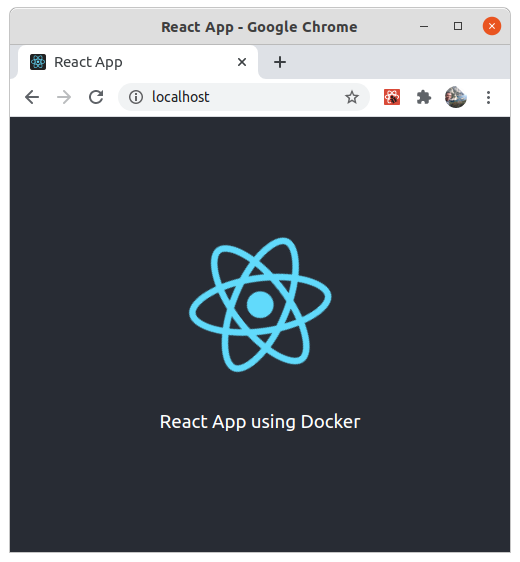

### 3.1. <a id="createdockercomposefrontend">Adding Frontend configuration in the docker-compose.yml.</a>
[Come Back](#summary)

Edit the **docker-compose.yml** file in your project's root folder. Add the following lines for your **Frontend**.

```Dockerfile
  nlw1_frontend:
    container_name: nlw1_frontend
    image: node:12.20.2 
    ports:
      - 80:3000
    volumes: 
      - ${PWD}/web:/opt/ui
    command: npm run start
    depends_on: 
      - "nlw1_backend"  
    working_dir: /opt/ui
    user: "1000"    
```

As we mentioned earlier, the port settings are added to the docker-compose.yml which will be active while creating the code for our project.

Save the file and in the root folder of your project type:

```
➜  NLW1_Ecoleta_Docker_SQLServer git:(master) ✗ docker-compose up --build 
```

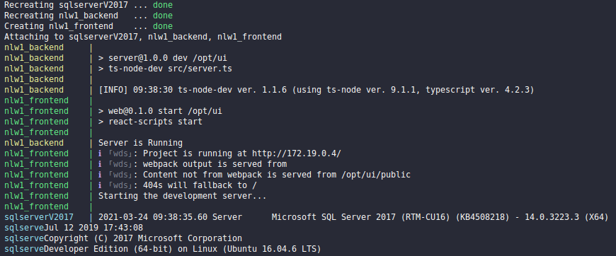

Now your web server is running nonstop on one terminal and you can continue with the code on another terminal easily.

Again, in your terminal click on the <kbd></kbd> sign to open a new terminal or on the option <kbd></kbd> to split the terminal and be able to enter new commands.


## 4. <a id="initiatemobileproject">Starting Mobile project with React Native and Typescript</a> 
[Come Back](#summary)

The last and not least project, which is our mobile app, will follow the same parameters as the previous ones with some exceptions.

Usually on your machine you need to install **expo-cli globally** with the command `npm install -g expo-cli`. in this case we won't have to do that because we have already added this step to the **Dockerfile** file.

```Dockerfile
  RUN apt-get update 

  RUN npm install -g expo-cli

  ENV PATH="$(npm global bin):$PATH"
```

Logo nesse caso a única coisa que necessitamos fazer é iniciar nosso container e criar nosso projeto **React Native** com Typescript.

Iniciando projeto com o Docker container.

And Again:

* EASYWAY! :D

So let's use our alias here to start our React project with just one command in the root folder. If you haven't created it, just don't forget to create the folder **mobile**, with `mkdir mobile` at the root of the project, again for reasons of user permissions.

Creating the `mobile` folder:

```
Docker-Init-Nodejs-React-React-Native-SQLServer git:(master) ✗ mkdir mobile
```

Initiating your `mobile` project:

```
  dockerNlw1server expo init mobile --npm
```


Select the blank option **Typescript** to work with it in the project.

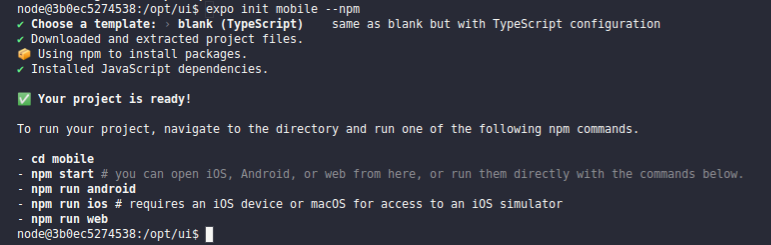

Your **React Native** project will be created in the **mobile** folder.

* NOT SO HARD WAY :D 

If you are logged into any container, exit with the command **exit**

```
node@392c8d1638ba:/opt/ui$ exit
exit
```

Again, in the project's root folder, run the command below, this is the same command we ran to create the backend and frontend project.

```
  docker run -ti -v "$(pwd)":/opt/ui nlw1ecoleta:v01 /bin/bash
  node@d468a50ba3f4:/opt/ui$ ls
  Dockerfile  README.md  mobile  server  web  
```

Note that you continue to view the same folders as when we started the project, **server, web and mobile**.

So now run the command inside the docker (we will use the option **-- npm** because we are working with the package manager **NPM** instead of **YARN**):

```
node@d468a50ba3f4:/opt/ui$ expo init mobile --npm
```

If the project takes too long to create, cancel using <kbd>Ctrl</kbd> + <kbd>C</kbd> and run the command again. If necessary, delete the contents of the folder. Maybe for reasons of slow internet or something.

Saia do container com o comando **exit**

```
node@392c8d1638ba:/opt/ui$ exit
exit
```

To run any command within the mobile project, we just need to access the folder and use the same Alias that we created for the Backend project. For example, we can add **@ react-navigation/native** with the command:

```
  ➜  mobile git:(master) ✗ dockerNlw1server npm install @react-navigation/native
```

## Running Mobile project using **docker run**

In order to run the **mobile** project on our mobile phone and load the **Expo** in our browser, we have a few more parameters, such as the **ports** and the **.env** file.

The default port for the mobile project, in the case to load the Expo in the browser, is the port **19002**.

### Creating our **.env file**

* We use the **.env file** to be able to pass environment variables to our Mobile container. Create an .env file in the **project's root folder** and add the information below.

Note that in your **.env** file you have the ip address that must be replaced with your machine's ip. On **Linux and Mac** you can use **ifconfig** to find the ip and on **Windows** you can use **ipconfig**. At the variable **REACT_NATIVE_PACKAGER_HOSTNAME** where the value is **192.168.1.70**, replace that value with your machine IP. 

**.env File**
```
REACT_NATIVE_PACKAGER_HOSTNAME=192.168.1.70
EXPO_DEBUG=true
EXPO_DEVTOOLS_LISTEN_ADDRESS=0.0.0.0
``` 

``` 
cd mobile 
docker run -ti -p 19000:19000 -p 19001:19001 -p 19002:19002 -p 19006:19006 --env-file "../.env" -v "$(pwd)":/opt/ui nlw1ecoleta:v01 npm start
```

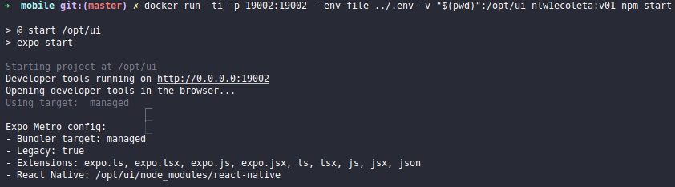

Now your React Native web is running and you can access it using the Expo App installed on your Smartphone, if you don't have it installed, you can download it from [PlayStore] (https://play.google.com/store /apps/details?id=host.exp.exponent&hl=en_US&gl=US) or the [Apple Store] (https://apps.apple.com/us/app/expo-go/id982107779)

In your browser at the address of your local ip, on port **19002** you will be able to access the Expo emulator.


## React Native App working on Android with Expo Emulator


### 4.1. <a id="createdockercomposemobile">Adding Mobile configuration in the docker-compose.yml</a>
[Come Back](#summary)

Notes when running React Native Expo Service.
   > Using Docker Expo Developer Tools to emulate the Android or IOS mobile app, in the case of React Native. This docker will not be used in production.
  - In order to run the application on the phone and use the *Expo Developer Tools* in our browser we have to add some extra settings that could be in our *DockerFile*, but we would have greater problems to change it having to do the rebuild every time we change of IP for example.
  - To deal with this, we can use the **.env** file and add the variables that we need to access inside the container.

Edit the **docker-compose.yml** file in your project's root folder. Add the following lines for your **Mobile**. You can add it before **SQL Server** service.

```Dockerfile
  nlw1_expo:
    container_name: nlw1_expo
    build: 
      context: .
      dockerfile: Dockerfile
    env_file: .env
    ports: 
      - 19000:19000
      - 19001:19001
      - 19002:19002
      - 19006:19006
    volumes:
      - ${PWD}/mobile:/opt/ui
    command: npm run start
    depends_on: 
      - "nlw1_backend"
```


In this case the **Mobile** service depends on the **backend** service, due to the APIs we are using.

* `Dockerfile` - Note that unlike the other services that use the image parameter, we are using the build parameter and using our **Dockerfile** as the basis for our service, this is because we have added some additional settings in our Dockerfile that do not exist in the  image **node:12.20.2** that we use for the **backend** and **frontend** service.

```
    build: 
      context: .
      dockerfile: Dockerfile
```

As previously mentioned, we are adding **expo-cli** *globally* that allows us to run our **React Native** project.

```Dockerfile
  RUN apt-get update 

  RUN npm install -g expo-cli

  ENV PATH="$(npm global bin):$PATH"
```

OK, now with the 4 docker containers running and working we have to simplify things so we don't have to be running several commands to go up the 4 instances, so we have **docker-compose.yml**. A single file with our entire structure running.

### Building e rodando o docker-compose

```
  docker-compose up --build
```
OU
```
  docker-compose up --build -d
```

>--build - Build images before starting containers.
> -d, --detach - Detached mode: Run containers in the background, the termianl is released and you can use it. But if you want to stop the services you need to type:

```
docker-compose down
```

Next time, only.

```
docker-compose up
```

Of course, if you change any settings you can run ** - build ** again.

Finally.

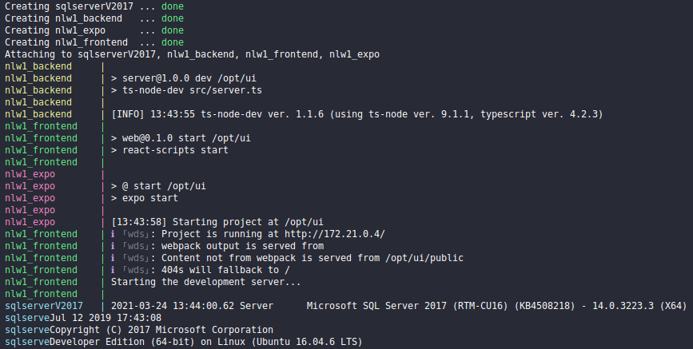

Of course, after creating the images using **docker-compose --build** you will need to run new commands, add new packages to your application, so you can run the commands inside the docker by accessing *bash* with *docker run*. However, now you can also access the images generated by **docker-compose**.

You can also see the images created and the containers running on **Vscode**:


If you want to check if your applications are running correctly you can also run the command:

```
➜  NLW1_Ecoleta_Docker_SQLServer git:(master) ✗  docker images 
REPOSITORY                                    TAG                 IMAGE ID            CREATED             SIZE
nlw1_ecoleta_docker_sqlserver_nlw1_expo       latest              9a595b4dbf07        6 days ago          1.15GB
nlw1_ecoleta_docker_sqlserver_nlw1_backend    latest              9a595b4dbf07        6 days ago          1.15GB
sqlhtml                                       v01                 9a595b4dbf07        6 days ago          1.15GB
nlw1_ecoleta_docker_sqlserver_nlw1_frontend   latest              5cf07abc153a        6 days ago          1.16GB
<none>                                        <none>              cdc439acf93c        2 weeks ago         1.22GB
node                                          12.20.2             af3e1e2da75b        5 weeks ago         918MB
node                                          12.14.1             839a5e8f04b4        13 months ago       913MB
mcr.microsoft.com/mssql/server                2017-latest         d9b9b96627b7        20 months ago       1.36GB
mysql                                         5.7.22              6bb891430fb6        2 years ago         372MB
```

You can see that the images were generated by **docker-compose** are composed by the name of the **folder of your project** and part of the data in the file **docker-compose.yml**.

If you want to check if your applications are running correctly you can also run the command:

```
sudo lsof -i -P -n | grep LISTEN
```

Or create an Alias for the same:

```
alias ListenPorts='sudo lsof -i -P -n | grep LISTEN'
ListenPorts
```

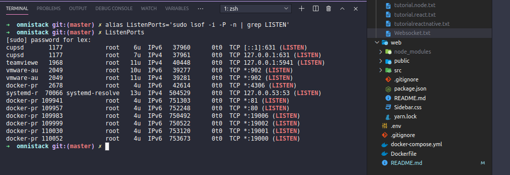

See the complete dockers documentation at:
https://docs.docker.com/engine/reference/commandline/start/
https://docs.docker.com/compose/gettingstarted/

## 5. Connect Project Backend (server) with SQL Server and return Data to Frontend (web)
[Come Back](#summary)

The next steps will be to return data to the frontend and mobile using an Api created on the backend. For that we will have to add and configure some components in our project, starting with [knex](http://knexjs.org/), query builder, used to return data from relational database in **Node.js**. After configuring **Axios** in the frontend, [CORS](https://developer.mozilla.org/en-US/docs/Web/HTTP/CORS) to allow frontend access to our API among others.

However this is just an introduction, there is much more to explore, but you can access other projects with more information at the links below:

Complete project with App available on Github https://github.com/lexvieira/NLW1_Ecoleta_Docker_SQLServer. Based on the Rocketseat project https://github.com/rocketseat-education/nlw-01-omnistack.
Also at https://github.com/lexvieira/TSQLtoHTMLTable, a project that allows returning SQL Server data in HTML format and rendering in React.

## Let's Go!

### 5.1. <a id="configureconectionusingknex">Configuring a database connection using Knex</a>. 
[Come Back](#summary)

To access the data in our database we will use a package for Node.js called **Knex**, which allows us to build queries and return data in a friendly way to our backend.

`npm install knex` - Using our docker inside the **backend (server)** folder, type the command:
```
➜  NLW1_Ecoleta_Docker_SQLServer git:(master) ✗ cd server
   dockerNlw1server npm install knex --save
```     

A note about Knex. In the project [NLW1 Ecoleta Docker SQL Server](https://github.com/lexvieira/NLW1_Ecoleta_Docker_SQLServer), based on the [NLW1 Ecoleta](https://github.com/rocketseat-education/nlw-01-omnistack) from Rocketseat, we are working with `"knex": "^0.21.17"` and in this project, we are working with `"knex": "^0.95.4"`. In `^0.95.0` and higher, we have to add the package (package) [tediousjs](https://tediousjs.github.io/tedious/installation.html) to handle SQL Server connections. If you have connection problems, check the versions of the packages.

`npm install mssql` - Também instale o SQL Server :
```
   dockerNlw1server npm install mssql --save
```     

`npm install --save tedious`
```
   dockerNlw1server npm install tedious --save
```

### Configuring the connection

First to facilitate our access to the server's IP, which can sometimes change depending on our network, let's create a module called **environment** that will have some useful information, such as **IP**, **server port** and **server address**. Create the `index.ts` file in the *src/environments/* folder and enter the following code:

```Typescript
export const apiAddr = () => {
    return `${environment.protocol}${environment.ipServer}:${environment.port}`; 
}

export const environment = {
    ipServer: '192.168.1.70',
    protocol:  'http://',
    port: '81'    
};
```

The above module will allow us to access the server information in an easier way, without having to keep changing in several files every time the **server IP** changes. To access the server data, just import our enrironment module and return the ip by calling the `environment.ipServer` variable or for example the `apiAddr` function that returns the complete server address.

```Typescript 
import { environment } from './src/environments/index';
      
const ip = `${environment.ipServer}`,
```

When using **Knex**, we have to create a configuration file called **knexfile.ts** that is located in the **backend project's root folder**, with the following code:

```Typescript
import { environment } from './src/environments/index';
import path from 'path';

module.exports = {
    client: 'mssql',
    connection: {
      host : `${environment.ipServer}`,
      user : 'SA',
      password : 'Q5zA4@5?25wCy8',
      database : 'DB_NLW1'        
    },
    migrations: {
      directory: path.resolve(__dirname, 'src', 'database', 'migrations')
    },
    seeds: {
      directory: path.resolve(__dirname, 'src', 'database', 'seeds')
    }, 
    useNullAsDefault: true,
};
```
Next, we will create our connection file that we will use to access our database. Note that we are also importing our **environments module** and returning the **server's ip**.

```Typescript
import { environment } from './../environments/index';
import knex from 'knex';

const connection = knex({
    client: 'mssql',
    connection: {
      host : `${environment.ipServer}`,
      user : 'SA',
      password : 'JHu@hGTWSK@9t63',
      database : 'MY_DB'
    }
});
  
export default connection;
```

After creating our connection file, we now have to create our **Migrations** and **Seeds** files:

* **Migrations:** Module that allows creating, altering, deleting tables, among other things in the database. Basically we create a **migration script** and then execute the command to run the migration on the server. If everything is correct, the tables are created on the server and we are able to access them smoothly. History of the ados bank.

* **Seeds** Script that allows you to insert data into the database tables. Widely used when we have initial default values for our application.

Our **migration** files are in the `src\database\migrations` folder and **seeds** are in the `src\database\seeds` folder. In this case we can create the files manually like any script but we can create the *initial file for migrations* with the command:

```
➜  backend git:(master) ✗ dockerNlw1server npx knex migrate:make initUsers --env development
Requiring external module ts-node/register
Created Migration: /opt/ui/src/database/migrations/20210330145952_initUsers.ts
```

If you prefer you can rename the beginning of the file by numbering it to be more organized with the command `mv`, if you do not want it is not mandatory.

```
➜  backend git:(master) ✗ cd src/database/migrations 
➜  migrations git:(master) ✗ mv 20210330145952_initUsers.ts 01_20210330145952_initUsers.ts
```

Our file created with the result of the above command. To know the types of data when creating the tables, see: [Schema](https://devhints.io/knex#schema) or [Knex cheatsheet](https://devhints.io/knex).

```Typescript
import { Knex } from "knex";

export async function up(knex: Knex): Promise<void> {
  await knex.schema.createTable("users", table => {
    table
      .increments("user_id")
      .unsigned()
      .primary();
    table
      .string("email")
      .unique()
      .notNullable();
    table.string("first_name").notNullable();
    table.string("last_name").notNullable();
    table.date("dob").notNullable();
    table.date("age").notNullable();
  });
}

export async function down(knex: Knex): Promise<void> {
  await knex.schema.dropTable("users");
}
```

To run our **migration**, that is, so that our tables are passed on to the database, we will use the command.

```
dockerNlw1server knex --knexfile knexfile.ts migrate:latest
```

ou também com o script que criamos no `package.json`

```json
    "knex:seed": "knex --knexfile knexfile.ts seed:run",
    "knex:migrate": "knex --knexfile knexfile.ts migrate:latest"
```

Nesse caso criamos dois scripts, um para o **migration** e outro para o **seeds**.

Para rodar o nosso migrate somente digite:

```
➜  backend git:(master) ✗ dockerNlw1server npm run knex:migrate

> backend@1.0.0 knex:migrate /opt/ui
> knex --knexfile knexfile.ts migrate:latest

Requiring external module ts-node/register
Batch 1 run: 4 migrations
```

* Remembering that we are executing our commands inside a **docker container** so our `dockerNlw1server` is a shortcut to `docker run -ti -v $ (pwd): / opt / ui nlw1ecoleta: v01 npm run dev`

### Erros with **Migrations**:

Be careful with the order and name that the migration files are named, as we may encounter migration or database errors. In the case below we had an error because I named/renamed the filenames and accidentally put the filenames from `01_create_points.ts`,` 02_create_items.ts`, `03_create_point_items.ts` to` 01_create_point_items.ts`, `02_create_items.ts`, `03_create_points.ts`. Note that the first file is `01_create_point_items.ts`, in which case when we ran our migrate we received the message that the migration failed with the error: **Could not create constraint or index**. This is because the **points** and **items** tables have not yet been created.

```sql
➜  backend git:(master) ✗ dockerNlw1server npm run knex:migrate                            

> backend@1.0.0 knex:migrate /opt/ui
> knex --knexfile knexfile.ts migrate:latest

Requiring external module ts-node/register
migration file "02_create_point_items.ts" failed
migration failed with error: 
  CREATE TABLE [point_items] 
    ([id] int identity(1,1) not null primary key,
    [point_id] int not null,
    [item_id] int not null,
    CONSTRAINT [point_items_point_id_foreign] FOREIGN KEY ([point_id]) REFERENCES [points] ([id]),
    CONSTRAINT [point_items_item_id_foreign] FOREIGN KEY ([item_id]) REFERENCES [items] ([id]))
  - Could not create constraint or index. See previous errors.
```

If we execute our code in the database we receive the error:

```sql
	Msg 1767, Level 16, State 0, Line 1
Foreign key 'point_items_point_id_foreign' references invalid table 'points'. 
	
	Msg 1750, Level 16, State 1, Line 1
Could not create constraint or index. See previous errors. 
``` 

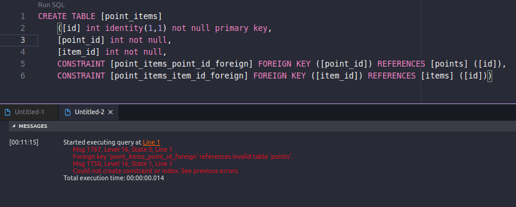

This goes a little further in the database part, which we will leave for other projects: D.

### Rollaback 

You can still do a **Rollback**, which means going back the previous steps, in case you forgot something.

```
 ➜  backend git:(master) ✗ dockerNlw1server npx knex migrate:rollback
Requiring external module ts-node/register
Batch 1 rolled back: 3 migrations
```

The **Rollback** command will execute within the **migration script** that you created the down method. The **rollback** in this case will execute the code to do a **DROP** on the table **users**, which means to delete the table.

```typescript
export async function down(knex: Knex): Promise<void> {
  await knex.schema.dropTable("users");
}
```

If you did a **rollback** of your **migrations** to test it, then just run the `knex: migrate` command again:

```sql
➜  backend git:(master) ✗ dockerNlw1server npm run knex:migrate 
``` 

### Inserting dummy data into the database for testing.

We will insert some user fakes data to test our database using [faker.js] (https://github.com/Marak/faker.js). See the article: [Seeding your Database with Thousands of Users using Knex.js and Faker.js](https://blog.bitsrc.io/seeding-your-database-with-thousands-of-users-using-knex-js-and-faker-js-6009a2e5ffbf).

Now let's add **faker.js** to our project, but with the option **- D**, which means *development dependency*. It is also possible to use the online version at [FakerCloud] (https://fakercloud.com/api). We also added **date-diff**, a library for calculating dates using javascript.  

```
dockerNlw1server npm install faker -D 
dockerNlw1server npm install date-diff
```

Basically we created a base of 100 users to return the data through our API. The code is available in the `src\database\seeds\create_users.ts` folder.

And our result is:

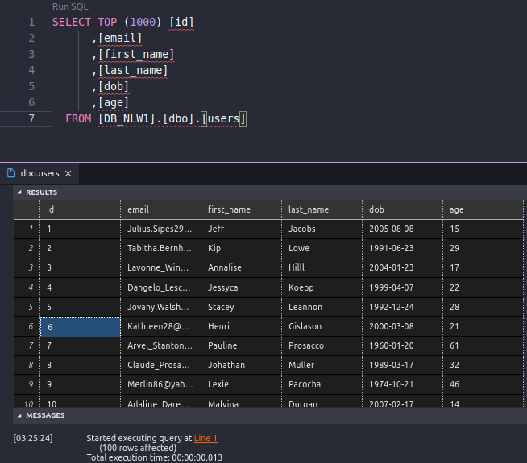

### 5.2. <a id="returndatausingapi">Returning data from the database using an API</a>.
[Come Back](#summary)

Now that our database is functional, we have already created our tables, and finally we have already included our data, fictitious data using the faker. Now we are going to return some of our users using our API.

First we will create our controller to return our data and then we will create a route to return the data to the frontend, in which case this will be the url used to access the user's data.

Our **Users Controller** is using the connection from **Knex** that we have already commented on and returning the user data with a limit of 30 users. in our case, we inserted 100 records into the database, but we don't need to return them all at the moment. `usersController.ts` created in the `src\controllers\usersController.ts` folder:

```typescript
import { Request, Response } from "express";
import knex from "../database/connection"; 

class UsersController {
    async index(request: Request, response: Response) {

        const users = await knex('users').select("*").limit(30);

        const serialItems = users.map(user => {
            return {
                email: user.email,
                first_name: user.first_name,
                last_name: user.last_name,
                dob: user.dob,
                age: user.age,
            };
        });

        return response.json(serialItems);
    }
}

export default UsersController;
```

After creating the controller we have to add a **route** to the controller so that we can return the data in the **frontend**. A route is like the complete address for each request you need to make in your application. Every time we create a route for our application, we have to think about the semantics of the item we are creating, for example, if we want to return **user data**, there is no logic in creating a route like http://localhost:81/items, the correct thing would be to create the route of our application as http://localhost:81/users.

In the code below, in the `/src/server.ts` file, we modified our first route, which previously only returned a message to the user, however now we are returning user data via the route` app.get ('/users',usersController.index) `.

Translating to the end user when we write this `app.get ('/users',usersController.index);` we see `http://localhost:81/users`.

```typescript
import express, {Response} from 'express';
import UsersController from "./controllers/usersController";

const app = express();

const usersController = new UsersController();

app.get('/users',usersController.index);

app.listen(3333);  

console.log('Server is Running');
```

When we load the application at the web address `http://localhost:81/users` we will get the feedback below.

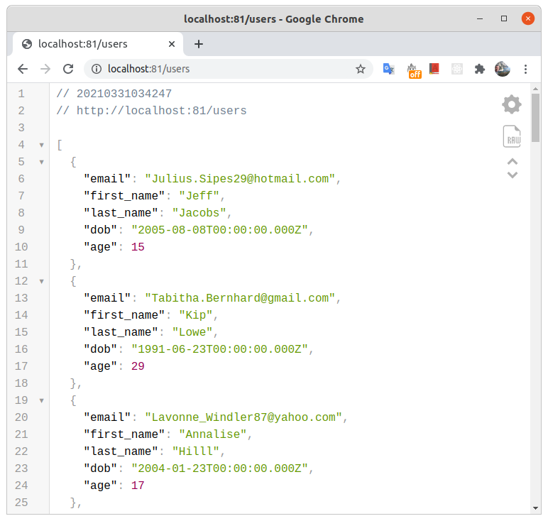

I will not address the question of Restfull APIs and how to test them because it will go out of scope, but if you want to test your APIs, you can use [Insomnia](https://insomnia.rest/) or [Postman](https : //www.postman.com/). With them you can test your APIs, making requests of the type **GET, POST, PUT, PATCH, DELETE**, in addition to being able to do tests with file uploads as well.

### 5.3. <a id="acessingapiwithfrontend">Accessing the API with the Frontend</a>.
[Come Back](#summary)

OK Guys, now comes the part of bringing the data we generate to the real world. soon we will make our frontend application see the data generated by the backend.

For this we will create a service that will connect with our backend and return the data in Json so that we can use it.

First let's add **axios**, package to make HTTP requests to return e/or send data to the **backend**. See the article of [Side Point](https://www.sitepoint.com/axios-beginner-guide/#:~:text=Axios%20is%20a%20popular%2C%20promise,application%20will%20need%20to%20do.).

`npm install axios`
```typescript  
➜  web git:(master) ✗ dockerNlw1server npm install axios
npm WARN @babel/plugin-bugfix-v8-spread-parameters-in-optional-chaining@7.13.12 requires a peer of @babel/core@^7.13.0 but none is installed. You must install peer dependencies yourself.
npm WARN optional SKIPPING OPTIONAL DEPENDENCY: fsevents@2.3.2 (node_modules/fsevents):
npm WARN notsup SKIPPING OPTIONAL DEPENDENCY: Unsupported platform for fsevents@2.3.2: wanted {"os":"darwin","arch":"any"} (current: {"os":"linux","arch":"x64"})
npm WARN optional SKIPPING OPTIONAL DEPENDENCY: fsevents@1.2.13 (node_modules/webpack-dev-server/node_modules/fsevents):
npm WARN notsup SKIPPING OPTIONAL DEPENDENCY: Unsupported platform for fsevents@1.2.13: wanted {"os":"darwin","arch":"any"} (current: {"os":"linux","arch":"x64"})
npm WARN optional SKIPPING OPTIONAL DEPENDENCY: fsevents@1.2.13 (node_modules/watchpack-chokidar2/node_modules/fsevents):
npm WARN notsup SKIPPING OPTIONAL DEPENDENCY: Unsupported platform for fsevents@1.2.13: wanted {"os":"darwin","arch":"any"} (current: {"os":"linux","arch":"x64"})

+ axios@0.21.1
added 1 package from 1 contributor and audited 1960 packages in 15.323s

135 packages are looking for funding
  run `npm fund` for details

found 0 vulnerabilities
```

After adding **axios** we will create our service in the `/src/services/api.tsx` folder with the code:

```typescript
import axios from 'axios';

const api = axios.create({
    baseURL: process.env.REACT_APP_API_ADDR,
});

export default api;
```

The `process.env.REACT_APP_API_ADDR` environment variable you are seeing is coming from the `.env` file in the root folder of our project:

```typescript
REACT_APP_API_ADDR='http://192.168.1.70:81'
```

In this case, the environment variable(s) are loaded as soon as the project is started. It makes it so much easier that you don't have to keep changing the IP of the website under development every time you change the IP on your machine, so you only need to change it in one place.

There are several ways to work with environment variables to make our lives easier when we are creating a web application. In **backend** for example, we created the file `backend/src/environments/index.ts` that allows us to create several variables and also functions to more easily return our variables with IP addresses, etc.

Interesting articles: https://dev.to/numtostr/environment-variables-in-node-js-the-right-way-15ad and https://medium.com/ulangi-app/why-dotenv-is-unnecessary-4ca981c1253

We added **Axios** and the file **.env**, now we will create our page to return the data to the frontend.

First we will create our UserList page in `scr/pages/UserList/index.tsx` and we will also include the file `styles.css` in the same folder. Afterwards, the `UserList` can become a reusable component for several pages in the application.

`react-router-dom` e `npm install @types/react-router-dom` - Router way to do the transitions between components
`npm install react-icons` - Wide variety of icons available for use in React Applications.

```
➜  web git:(master) ✗ dockerNlw1server npm install react-router-dom
➜  web git:(master) ✗ dockerNlw1server npm install @types/react-router-dom -D
➜  web git:(master) ✗ dockerNlw1server npm install react-icons
```

We created our simple home page in the `src/pages/home/index.tsx` folder and our User List in the `src/pages/UserList/.tsx` folder. As in **backend**, in **frontend** with React we also have to create Routes for our pages. In this case, we created a route file inside our `src/routes.tsx` folder.

`src/pages/home/index.tsx` - Here we create our home page that will be accessed through the address **http://localhost** or **http://ip_da_sua_maquina**.

```typescript
import React from "react";
import { Link } from "react-router-dom";
import { FiLogIn } from "react-icons/fi";

const Home = () => {
    return (
        <>
            <h1>
                Home Page E-collect
            </h1>
            <Link to="/user-list">
                <span>
                    <FiLogIn />
                </span>
                <strong>
                    Access user list.
                </strong>               
            </Link>
        </>
    )
}

export default Home;
```

And here is the crux of our project, where we access user data and return to the **frontend**. I'm not going to put the whole code here so it doesn't get too big, but basically what we're using here is **UseEffect** which will only call our api when the page is initialized. **UseState** to store and change the data received from our **Api backend** in the constant **users**. Later we will discuss more about useEffect and UseState and how they interact with the application. Access the complete file available in the application folder. [See UserList](web/src/pages/UserList/index.tsx).

<a id="apiusersweb" href="#apiusersmobile" target="_blank">Click here to see the mobile part</a> 

`web/src/pages/UserList/index.ts` 
```typescript
import React, { useEffect, useState } from "react";
import api from "../../services/api";

const UserList = () => {
    const [users, setUsers] = useState<User[]>([]);

    useEffect(() => {
        api.get('users').then(response => {
            setUsers(response.data);        
        })
    }, []);

}
export default UserList;
```

Accessing user data using the `.map` function. Using the map function, we were able to iterate  through the user data returned by our Api and present them on screen.

The image below shows how we use an `Arrow Function` to make a` loop` (loop of repetition) and generate a `html` table with the user data.

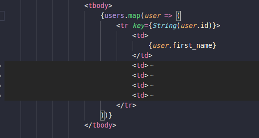

After we create our **Home** and **User List**, we have to make the pages available to users, for that we will create our route file, as I said before, basically in the same format as in our backend. In this case our file is very compact, so we can add it here.

`src/routes.tsx`
```typescript
import React from "react";
import { Route, BrowserRouter } from "react-router-dom";

import Home from "./pages/Home";
import UserList from "./pages/UserList";

const Routes = () => {
    return (
        <BrowserRouter>
            <Route component={Home} path="/" exact />
            <Route component={UserList} path="/user-list" />
        </BrowserRouter>
    )
}

export default Routes;
```

That done, we run our **backend**, **frontend** and **database**, you can run them with `docker-compose up` or one by one with the commands:

```
➜  backend git:(master) ✗ docker run -ti -v $(pwd):/opt/ui -p 81:3333 nlw1ecoleta:v01 npm run dev
➜  web git:(master) ✗ docker run -ti -v $(pwd):/opt/ui -p 80:3000 nlw1ecoleta:v01 npm start
```

The database, as we have already created our image, we can just start the `container` in any folder we have with the command:

```
➜  Docker-Init-Nodejs-React-React-Native-SQLServer git:(master) ✗ docker start sqlserverv2017
```

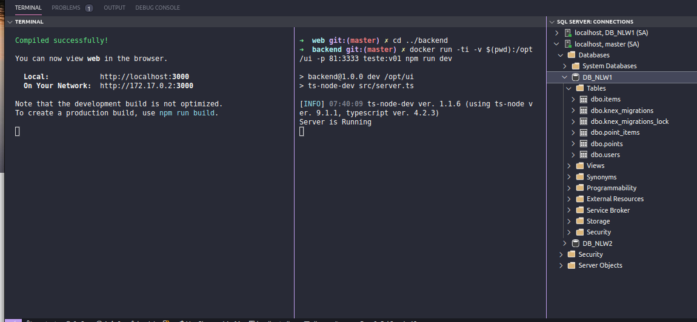

When we run our frontend, backend and database services we can see that we can access our application without any problems and also return the data from our Api.


However, if we pay attention to the Users screen, we will notice that the data has not been rendered in our application. This is because **backend application** is not using **CORS** *(Cross-Origin Resource Sharing)* to allow external applications to access the created api.

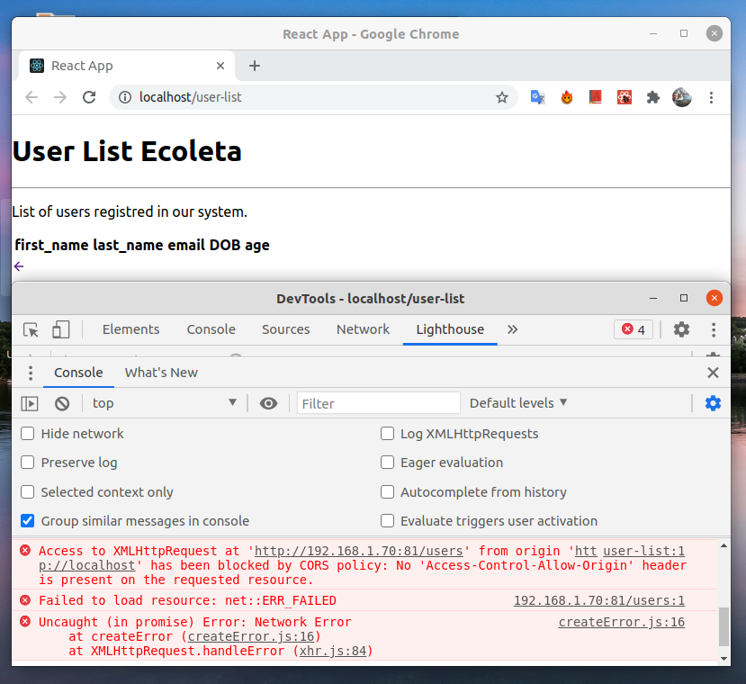

In this case we will install `CORS` in our application with the command:

```
➜  backend git:(master) ✗ dockerNlw1server npm install cors
➜  backend git:(master) ✗ dockerNlw1server npm install @types/cors -D
```

This will allow our frontend to communicate with the **backend**. *You may need to restart the backend server for the changes to take effect.*

```
➜  backend git:(master) ✗ dockerNlw1server npm install cors
npm WARN backend@1.0.0 No description
npm WARN backend@1.0.0 No repository field.
npm WARN optional SKIPPING OPTIONAL DEPENDENCY: fsevents@2.3.2 (node_modules/fsevents):
npm WARN notsup SKIPPING OPTIONAL DEPENDENCY: Unsupported platform for fsevents@2.3.2: wanted {"os":"darwin","arch":"any"} (current: {"os":"linux","arch":"x64"})

+ cors@2.8.5
added 1 package from 1 contributor and audited 289 packages in 3.415s

11 packages are looking for funding
  run `npm fund` for details

found 0 vulnerabilities

➜  backend git:(master) ✗ dockerNlw1server npm install @types/cors -D
npm WARN backend@1.0.0 No description
npm WARN backend@1.0.0 No repository field.
npm WARN optional SKIPPING OPTIONAL DEPENDENCY: fsevents@2.3.2 (node_modules/fsevents):
npm WARN notsup SKIPPING OPTIONAL DEPENDENCY: Unsupported platform for fsevents@2.3.2: wanted {"os":"darwin","arch":"any"} (current: {"os":"linux","arch":"x64"})

+ @types/cors@2.8.10
added 1 package from 2 contributors and audited 290 packages in 3.126s

11 packages are looking for funding
  run `npm fund` for details

found 0 vulnerabilities
```

After installation we will have to add a line of code to our **backend application** in the `src / server.ts` file. After the line `const app = express();` add the code `app.use(cors());`. If necessary, restart the server and test your application.

```typescript
import express, {Response} from 'express';
import UsersController from "./controllers/usersController";
import cors from "cors";

const app = express();

app.use(cors());
```

E novamente **Et Voilà**


E agora só falta acessar os dados com a nossa aplicação Mobile.

### 5.4. <a id="acessingapiwithmobile">Accessing API with the Mobile App</a>.
[Come Back](#summary)

To start, just like React and Node.js, we are going to install some components that we will use in our application.

See: https://reactnative.dev/, https://reactnavigation.org/docs/getting-started/

```
➜  mobile git:(master) ✗ dockerNlw1server npm install @react-navigation/native
npm WARN @babel/plugin-bugfix-v8-spread-parameters-in-optional-chaining@7.13.12 requires a peer of @babel/core@^7.13.0 but none is installed. You must install peer dependencies yourself.
npm WARN optional SKIPPING OPTIONAL DEPENDENCY: fsevents@1.2.13 (node_modules/fsevents):
npm WARN notsup SKIPPING OPTIONAL DEPENDENCY: Unsupported platform for fsevents@1.2.13: wanted {"os":"darwin","arch":"any"} (current: {"os":"linux","arch":"x64"})

+ @react-navigation/native@5.9.3
added 11 packages from 3 contributors and audited 1043 packages in 17.803s
```

The next step is to install the `axios` package (package) that will allow us to make calls to our APIs.

`npm install axios` 
```
mobile git:(master) ✗ dockerNlw1server npm install axios
+ axios@0.21.1
added 2 packages from 4 contributors and audited 1062 packages in 8.516s
```
`Axios` installed, we can now return the data from our API.

### Home Screen

Let's create a simple **HOME** that will be the gateway to our app and from there create a route to our users page.

In React Native Apps in the same way when we are developing apps with ** Android Studio ** we do not use HTML tags, so in the case of ** React Native ** we will use exclusive tags of the same. For example, instead of using the `img` tag of `HTML` we are going to import the [Image](https://reactnative.dev/docs/image) component of `react-native`. In the same way with the [Text](https://reactnative.dev/docs/text)  that replaces tags like `H1, H2 ... H6` among other text tags that we would use in HTML, in this case the `Text` does the job well done and with styling, you can do wonders. In the case of [View](https://reactnative.dev/docs/view), totally important for any project ** React Native **, where it behaves like an `Div` HTML, flexible and simple to work with styles [CSS](https://www.w3.org/Style/CSS/Overview.en.html). 

Complete file in [src/pages/Home/index.tsx](mobile/src/pages/Home/index.tsx).

```javascript
import { Text, Image, View } from "react-native";
...
const Home = () => {
...
return (
        <View>
            <Text style={styles.title}>Seu marketplace de coleta de resíduos</Text>
            <Text style={styles.description}>Recicle conosco, encontre um ponto de reciclágem próximo</Text>                    
        </View>
...
...
...
)}

const styles = StyleSheet.create({

    title: {
      color: '#322153',
      fontSize: 32,
    },
  
    description: {
      color: '#6C6C80',
      fontSize: 16,
    },

```

In the case of our Home we will have a button that will give us access to our list of users. For this we will use adding a `ReactButton` with the `onPress` event that will redirect us to our list of users.

```javascript
        <View style={styles.footer}>
            <RectButton style={styles.button}  onPress={handleNavigateToUsers}> 
                <View style={styles.buttonIcon}>
                    <Text>
                        <Icon name="users" color="#FFF" size={24} />                        
                    </Text>
                </View>
                <Text style={styles.buttonText}>
                    Users List
                </Text>
            </RectButton>            
        </View>
```

The `onPress` function will call the` handleNavigateToUsers` function that will simply redirect us to the screen, the **Users screen**.

```typescript
import { useNavigation } from "@react-navigation/native";
...
const navigation = useNavigation();
...
  function handleNavigateToUsers(){
    navigation.navigate('Users');
  }
```

When using navigation, we have to import `useNavigation` to go to the users screen. In this case, the `Users` we are calling is a route to the page or screen (Users) **Users** in [src/pages/Users/index.tsx](mobile/src/pages/Users/index.tsx).

### Routes - Configuring our routes to access the next screens.

In the same way that we did in the **Web** project, here we also have to configure our routes so that we can move between our screens and when we tap (click) the button to access our next screen, the **routes** file will the work for us.

First we will create our [routes](/src/routes.tsx) file, we will import **createStackNavigator** from `@ react-navigation/stack` and **NavigationContainer** from `@react-navigation/native` to help us create our routes. Basically we import our pages into our route files. The next step is to create a **NavigatorContainer** and add our routes there using **AppStack.Navigator**. In AppStack.Navigator, we include AppStack.Screen with two(2) parameters(attibutos), name(name of the route) and component(name of the component we created). The Home component will be the first to be accessed, since it is the first in the list, see [Navigation](https://reactnative.dev/docs/navigation). You can reverse the order of the components to see how they behave.

```javascript
import React from "react";
import { NavigationContainer } from "@react-navigation/native";
import { createStackNavigator } from "@react-navigation/stack";


import Home from "./pages/Home";
import Users from "./pages/Users";
import UserDetail from "./pages/UserDetail";

const AppStack = createStackNavigator();

const Routes = () => {
    return (
        <NavigationContainer>
            <AppStack.Navigator headerMode="none"
                screenOptions={{
                    cardStyle: {
                        backgroundColor:"#FFF"
                    }
                }}
            >
            <AppStack.Screen name="Home" component={Home} />
            <AppStack.Screen name="Users" component={Users} />
            <AppStack.Screen name="UserDetail" component={UserDetail} />              
            </AppStack.Navigator>
        </NavigationContainer>
    )
}

export default Routes;
```

With the complete route file it will be easier to manage the components and also create new routes when necessary.

Now, from our **HOME** screen we will access the **Users** screen to view user data and from there we will go to **UserDetail**.

We can do a test with our App by running our mobile service with the Expo. Now we won't need to run our **backend** because we only show the app's presentation screen. At the terminal, run the command:

```
cd mobile
docker run -ti -p 19000:19000 -p 19001:19001 -p 19002:19002 -p 19006:19006 --env-file "../.env" -v "$(pwd)":/opt/ui nlw1ecoleta:v01 npm start
```

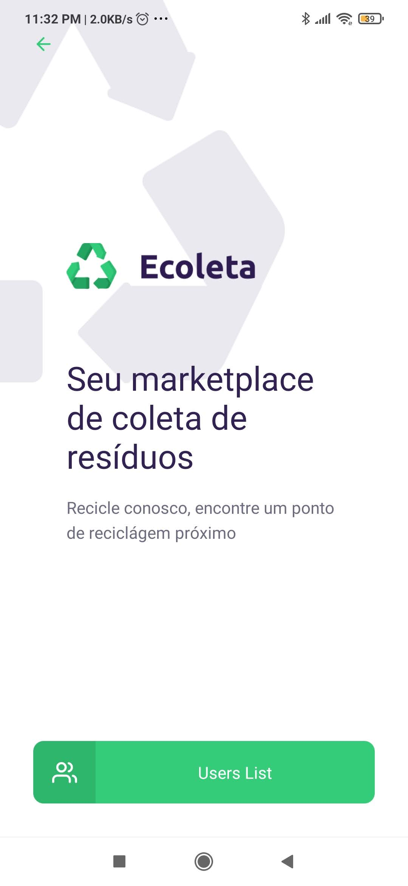

### Users Screen

Now we have our App with the button to access our list of users and that is what we are going to work on now.

Ah. If you want you can stop the **expo** server for now! : D

In addition to the usual components, we will use a new component called `react-native-table-component` that will help us work with tables on mobile, since **React Native** does not have a native table.

We already have most of our components installed, so let's just install `react-native-table-component` and` @types/react-native-table-component`.

Note that in the rodadmos command `npm i` instead of `npm install`, but it means the same thing. i = install.

```
cd mobile 
➜  mobile git:(master) ✗ dockerNlw1server npm i react-native-table-component  
➜  mobile git:(master) ✗ dockerNlw1server npm i @types/react-native-table-component  
```

Installed the components, get to work!

Let's create our `Users` in the `src/pages/Users/index.tsx` folder. As the file is a little big, we will not put it all here, but explain the concepts and what we used to create it. Let's go!

```typescript
import React, { useState, useEffect} from "react";
import { StyleSheet, View, ImageBackground, TouchableOpacity ,Text, Image } from "react-native";
import { Table, TableWrapper, Row, Rows, Col, Cols, Cell } from 'react-native-table-component';
import api from "../../services/api";
```

In imports, we basically have the normal components that we already use in the `Home Screen`, such as Text, StyleSheet, ImageBackground and etc., in addition to React, useState, useEffect and useNavigation. In our table component `react-native-table-component`, we have some items like **Table, Rows, Cells** where in the case of **Table**, it ends up being very common in **HTML**, but **Rows** and **Cells** are more common with **Asp.Net** and others for example. However in the end, they are very similar.

```javascript
  const Users = () => {

   //DataExample 
    const tableState = {
      tableHead: ['Head', 'Head2', 'Head3', 'Head4'],
      tableData: [
        ['1', '2', '3', '4'],
        ['a', 'b', 'c', 'd'],
        ['1', '2', '3', '456\n789'],
        ['a', 'b', 'c', 'd']
      ]
    }
```

Above we have an example of how to generate data for our table. Available at https://www.npmjs.com/package/react-native-table-component. If we check the **tableState** object in **Chrome Dev Tools** we will notice that we have the **tableState** object, it has 2 arrays, the first **tablehead**, contains 4 positions with the header table, the second is the **tableData** with the data from the table, in a **Array with 4 positions** and in each position, another Array with 4 positions.

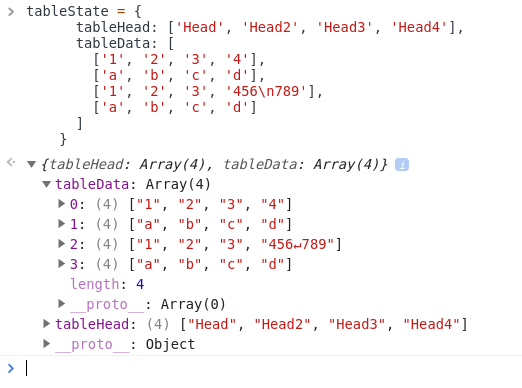

To return the data to the table, first in the attribute **data** of the element **Row** we add the `tableState.tableHead` array with the header data. In the **data** attribute of the **Rows** element, we return the values of `tableState.tableData`, in which case the Rows element will generate the number of rows required for the table.

```javascript
    return (

      <View style={styles.container}>
        <Table borderStyle={{borderWidth: 2, borderColor: '#c8e1ff'}}>
          <Row data={tableState.tableHead} style={styles.head} textStyle={styles.text}/>
          <Rows data={tableState.tableData} textStyle={styles.text}/>
        </Table>
      </View>

    )
  }
```

In the case of our application code we will declare the header data in an Array, but the user data will be returned from our <a id="apiusersmobile">Api</a> exactly as we did in the [frontend](#apiusersweb). In this case when we return the data from the **backend** we will convert it into an Array, if we want to use it in the same way as in the example above, but as we are going to add a button to access each user individually, we will use `map` and the `Cell` component of the` react-native-table-component` to populate the table data.

```javascript
const Users = () => {
    const navigation = useNavigation();    
    const [users, setUsers] = useState<Users[]>([]);
    const [dataUser,setDataUser] = useState([]);

    //DataExample 
    const tableHead = ["First Name","Last Name","Email","Age", "Detail"];

    useEffect(() => {
        api.get('users').then(response => {
            setUsers(response.data);
            const userData:any = [];
            response.data.map((user: Users ) => {
              userData.push([
                  user.first_name,
                  user.last_name,
                  user.email,
                  user.age                
              ]);
            });
            setDataUser(userData);
        });
    },[])
```

In the case above, how we use `useEffect` to load user data only in the` onload` of the users screen. We return the data in the **Api users**, we set the value of the variable `users` called `setUsers`, see more about [immutability in react](https://blog.logrocket.com/immutability-in-react-ebe55253a1cc/) or in [React Hooks](https://reactjs.org/docs/hooks-state.html).

We will also use `map` to generate an array with the values for the users and store them in the` userData` variable. So, if we want to return all of the user data in the table dominating the `Rows` element and add the data from the `userData` array, like this:

```javascript
  <Rows data={userData} textStyle={styles.text}/>
``` 

Your return will be a table like this:

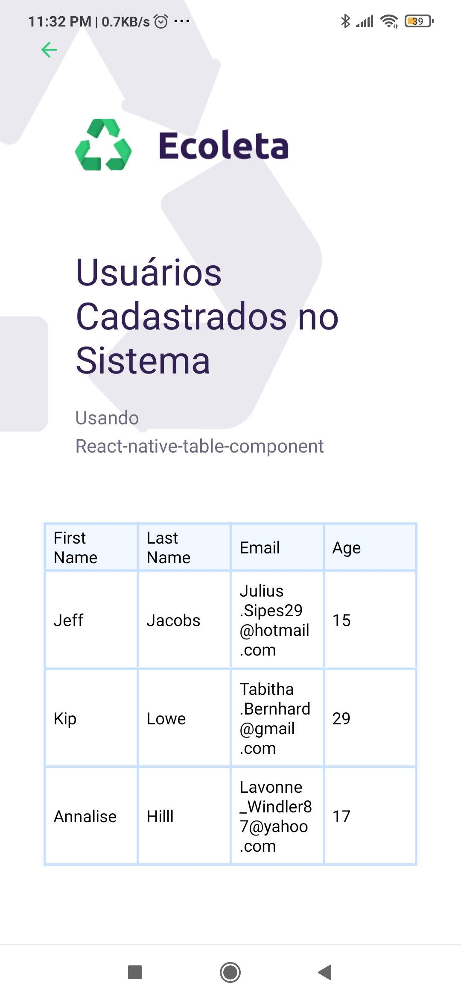

This example is basically the same as [react-native-table-component](https://www.npmjs.com/package/react-native-table-component). In the case of our table, we will use the `Cell` element to return with a **button** to access the user data on the **User details** screen. The example below is a complete table component:

```javascript
        <Table borderStyle={{borderWidth: 2, borderColor: '#c8e1ff'}}>
          <Row data={tableHead} style={styles.head} textStyle={styles.text}/>
            {                    
              users.map((user, userIndex) => {
                return (
                  <TableWrapper key={user.id} style={styles.row}>
                    <Cell data={user.first_name} textStyle={styles.text} />
                    <Cell data={user.last_name} textStyle={styles.text} />
                    <Cell data={user.email} textStyle={styles.text} />
                    <Cell data={user.age} textStyle={styles.text} />
                    <Cell textStyle={styles.text}
                      data={
                        <TouchableOpacity onPress={() => handleNavigateToDetail(user.id)}>
                          <View style={styles.btn}>
                            <Icon name="user" size={20} color="#34cb79" />
                          </View>
                        </TouchableOpacity>                                  
                      }
                    >
                    </Cell>
                  </TableWrapper>
                )
              })
            }
        </Table>

```

Above we use `TableWrapper` as if it were the table rows and` Cell` to return user data using `users.map`. For each one we create using **TableWrapper**, we add the `key` attribute as the unique identification of each line. Our table is composed of 4 columns with data and the last one with a **button** to access the user data, right in the last element `Cell` in the assigned` data` we return the component `TouchableOpacity` with the event `onPress` which will allow us to tap the button and perform the `handleNavigateToDetail` function.

```javascript
      <TouchableOpacity onPress={() => handleNavigateToDetail(user.id)}>
```

Note that in order to call the function that has a parameter, we have to transform the function into an `Arrow function`.

In the function below we are navigating to the **UserDetail** screen and sending the `id` parameters, and in this example any other parameter that you think is necessary. They will be displayed on the next screen with `useRoute`. 

```typescript
function handleNavigateToDetail(id: number){
  navigation.navigate('UserDetail', { 
      user_id: id,
      myAnyOtherParam: ["item 1", "item 2..."]
    });
}     
``` 

When we load our app we can see that it is showing the list of users. The next step is to view the **user details**.


### Creating Api to return user details

In the final part of our code we will bring the details of each user using the `Api` that we created in the **backend**, however sending the parameter with the user Id, soon we have to add one more function in the application **backend** in the file [usersController.ts](backend/src/controllers/usersController.ts).

Basically, we will use a method [HTTP get](https://www.w3schools.com/tags/ref_httpmethods.asp), but in this case we will only return **a record** by calling the `show method`, see more at [Restful Api](https://restful-api-design.readthedocs.io/en/latest/methods.html).

```typescript
    async show(request: Request, response: Response) {
        const { id } = request.params;

        const user = await knex('users').where('id', id).first();

        if (!user) 
            return response.status(400)
            .json({ message: "User Not Found"});

        return response.json( user );
    }
```
In this case, if the record is found in our database, the user's data is returned in json format, otherwise the code returns **error 400** with the information that the user was not found.

For `Api` to work we have to trigger a route for it, in this route we will add the line` app.get('/users/:id',usersController.show);` below the route ** users **. This route will have the parameter `/:id`, which in this case is the user id that we want to return from the database.

```typescript
  app.get('/users',usersController.index);
  app.get('/users/:id',usersController.show);
```

Se rodamos nosso backend server e tentarmos dar um get dos dados do usuário com o `id 2` na url: [http://localhost:81/users/2], teremos o retorno abaixo:


### User Detail Screen

Now that we have our `Api` up and running, we just need to return the user data to the user details screen [UserDetail](mobile/src/pages/UserDetail/index.tsx).

This screen will be more basic, moreover, most of the components we already used in the previous screens, so here we go, we will get the most important details, how to receive the user data from the previous screen and view the data of a single user on the screen .

Let's start with the `Params interface` and the` useRoute`.

We created the `Params` interface where we were able to identify what kind of data we have. In this case we have the `user_id: number` which is a number and this second `myAnyOtherParam: any` that we are not using is just an example for any other parameters that we want to send from one screen to another.

A little further down, a `hook` function of type` useRoute()` that will give us access to the **routes** object that contains the parameters we received from the other screen.

```typescript
import { useNavigation, useRoute } from "@react-navigation/native";
import api from "../../services/api";

interface Params {
    user_id: number,
    myAnyOtherParam: any
}
...
const UserDetail = () => {
const [user, setUser] = useState<User>({} as User); 

const route = useRoute();
const routeParams = route.params as Params;

```

Below we have the `useEffect` that will be called in the `onLoad` of the screen. It receives the parameter from the users screen and returns in the `Api` call with the parameter `${routeParams.user_id}`. 

```typescript
useEffect(() => {
    //console.log(routeParams.user_id);
    api.get(`users/${routeParams.user_id}`).then(response => {
        setUser(response.data);
    })
},[]);
```

In the code that will be displayed on screen to the user, we are basically using the `Text` component, which in turn is receiving the data from the `user` variable, which is not declared this time only as an `User` type object, thus `const [user, setUser] = useState <User>({} as User` , this way **we will not use** the `map` to return the **data**, we will just call it directly of this way `{user.first_name}`.

```javascript
interface User {
    id: number,
    first_name: string,
    last_name: string,
    email: string,
    dob: string,    
    age: number,
    user_url: string,    
}
...
const UserDetail = () => {
const [user, setUser] = useState<User>({} as User); 
...
return (
    
    <ImageBackground 
        source={require('../../assets/home-background.png')}
        style={styles.container}
        imageStyle={{ width: 274, height: 368}}>
            <View style={styles.container}>
                <View>
                  <Text style={styles.label}>Avatar: </Text>
                  <Image style={styles.avatar} source={{ uri: user.user_url }}/>
                </View>
                <View>
                    <Text style={styles.label}>Nome: </Text>
                    <Text style={styles.description}>{user.first_name} {user.last_name}</Text>
                    <Text style={styles.label}>Idade: </Text>
                    <Text style={styles.description}>{user.age}</Text>
                    <Text style={styles.label}>Email: </Text>                    
                    <Text style={styles.description}>{user.email}</Text>
                </View>                   
            </View>
            
    </ImageBackground>
)
```

Ready, we finished our App, we have to put a little bit of perfumery to give a treat on the screens, but with that it is already possible to send, receive data and interact with the user smoothly.

Now, let's run our **backend server** and **mobile**, to see the final result. Run the commands below to load our projects.

```
cd server
➜  server git:(master) ✗ docker run -ti -v $(pwd):/opt/ui -p 81:3333 nlw1ecoleta:v01 npm run dev    

...

cd mobile
➜  mobile git:(master) ✗ docker run -ti -p 19000:19000 -p 19001:19001 -p 19002:19002 -p 19006:19006 --env-file "../.env" -v "$(pwd)":/opt/ui nlw1ecoleta:v01 npm start
```

I added a small bonus, easy-peasy, putting a `fake image` on the user's `avatar`. Just take a look at the `userController` on the **backend server** to find :D.


I hope you enjoyed :D

# CREDITS

As usual, sometimes we have some problems to set up an environment, and with Docker it was no different, so here goes the credits for the comrades who helped a little with this small project with **Docker**, **Node.js**, **React**, **React Native** and **SQL Server**. 

### Rocketseat

- [rocketseat-education-semana-omnistack-10](https://github.com/rocketseat-education/semana-omnistack-10)

- [rocketseat-education/nlw-01-omnistack](https://github.com/rocketseat-education/nlw-01-omnistack)

### Docker

- [Running Expo/React Native in Docker - Haseeb Majid - Nov 1, 2018](https://hmajid2301.medium.com/running-expo-react-native-in-docker-ff9c4f2a4388)

- [Running React Native in Docker — Part 1/2 - Pavan Welihinda - Dec 9, 2019](https://medium.com/@pavan168/pavanwelihinda-running-react-native-in-docker-a0fe0b0c776e)

- [How to Run React Native Expo Web in a Docker Container - rockyourcode - 2020-10-20](https://www.rockyourcode.com/how-to-run-react-native-expo-web-in-a-docker-container/)

- [Metro bundler with Expo dockerized app is not working](https://stackoverflow.com/questions/59638451/metro-bundler-with-expo-dockerized-app-is-not-working)

- [Securing WebSocket API prevents use of Expo DevTools](https://github.com/expo/expo-cli/issues/1081)

- [MDBootstrap Angular Project with Dockers](https://github.com/lexvieira/mdbootstrapangular)

### Alias

- [Linux and Unix alias command tutorial with examples](https://shapeshed.com/unix-alias/)
- [How to set and save an alias in Windows Command Line using doskey](https://www.youtube.com/watch?v=E_6Lklnakew)
- [Your Must-Have PowerShell Aliases for Docker](https://blog.sixeyed.com/your-must-have-powershell-aliases-for-docker/)

### Readme Format and Other Stuff ;)

- [GitHub Cheat Sheet](https://github.com/tiimgreen/github-cheat-sheet/blob/master/README.md)
- [Get started with Docker Compose](https://docs.docker.com/compose/gettingstarted/)
- [Dockerfile reference](https://docs.docker.com/engine/reference/builder/)
- [Basic writing and formatting syntax](https://docs.github.com/en/github/writing-on-github/basic-writing-and-formatting-syntax#headings)