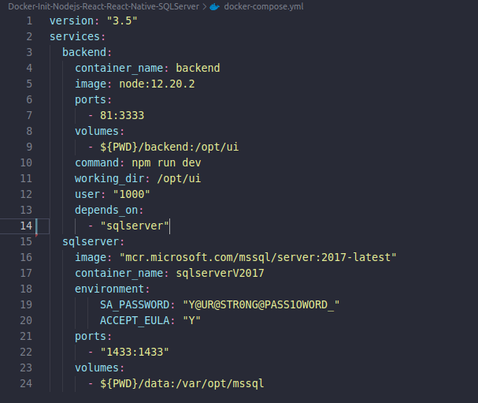
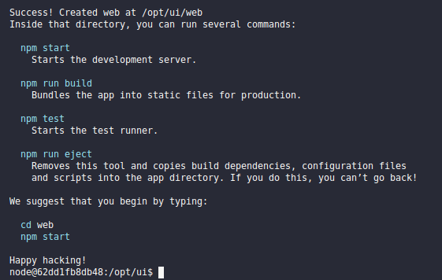

# NLW1 - Ecoleta na Tailândia - Com Docker e SQL Server Container

Read this in other languages: [English](README.en.md), [Portuguese](README.md).

Esse projeto foi baseado no Projeto `Ecoleta` da :rocket:[Rocketseact](https://github.com/rocketseat-education/nlw-01-omnistack) :wave:, projeto **Show**. Muito felizmente bate com o projeto da minha monografia, que trata sobre como usar tecnologia, como Apps, IoT, Big Data para melhorar o processo de reciclágem no Brasil.

Projeto Desenvolvido com as seguintes tecnologias, feito do zero, tendo algumas diferenças do projeto inicial:

- [Node.js](https://nodejs.org/en/)
- [React](https://reactjs.org)
- [React Native](https://facebook.github.io/react-native/)
- [Expo](https://expo.io/)
- [NPM (Gerenciador de Pacotes)](https://www.npmjs.com/)
- [Typescript]()

Adicional para quem está aprendendo Docker.

- [Docker](https://www.docker.com/) - **Nova Feature** (Rodo todo o projeto usando Docker, instalando somente o `Docker` na sua máquina)
- [SQL Server using Docker](https://hub.docker.com/_/microsoft-mssql-server/) - **Nova Feature** (SQL Server em segundos com apenas alguns comandos)

<p align="center">
  
</p>

## 💻 Projeto Ecoleta com Docker e Docker Compose

Projeto para conectar a comunidade à pontos de reciclágem espalhados na cidade. Cadastre pontos de coleta e encontre-os utilizando seu smartphone.

## :rocket: Tecnologias

## 🔖 Layout


## 🤔 Como contribuir

- Faça um fork desse repositório;
- Cria uma branch com a sua feature: `git checkout -b minha-feature`;
- Faça commit das suas alterações: `git commit -m 'feat: Minha nova feature'`;
- Faça push para a sua branch: `git push origin minha-feature`.

Depois que o merge da sua pull request for feito, você pode deletar a sua branch.

## :memo: Licença

Esse projeto está sob a licença MIT. Veja o arquivo [LICENSE](LICENSE.md) para mais detalhes.

---

## Ecoleta usando NodeJS (Backend), React (Web) and React Native (Mobile) e Banco de Dados rodando com Docker e Docker Compose. 

---
O objetivo the projeto é criar um ambiente completo usando [Docker](https://www.docker.com/) e [Docker-compose](https://docs.docker.com/compose), sem a necessidade de ter que criar o ambiente completo em sua máquina. 

O Docker nos permite criar imagens compactas de variados tipos de sistemas com funções especificas, veja em pouco mais nesse outro artigo/projeto do Github [Docker-Sql-Server](https://github.com/lexvieira/Docker-Sql-Server) que explica mias sobre docker e mostra na prática como subir e restaurar um banco de dados SQL Server usando docker. Disponível em Inglês e em Português. Sinta-se à vontade para testar e contribuir.

Nosso projeto será criado utilizando as seguintes tecnologias: 

* [Docker](https://www.docker.com/) - Cria container e rode projetos sem precisar criar todo o ambiente na sua máquina. 
* [Docker-compose](https://docs.docker.com/compose) - Suba todo o ambiente com somente comando `docker-compose up`. 
* [Node.js](https://nodejs.org/en/) - Backend da nossa aplicação, responsável pela parte de negócios
* [React](https://reactjs.org) - Frontend, responsável pela interação com o usuário. 
* [React Native](https://facebook.github.io/react-native/) - Mobile app desenvolvido para multiplataforma, Android e IOS. 
* [Expo](https://expo.io/), responsável por compilar o projeto mobile.
* [SQL Server](https://hub.docker.com/_/microsoft-mssql-server/) Banco de dados relacional da Microsoft.
* [NPM (Gerenciador de Pacotes)](https://www.npmjs.com/) para instalarmos os pacotes nas nossas 3 aplicações.

## Agora, mãos na massa. `Now, hands on.`  

## [Summary](#summary)

1. [Criar DockerFile para rodar os projetos Backend, Frontend e Mobile.](createdockerfile) `Create Docker File`
2. [Projeto Backend usando Docker Backend Project using Docker](#Initiatebackendproject).
   
    2.1 [Iniciando projeto backend com NPM init Starting backend project with NPM init](#Initiatebackendproject) 

    2.2. [Crie docker-compose.yml e adicione configuração de back-end Create docker-compose.yml and add backend configuration](#Createdockercompose). 

    2.3. [Configurar docker com SQL Server](). `Configure Docker with SQL Server`

    2.4. [Adicionar SQL Server ao Docker Compose](). `Configure Docker with SQL Server`
  
3. [Iniciar FrontEnd com React usando Dockerfile]()

4. [Iniciar Mobile](), `Initiate Projects Backend, FrontEnd and Mobile using Docker`
    


---

## 1 - <a id="createdockerfile">Criando nosso Dockerfile para rodar comandos no nosso Backend, Frontend e Mobile. `Create Dockerfile and Build the Image for initiate the Backend, FrontEnd and Mobile`</a> [Comeback](#summary)

Crie um arquivo na pasta raiz do seu projeto com o nom `Dockerfile` e insira o código abaixo. `Create a file at the root folder of your project with the name `Dockerfile` and insert the below code.` 

* Obs: O Dockerfile será utilizado a principio para rodar os 3 projetos, porque é mais fácil para executar os commandos e ambos os projetos utilizam **Node.js** e o **NPM** na mesma versão, porém ao final será a base somente para o projeto mobile que necessita utilizar o **expo-cli**.Para ambos Backend e Frontend nós vamos utilizar o **docker-compose** para rodar nosso projeto. `Obs: The Dockerfile will be used at the beginning to run both 3 projects, because is easy to run the commands and both projects use **Node.js** and **NPM** at the same version, however at the end only the last project will use the image buit using the Dockerfile that need to use the **expo-cli**. For both, Backend and Frontend we will use the **docker-compose** to run our project` 

```
FROM node:12.20.2

WORKDIR /opt/ui

RUN apt-get update 

RUN npm install -g expo-cli

ENV PATH="$(npm global bin):$PATH"

USER 1000

CMD ["node", "-v"]
```

Rodar o comando para construir a imagem docker do projeto. Nome da imagem deve ser em minúsculo [DockerFile](https://docs.docker.com/engine/reference/builder/). `Run the command below to build the project's docker image. Image name must be lowercase` [DockerFile](https://docs.docker.com/engine/reference/builder/) .

```
➜  NLW1_Ecoleta_Docker_SQLServer git:(master) ✗ docker build -t nlw1ecoleta:v01 .
```

Output

```
Sending build context to Docker daemon  10.75kB
Step 1/7 : FROM node:12.20.2
 ---> af3e1e2da75b
Step 2/7 : WORKDIR /opt/ui
 ---> Using cache
 ---> d139b0c48358
Step 3/7 : RUN apt-get update
 ---> Using cache
 ---> fe2d5cd6fc01
Step 4/7 : RUN npm install -g expo-cli
 ---> Using cache
 ---> a95f322dcf24
Step 5/7 : ENV PATH="$(npm global bin):$PATH"
 ---> Using cache
 ---> 6547d56efeda
Step 6/7 : USER 1000
 ---> Using cache
 ---> be5fba657587
Step 7/7 : CMD ["node", "-v"]
 ---> Using cache
 ---> 9a595b4dbf07
Successfully built 9a595b4dbf07
Successfully tagged nlw1ecoleta:v01
```

Crie 3 pastas para as aplicações backend (server), web (web), mobile (mobile). É importante criar as pastas antes de rodar os comandos no docker para que a pasta não fique com permissões de root, não permitindo criar novos arquivos dentro delas. `Create 3 folders for the aplications backend (server), web (web), mobile (mobile). It is important to create the folders before run the docker commands for that the folders don't stay with root permissions, not allowing to create new files inside them`

```
➜  NLW1_Ecoleta_Docker_SQLServer mkdir server & mkdir web & mkdir mobile 
[1]  - 173992 done       mkdir server
[2]  + 173993 done       mkdir web    
[3]  + 173994 done       mkdir mobile                                                                                         
➜  NLW1_Ecoleta_Docker_SQLServer ls
Dockerfile  mobile/  README.md  server/  web/
```

Para criarmos/iniarmos cada um dos projetos **backend, web e mobile**, rodaremos alguns comandos para cada tipo de projeto, sendo: 

* **backend** - Iniciar projeto backend
```
  npm init -y 
```
* **frontend** - Iniciar projeto frontend com React
```
   npx create-react-app web --template typescript --use-npm
```
* **mobile** - Iniciar projeto mobile com React Native and Expo
```
   expo init mobile --npm 
```

Basicamente com esses 3 comandos você pode iniciar um projeto Backend, Frontend e Mobile com Node.js, React e React Native

Não se preocupe, vamos passar por cada um dos ambientes detalhadamente rodando os comandos dentro de um **docker container** :)

# 2 - <a id="startbackendwithdockerfile">Projetos Backend usando Docker. `2 - Inicitiate backend using Docker`</a> [Come Back](#summary).

Nesse caso vamos executer o **docker run** para criar um container temporário e rodar nossos comandos. `In this case let's use the **docker run** to create a temporary container to run our commands`

```
  docker run -ti -v "$(pwd)":/opt/ui nlw1ecoleta:v01 /bin/bash
  node@70184f946a9a:/opt/ui$
```
* **docker run** - Cria um container temporário e roda os comandos dentro dele e para o container quando terminado. ` creates a temporary container, executes the command in it and stops the container when it is done.`
* **-ti** - Modo interativo, permite rodar comandos de texto no terminal. `Interative mode, allowing to run text commands in the terminal` 
* **-v "$(pwd)":/opt/ui** - Cria um volume dividido em duas partes. Antes do :(colon), pasta na sua máquina. Depois dos :, pasta dentro do container. $(pwd), retorna o seu diretório atual (word directory). `Create a volume divided in 2 parts. Before :(colon), your local folder. After :, folder inside the container. $(pwd), returns your local directory (work directory)`
* **nlw1ecoleta:v01** - Nome da imagem (sempre em minúsculo) e tag, depois dos :(dois pontos). [Tags](https://docs.docker.com/engine/reference/commandline/tag/) podem indicar versões, como :v01 ou :ultima, :latest, :v01.test.  `Image name (always lowercase) and tag, after :(colon). [Tags](https://docs.docker.com/engine/reference/commandline/tag/) can indicate versions, like :v01 or :latest, :v01.test.` 
* **/bin/bash** -  **shell** mais comum usado como shell padrão para login do usuário do sistema linux. O nome do shell é um acrônimo para **Bourne-again shell**. `most common **shell** used as default shell for user login of the linux system. The shell's name is an acronym for **Bourne-again shell**.` 

## 2.1 - <a id="Initiatebackendproject">**Iniciando Projeto Backend com NPM. Initiating backend project with NPM**</a> [Comeback](#summary)

* **npm vs yarn** (https://stackoverflow.com/questions/62806728/how-to-tell-if-a-project-uses-yarn)

Como saber se um projeto usa Yarn ou NPM? Ambos contêm um arquivo package.json, embora as dependências do Yarn contenham um arquivo na pasta chamada yarn.lock. `How does one know if a project uses Yarn or NPM? Both contain a package.json file, although Yarn dependencies contain a file in the folder called yarn.lock.` 

Ambos usam package.json com o mesmo formato JSON, mas o NPM 5 gera um arquivo package-lock.json, enquanto o Yarn gera um arquivo yarn.lock.`Both use package.json with the same JSON format, but NPM 5 generates a package-lock.json file, whereas Yarn generates a yarn.lock file.`

* `npm init -y` - Cria um projeto com as opções padrão. `Create project with default options`

```
node@70184f946a9a:/opt/ui$ ls
Dockerfile  README.md  mobile  server  web

node@70184f946a9a:/opt/ui$ cd server
node@70184f946a9a:/opt/ui/server$ ls

node@70184f946a9a:/opt/ui/server$ npm init -y
Wrote to /opt/ui/server/package.json:

{
  "name": "server",
  "version": "1.0.0",
  "description": "",
  "main": "index.js",
  "scripts": {
    "test": "echo \"Error: no test specified\" && exit 1"
  },
  "keywords": [],
  "author": "",
  "license": "ISC"
}

```

Para conseguirmos rodar nosso **backend** com sucesso precisaremos instalar mais alguns pacotes(packages). Não se preocupe, para cada pacote instalado teremos uma pequena explicação. `Para conseguirmos rodar nosso ** backend ** com precisaremos instalar mais alguns pacotes (packages). Não se preocupe, para cada pacote instalado teremos uma pequena explicação.`

Agora que você iniciou seu projeto você pode sair do terminal digitando **exit**.

```Shell
node@70184f946a9a:/opt/ui$ exit
➜  NLW1_Ecoleta_Docker_SQLServer git:(master) ✗
```

Acesse a **pasta server** dentro do seu projeto. Access the **server folder** within your project. Existem outras formas de executar os comandos direto da pasta root, mas nesse para facilitar vamos rodar os comandos dentro da pasta de cada projeto, **Backend (server), Web e Mobile**. Access the ** server folder ** within your project. Access the ** server folder ** within your project. There are other ways to execute the commands directly from the root folder, but in this one we will run the commands inside the folder of each project, **Backend (server), Web and Mobile**. 

```
  ➜  NLW1_Ecoleta_Docker_SQLServer git:(master) ✗ cd server
  ➜  server git:(master) ✗ ls
```

Agora conseguimos subir nosso servidor com apenas um comando, alem disso podemos rodar outros comandos e adicionar novos pacotes da mesma forma. somente adicionando o comando necessário como último **parametro** do commando. `Now we can run our server with only one command, beyond this, we can run other commands and add new packages of the same way, only adding the command necessary as the last **parameter** of the command.`

No exemplo abaixo já estariamos rodando o nosso servidor, adicionando a porta de entrada e saída, o volume e o comando **npm run dev** para rodar o servidor. 

```
➜  docker run -ti -p 81:3333 -v "$(pwd)/server":/opt/ui nlw1ecoleta:v01 npm run dev 
```

Nesse caso, o container é iniciado, executa os comandos necessários e depois **encerra o container**. Veja mais em: [Docker Exec Command With Examples](https://devconnected.com/docker-exec-command-with-examples/#:~:text=The%20difference%20between%20%E2%80%9Cdocker%20run,container%20when%20it%20is%20done). `In this case, the container is started, execute the commands and after **stops the container**. See more at: [Docker Exec Command With Examples](https://devconnected.com/docker-exec-command-with-examples/#:~:text=The%20difference%20between%20%E2%80%9Cdocker%20run,container%20when%20it%20is%20done)`

Vamos simplificar os comandos usando docker, uma vez que os comandos começarão ficarão um pouco grandes, quando começarmos a adicionar, volume, portas, envio de variaveis etc.

Por exemplo, ser formos adicionar o pacote para trabalhar com o Banco de Dados Sql Server, você precisa  

```
docker run -ti -v $(pwd)/server:/opt/ui nlw1ecoleta:v01 npm install mssql
```

OK, o comando é executado, mas é um pouco grande, as vezes podemos esquecer algum parâmetro e por ai vai, porém é bem fácil resolver isso com o  **Alias (nome curto para um comando)** . `OK, the command is executed, but it is a little big, sometimes we can forget some parameter and so on, but it is very easy to solve this with the **Alias (short name for a command)**`

Embora você possa sempre repetir esses comandos sempre que precisar :stuck_out_tongue_winking_eye:.

### Usando Alias `Using Alias` veja mais em [Github Semana Omnistack 10 #Alias Bonus](https://github.com/lexvieira/semana-omnistack-10/tree/run_on_docker#alias-bonus target="_blank") `see more in [Github Semana Omnistack 10 #Alias Bonus](https://github.com/lexvieira/semana-omnistack-10/tree/run_on_docker#alias-bonus target="_blank")`

Execute o comando no terminal ou adicione ao seu arquivo **.bashrc | .zshrc** dependendo do seu tipo de terminal. `Execute the command in your terminal or add into your file **.bashrc | .zshrc** depending on your type of terminal.

```
alias dockerNlw1server='docker run -ti -v "$(pwd)":/opt/ui nlw1ecoleta:v01'
```

* Observações: 
  * O commando alias é **temporário**, significa que você terá que rodar o comando novamente quando fazer o login novamente na sua máquina, ou a melhor opção é adicionar o comando ã um dos arquivos **.bashrc | .zshrc**. `The alias command is ** temporary **, it means that you will have to run the command again when you log in to your machine again, or the best option is to add the command to one of the files **. Bashrc | .zshrc **.`
  
  * O comando adionado ao alias deve estar com entre (') aspas ou (") aspas duplas. `The command added to the alias must be enclosed in (') quotation marks or (") double quotation marks.`

  * Não incluímos as portas para acessar nosso container no **Alias** porque usaremos o **docker-compose** para fazer isso. `We did not include the ports to access our container in ** Alias ** because we will use ** docker-compose ** to do this.` 

Nesse caso você reduziu o nome do seu comando para apenas o alias **dockerNlw1server** e agora quando precisar executar algum comando é só digitar o nome do **alias** e o comando desejado na frente. Exemplo: `In this case you have reduced the name of your command to just the alias **dockerNlw1server** and now when you need to execute a command just type the name of the **alias** and the desired command in front. Example:`

```
➜  server git:(master) ✗ dockerNlw1server ls                                                           
Output: node_modules  package-lock.json  package.json  src  tsconfig.json
➜  server git:(master) ✗ 
```

Agora você pode instalar os pacotes apenas digitando: `➜  dockerNlw1server npm install [nome do pacote]`. Now  you can **install the packages** just by typing: `➜ dockerNlw1server npm install [package name]`.

Vamos continuar nosso projeto e já executando os comandos com o Alias **dockerNlw1server**. `We will continue our project and already running the commands with Alias **dockerNlw1server**.`

Let's Go!
Na pasta root do seu projeto 

* `npm install express` - Microframework para lidar com rotas no Node.js `Microframework to handle with routes in Node.js.`

```
dockerNlw1server npm install express
``` 

No seu arquivo **/src/server.ts** você terá que importar o **express**

```Typescript
    import express from 'express';
```

* npm install @types - Definition Types Typescript - significa que iremos instalar as *definições de tipos* da biblioteca, trazendo informações da biblioteca/package que você está instalando no seu projeto, como tipos de variáveis, funções, parametros, retornos e outros. Algumas bibliotecas já vem com a definição de tipos instaladas e outras não. para as que não vem é só instalalas usando o comando abaixo sendo que depois da "/" é só informar o nome da biblioteca, ex `npm install @types/express -D`. Veja mais em https://www.typescriptlang.org/docs/handbook/2/type-declarations.html. `it means that we will install the * type definitions * of the library, bringing information from the library / package that you are installing in your project, such as types of variables, functions, parameters, returns and others. Some libraries already come with the definition of types installed and others do not. for those that do not come, just install them using the command below and after "/" just enter the name of the library, ex `npm install @ types / express -D`. See more at`

* -D option = () (-D) **DEVELOPER DEPENDENCY** - significa que somente será utilizada durante a fase de desenvolvimento. `means that will be only used when you are developing the app` 

`npm install @types/express -D` - Definição de tipos do express. `Definition types express.`
```
dockerNlw1server npm install @types/express -D
``` 

`npm install typescript -D` - Typescript para trabalhar com Node.js, uma vez que o node somente entende Javascript. `Typescript to work with NodeJs, once node just understand Javascript`
```
dockerNlw1server npm install typescript -D
``` 

* `npx tsc --init` - Cria arquivo de configuração Typescript **tsconfig.ts**, necessário para trabalhar com Typescript no projeto. `Creates Typescript configuration file **tsconfig.ts**, needed to work with Typescript 
```
dockerNlw1server npx tsc --init
``` 


* `npm install ts-node -D` - Já que o Node somente entende Javascript, você precisa instalar o ts-node como dependência de desenvolvimento para poder rodar seus scripts.ts. `Once Node just understand Javascript, you need to install the ts-node as Developer Dependency to run your scripts.ts.` 
```
dockerNlw1server npm install ts-node -D
``` 
* First Route
  
```TypeScript
  apt.get('/users', () => {
    response.send('Retorno para o usuário');
  })
```

`npx ts-node src/server.ts` - Este comando irá rodar nosso app. O **npx** tem a função de executar um pacote(package) instalado no nosso projeto, nesse caso o ts-node. `this command will run our app. **npx** has the function of execute a installed package, in this case ts-node.` 

* Nosso Output, servidor está funcionando. Our output, server is running.
``` 
  dockerNlw1server npx ts-node src/server.ts
  Server is Running  
``` 

 `npm install ts-node-dev -D` - Serve para ficar observando o codigo e caso tenha uma alteração, reinicia o serviço. `Keep observing the code and when there is a change, restart the service.`
``` 
  dockerNlw1server npm install ts-node-dev -D
``` 

* `package.json` - Adicione a linha ao arquivo package.json na pasta raiz do seu projeto. Add the line to the file package.json at the root folder of your project.
```json
"scripts": { "dev": "ts-node-dev src/server.ts" } () => {
    //Add the line "dev" to the script flag inside of package.json
}
```

`npm run dev` -  Uma vez que você adicionou a linha no arquivo **package.json** para rodar o script para rodar agora você pode rodar o servidor apenas com o comando **npm run dev**, `dev` é referente à referência dev que você adicionou ao seu package.json. `Once you have added the line in the **package.json** file to run the script to run now you can run the server only with the command **npm run dev**, `dev` refers to the reference dev that you added to your package.json.` 

```
  dockerNlw1server npm run dev
  [INFO] 10:17:56 Restarting: /opt/ui/src/server.ts has been modified
  Server is Running   
```

* Expondo portas no Docker. `Exposing ports on Docker`

Nesse momento se você tentar acessar o site, a resposta será negativa porque quando executamos o comando Run, nos não falamos que portas estavamos expondo para o usuário adicionando a opção **-p 81:3333**, Note que a porta que estamos usando externamente é a porta *81* e internamente é *3333*, logo podemos enxergar desssa forma *-p foradocontainer:dentrodocontainer* fora do container e dentro do container.
Veja mais em: https://docs.docker.com/config/containers/container-networking/. `At this point, if you try to access the site, the answer will be negative because when we run the Run command, we do not say which ports we were exposing to the user by adding the option ** - p 81: 3333 **, Note that the port we are using externally it is port * 81 * and internally it is * 3333 *, so we can see this form * -p outsidecontainer: insidecontainer * outside the container and inside the container.
See more at: https://docs.docker.com/config/containers/container-networking/.`


Para resolver isso vamos sair do nosso docker container com o comando **exit** e adicionar uma nova configuração para ao rodar comando **docker run** 

Como disse anteriormente vamos usar o **docker-compose** para rodar o nosso servidor backend. Da mesma maneira os outros projetos Web e Mobile. As I said before, we will use **docker-compose** to run our back-end server. Likewise the other Web and Mobile projects.

However, caso não queiram utilizar o docker-compose vocês também podem rodar o seu servidor executando o comando abaixo dentro da pasta **server**

```
➜  NLW1_Ecoleta_Docker_SQLServer git:(master) ✗ cd server
➜  server git:(master) ✗ docker run -ti -p 81:3333 -v "$(pwd)":/opt/ui nlw1ecoleta:v01 npm run server
Server is Running
```

* Note que você continua informando no **volume** do docker container somente $(pwd):/opt/ui, mas para isso agora você precisa acessar a pasta **server** dentro da pasta do seu projeto. `Note that you continue to inform in the ** volume ** of the docker container only $(pwd):/opt/ui, but for that you now need to access the ** server ** folder within your project folder.` 

Em qualquer momento se você quiser acessar o docker container para executar um ou mais comandos você apenas precisar executar o **docker run** e adicionar como parametro final **/bin/bash**. Nesse caso adicionamos também o parâmetro **-p 81:3333** para poder executar o servidor web e visualizar a página na sua máquina.

```
➜  server git:(master) ✗ docker run -ti -p 81:3333 -v "$(pwd)":/opt/ui nlw1ecoleta:v01 /bin/bash 
  node@62dd1fb8db48:/opt/ui$ ls
  Output node_modules/  package.json  package-lock.json  src/  tsconfig.json

> server@1.0.0 dev /opt/ui
> ts-node-dev src/server.ts

node@62dd1fb8db48:/opt/ui$ npm run dev
[INFO] 20:25:49 ts-node-dev ver. 1.1.6 (using ts-node ver. 9.1.1, typescript ver. 4.2.3)
Server is Running
```


Nesse caso rodamos o comando completo porque tivemos que adicionar o parâmetro com a **porta de entrada e saída** `-p 81:3333` ao nosso comando **docker run**. Nosso Alias não tem o parâmetro de porta disponível porque vamos configurar o docker-compose e utilizaremos as configurações de porta lá. Se adicionarmos no Alias e estivermos utilizando em qualquer um dos casos, receberemos uma mensagem de que a porta já está sendo utilizada por outro serviço ou container.

* Exemplo Terminal 1:


* Exemplo Terminal 2:


Para trabalharmos com a questão das portas de uma maneira mais fácil, vamos utilizar o docker-compose para configurar nossos serviços e deixa-los ativos enquanto estivermos utilizando-os, inclundo o serviço do SQL Server que usamos com o nosso Backend para retornar os dados para os usuários.


## OK, GENIAL! OK, GREAT!

Bacana, servidor web com Docker funcionado 100%. `Cool, web server with 100% Docker.` 

## 2.2. Create docker-compose.yml and add backend configuration <a id="Createdockercompose" href="summary">Come Back</a>

Crie o arquivo **docker-compose.yml** na pasta raiz do seu projeto. Abra o arquivo e inclua as seguintes linhas

```Dockerfile
version: "3.5"
services: 
  nlw1_backend:
    container_name: nlw1_backend
    image: node:12.20.2
    ports: 
      - 81:3333
    volumes: 
      - ${PWD}/server:/opt/ui
    command: npm run dev
    working_dir: /opt/ui
    user: "1000"
```

Como falamos anteriormente, as configurações de porta estão adicionadas no docker-compose.yml que ficará ativo enquanto criamos o código do nosso projeto.

Salve o arquivo e na pasta raiz do seu projeto digite:

```
➜  NLW1_Ecoleta_Docker_SQLServer git:(master) ✗ docker-compose up --build 
```


Agora seu servidor Web está rodando sem parar em um terminal e você pode continuar com o código em outro terminal tranquilamente.

No seu terminal clique no sinal de <kbd>+<kbd> ou na opção para dar um split no terminal para abrir um novo terminal e poder digitar novos comandos.


## 2.3 - Configurar docker e docker-compose.yml com SQL Server 

O conteúdo com o Docker SQL Server já está disponível no Github no link <a href="https://github.com/lexvieira/Docker-Sql-Server" target="_blank">https://github.com/lexvieira/Docker-Sql-Server</a>, inclusive com a opção de restauração de base de dados com docker.

Aqui vamos rodar os comandos básicos para configurar o banco de dados sql server e acessa-lo com nossa aplicação backend.

Em outro terminal, dentro da pasta root do projeto digite ou <kbd>Ctrl</kbd> + <kbd>C</kbd>, <kbd>Ctrl</kbd> + <kbd>V</kbd>:

```
sudo docker run -e "ACCEPT_EULA=Y" -e "SA_PASSWORD=YOUR_PASSWORD" -p 1433:1433 --name sqlserverV2017 -v $(pwd)/data:/var/opt/mssql -d mcr.microsoft.com/mssql/server:2017-latest
```

Escolha uma senha e adicione o caminho para a pasta que pretende armazenar os arquivos do banco de dados.
Por exemplo se deseja adicionar um caminho absoluto, você pode incluir na opção:

* `-v /home/myuser/data:/var/opt/mssql`. lembrando que do lado esquerdo do ":" é o diretório na sua máquina ou servidor de arquivos e o endereço no lado direito é o endereço dentro do container. Não altere no lado direito pois está é a pasta default do SQL Server.
* `-v ../data:/var/opt/mssql ` - **../data:** Nesse caso informamos que queremos voltar um nível na hierarquia das pastas e adicionar os dados do banco de dados dentro da pasta **data** disponível nesse nível anterior. 

* Na opção **name** adicionamos um nome que é fácil de relacionar com a imagem existem, nesse caso **sqlserverV2017**.

## START|STOP SQL SERVER

Depois de rodar o primeiro comando você pode iniciar ou parar o serviço quando desejar com o comando: *docker start|stop*. Ainda é possível criar um Alias para rodar esses comandos, como foi explicado anteriormente.

```
docker start sqlserverV2017
docker stop sqlserverV2017
```

## 2.3 - Adicionando a configuração do SQL Server ao docker-compose.yml. 

Agora que aprendemos como configurar o docker para subir um container com o SQL Server, agora vamos subir os dois serviços simultâneamente usando o **docker-compose.yml**.

Pare o serviço do docker-compose que está rodando o seu backend com um <kbd>Ctrl</kbd> + <kbd>C</kbd>. 

No seu arquivo **docker-compose.yml** adicione as seguintes linhas:

```Dockerfile
  sqlserver:
    image: "mcr.microsoft.com/mssql/server:2017-latest"
    container_name: sqlserverV2017
    environment:
        SA_PASSWORD: "JHu@hGTWSK@9t63"
        ACCEPT_EULA: "Y"
    ports:
      - "1433:1433"      
    volumes: 
      - ${PWD}/data/sqlserver:/var/opt/mssql    
```

Em volume, a opção **${PWD}**, indica seu **diretório atual**

* IMPORTANTE! IMPORTANT!
  
Da mesma forma que fizemos nos projetos backend, web e mobile, será necessário criar a **pasta data**, **sqlserver**, ou outro qualquer fora do container. Por quê? 

Quando você criar a pasta dentro do container, a pasta virá com permissões de **root**, logo quando você precisar criar algum arquivo dentro da pasta não consiguirá. 


Você também pode optar por salvar os dados em outra pasta como por exemplo, como a de outro projeto, como no exemplo abaixo:

```
    volumes: 
      - ../DockerSqlserver/data/sqlserver:/var/opt/mssql
```

Nesse caso, estavamos voltando um diretório e salvando na pasta **DockerSqlserver**, você pode usar essa opção caso tenha vários projetos e queira disponibilizar a mesmo container SQL Server para todos os projetos que você tenha usando SQL Server, MySQL ou outros banco de dados. A localização dos arquivos é indiferente para o banco de dados e para o container, contanto que ambos tenham permissão de escrita nas pastas.

## Voltando um pouco ao Backend.

No serviço de backend, adicione a opção **depends_on sqlserver** no arquivo **docker-compose.yml**, que indica que o serviço de backend depende do serviço de banco de dados, da mesma forma que o serviço de **frontend** dependerá do serviço de **backend**. 

```Dockerfile
    depends_on: 
      - "sqlserver"
```

O aquivo ficará dessa forma:



Execute novamente o `docker-compose up --build`

``` 
  ➜  NLW1_Ecoleta_Docker_SQLServer git:(master) ✗ docker-compose up --build
```


Show, agora você tem Backend e Banco de dados configurados e rodando sem problemas.

Nas próximas etapas faremos algumas inclusões de dados e conectaremos o **backend** ao banco de dados **sql server**, mas por agora, vamos proseguir iniciando o **Frontend** e **Mobile**. 

---
# 3 - **Iniciando Projeto Web. `Initiating web project**  <a id="Initiatewebproject" href="summary">Come Back</a>

Estamos a 2 passos de subir um projeto completo com Docker com Node.js, SQL Server, React e React Native. Então, Let's Go!.

Agora para criar o projeto Web e mobile será mais simples, somente teremos que alterar alguns parâmetros para rodar nosso Docker relacionado com cada um dos projetos, web e mobile. `Now to create the Web and mobile project it will be simpler, we will only have to change some parameters to run our Docker related to each of the projects, web and mobile.`

Iniciando projeto com o Docker container.

* MODO FÁCIL, EASYWAY 

Nosso Alias **dockerNlw1server** que após tanto digitar eu notei que poderia se chamar somente **dockerNlw1** ou o nome mais significante dependendo do seu projeto ;).

Então vamos usar nosso alias aqui para iniciar nosso projeto React com apenas um comando na pasta raiz. Se você não criou, somente não se esqueça de criar a pasta **web**, com `mkdir web` na raiz do projeto, novamente por questões de permissões de usuário.

```
  dockerNlw1server npx create-react-app web --template typescript --use-npm
```

 

* MODO NÃO TÃO DIFÍCIL :),  NOT SO HARD WAY :) 

Se você estiver logado em algum container, saia com o comando **exit**

```
node@392c8d1638ba:/opt/ui$ exit
exit
```

Na pasta raiz do projeto rodo o comando abaixo, esse é o mesmo comando que rodamos para criar o **projeto backend**.

```
  docker run -ti -v "$(pwd)":/opt/ui nlw1ecoleta:v01 /bin/bash
  node@62dd1fb8db48:/opt/ui$ ls
  Dockerfile  README.md  mobile  server  web  
```

Note que você continua visualizando as mesmas pastas de quando iniciamos o projeto, **server, web e mobile**. `Note that you continue to view the same folders as when we started the project, server, web and mobile.`

Então agora rode o comando dentro do docker:

```
node@62dd1fb8db48:/opt/ui$ npx create-react-app web --template typescript --use-npm
```


O Projeto criado com **NPM**. O nosso output é o mesmo, tanto usando o alias **dockerNlw1server** ou o comando completo, que também **recomendo** para aprendizado.



Saia do container com o comando **exit**

```
Happy hacking!
node@392c8d1638ba:/opt/ui$ exit
exit
```

* IMPORTANT!
  * Como estamos utilizando somente um **Alias** para rodar os comandos dentro dos projetos, você só precisa se lembrar que temos que **iniciar o projeto sempre na pasta root do projeto** e depois do projeto iniciado com a configuração inicial, podemos **executar os comandos dentro das pastas dos projetos** ***backend, web e mobile*** 

### Executando Web Server React usando o Alias que acabamos de criar

Como Alias não aceita parametros no meio do comando, como por exemplo **adicionar uma porta**, então não vamos poder expor as portas do nosso projeto usando o nosso dockerNlw1server 

```
➜  cd web
dockerNlw1server npm start
```
Receberemos o retorno de que o projeto está rodando, porém no nosso navegador teremos o famoso:


Resolvemos isso rodando o comando diretamente no nosso terminal:

```
➜  NLW1_Ecoleta_Docker_SQLServer git:(master) ✗ cd web 
➜  docker run -ti -v $(pwd):/opt/ui -p 80:3000 nlw1ecoleta:v01 npm start
```

**ET VOILÀ**


React Web app rodando na porta **80**. Você não irá ver **http://localhost:80** porque a **porta 80** é a porta padrão para qualquer site **HTTP**, logo seu navegador traduz como **http://localhost** ou somente **localhost**.


## 3.1. Adicionado o Frontend ao docker-compose.yml e iniciando os docker-compose <a id="Createdockercomposefrontend" href="summary">Come Back</a>

Edite o arquivo **docker-compose.yml** na pasta raiz do seu projeto. Adicione as seguintes linhas referente ao seu **Frontend**. 

```Dockerfile
  nlw1_frontend:
    container_name: nlw1_frontend
    image: node:12.20.2 
    ports:
      - 80:3000
    volumes: 
      - ${PWD}/web:/opt/ui
    command: npm run start
    depends_on: 
      - "nlw1_backend"  
    working_dir: /opt/ui
    user: "1000"    
```

Como falamos anteriormente, as configurações de porta estão adicionadas no docker-compose.yml que ficará ativo enquanto criamos o código do nosso projeto.

Salve o arquivo e na pasta raiz do seu projeto digite:

```
➜  NLW1_Ecoleta_Docker_SQLServer git:(master) ✗ docker-compose up --build 
```


Agora seu servidor Web está rodando sem parar em um terminal e você pode continuar com o código em outro terminal tranquilamente.

No seu terminal clique no sinal de <kbd>+<kbd> ou na opção para dar um split no terminal para abrir um novo terminal e poder digitar novos comandos.


### 4 **Iniciando Projeto Mobile com React Native e Typescript. `Initiating Mobile project with React Native and Typescript** 

O último e não menos importante projeto, que é o nosso mobile app vai seguir os mesmos parametros dos anteriores com algumas excessões.

Normalmente na sua máquina você necessita instalar o **expo-cli globalmente** com o comando `npm install -g expo-cli`. nesse caso não precisaremos fazer isso pois já adicionamos essa etapa ao arquivo **Dockerfile**. 

```Dockerfile
  RUN apt-get update 

  RUN npm install -g expo-cli

  ENV PATH="$(npm global bin):$PATH"
```

Logo nesse caso a única coisa que necessitamos fazer é iniciar nosso container e criar nosso projeto **React Native** com Typescript.

Iniciando projeto com o Docker container.

E novamente:

* MODO FÁCIL, EASYWAY 

Nosso Alias **dockerNlw1server** que após tanto digitar eu notei que poderia se chamar somente **dockerNlw1** ou o nome mais significante dependendo do seu projeto ;).

Então vamos usar nosso alias aqui para iniciar nosso projeto React com apenas um comando na pasta raiz. Se você não criou, somente não se esqueça de criar a pasta **mobile**, com `mkdir mobile` na raiz do projeto, novamente por questões de permissões de usuário.

```
  dockerNlw1server expo init mobile --npm
```


Selecione a opção blank (Typescript) para trabalharmos com o mesmo no projeto.


Seu **React Native** project será criado na pasta **mobile**.

* MODO NÃO TÃO DIFÍCIL :),  NOT SO HARD WAY :) 

Se você estiver logado em algum container, saia com o comando **exit**

```
node@392c8d1638ba:/opt/ui$ exit
exit
```

Novamente, na pasta raiz do projeto rodo o comando abaixo, esse é o mesmo comando que rodamos para criar o projeto backend e frontend.

```
  docker run -ti -v "$(pwd)":/opt/ui nlw1ecoleta:v01 /bin/bash
  node@d468a50ba3f4:/opt/ui$ ls
  Dockerfile  README.md  mobile  server  web  
```

Note que você continua visualizando as mesmas pastas de quando iniciamos o projeto, server, web e mobile. `Note that you continue to view the same folders as when we started the project, server, web and mobile.`

Então agora rode o comando dentro do docker (utilizaremos a opção **--npm** porque estamos trabalhando com o gerenciador de pacotes **NPM** ao invés do **YARN**).:

```
node@d468a50ba3f4:/opt/ui$ expo init mobile --npm
```

Se o projeto demorar muito para ser criado, cancele usando <kbd>Ctrl</kbd> + <kbd>C</kbd> e rode novamente o comando. Caso necessário exclua o conteúdo da pasta. Talvez por questões de internet lenta ou algo do tipo.

Saia do container com o comando **exit**

```
node@392c8d1638ba:/opt/ui$ exit
exit
```

Para rodar qualquer comando dentro do projeto mobile, somente precisamos acessar a pasta e usar o mesmo Alias que criamos para o projeto Backend. Por exemplo, podemos adicionar o **@react-navigation/native** com o comando 

```
  ➜  mobile git:(master) ✗ dockerNlw1server npm install @react-navigation/native
```

## Rodando projeto Mobile usando **docker run**

Já para rodar o projeto **mobile** no nosso celular e carregar o **Expo** no nosso Navegador, temos mais alguns parametros, como as **portas** e o arquivo **.env**.

A porta padrão para o projeto mobile, no caso para carregar o Expo no navegador é a porta **19002**. 

* Criando nosso **.env file** para conseguirmos passar variáveis de ambiente para nosso container Mobile. Crie um arquivo .env file na pasta root do projeto e adicione as informações abaixo.

Note que no seu **.env** file você tem o endereço de ip que deve ser substituído pelo ip da sua máquina. No **Linux e Mac** você pode usar o **ifconfig** para encontrar o ip e no **Windows** você pode usar o **ipconfig** 

**.env File**
```
REACT_NATIVE_PACKAGER_HOSTNAME=192.168.1.70
EXPO_DEBUG=true
EXPO_DEVTOOLS_LISTEN_ADDRESS=0.0.0.0
``` 

``` 
cd mobile 
docker run -ti -p 19000:19000 -p 19001:19001 -p 19002:19002 -p 19006:19006 --env-file "../.env" -v "$(pwd)":/opt/ui nlw1ecoleta:v01 npm start
```


Agora seu React Native web está rodando e você pode acessa-lo usando o App do Expo instalado no seu Smartphone, se você não tem instalado, você pode baixa-lo na [PlayStore](https://play.google.com/store/apps/details?id=host.exp.exponent&hl=en_US&gl=US) ou na [Apple Store](https://apps.apple.com/us/app/expo-go/id982107779) 


No seu navegador no endereço do seu local ip, na porta **19002** você conseguirá acessar o emulador do Expo. 


## React Native App working on Android with Expo Emulator


## 4.1. Adicionado o Mobile ao docker-compose.yml e iniciando os docker-compose com todos os projetos <a id="Createdockercomposefrontend" href="summary">Come Back</a>

Observações ao rodar Serviço React Native Expo.
   > Usando o Docker Expo Developer Tools para emular o mobile app Android ou IOS, no caso do React Native. Este docker não será utilizado em produção.
  - Para podermos rodar a aplicação no celular e usar o *Expo Developer Tools* em nosso navegador temos que adicionar algumas configurações extras que poderiam estar em nosso *DockerFile*, porem teriamos maiores problemas para altera-lo tendo que fazer o rebuild toda vez que trocassemos de IP por exemplo.
  - Para lidar com isso, podemos usar o **.env** arquivo e adicionar as variáveis que precisamos acessar dentro do container.

Edite o arquivo **docker-compose.yml** na pasta raiz do seu projeto. Adicione as seguintes linhas referente ao seu **Mobile**. Você pode adiciona-lo antes do serviço do **SQL Server**.

```Dockerfile
  nlw1_expo:
    container_name: nlw1_expo
    build: 
      context: .
      dockerfile: Dockerfile
    env_file: .env
    ports: 
      - 19000:19000
      - 19001:19001
      - 19002:19002
      - 19006:19006
    volumes:
      - ${PWD}/mobile:/opt/ui
    command: npm run start
    depends_on: 
      - "nlw1_backend"
```


Nesse caso o serviço **Mobile** depende do serviço **backend**, devido as APIs que estamos utilizando.  

* `Dockerfile` - Note que diferente dos outros serviços que utilizam o parâmetro image, nós estamos utilizando o parâmetro build e utilizando nosso **Dockerfile** como base para nosso serviço, isso é porque estamos adicionado algumas configurações adicionais no nosso Dockerfile que não existe na image do node:12.20.2 que utilizamos para o serviço **backend** e **frontend**.

```
    build: 
      context: .
      dockerfile: Dockerfile
```

Como foi dito anteriormente, estamos adicionando o **expo-cli** *globalmente* que nos permite rodar o nosso projeto **React Native**.

```Dockerfile
  RUN apt-get update 

  RUN npm install -g expo-cli

  ENV PATH="$(npm global bin):$PATH"
```
OK, agora com os 4 docker containers rodando e funcionando temos que simplicar as coisas para não ter que ficar rodando varios comandos para subir as 4 instâncias, logo temos o **docker-compose.yml**. Um unico arquivo com a nossa estrutura inteira rodando.

### Building e rodando o docker-compose

```
  docker-compose up --build
```
OU
```
  docker-compose up --build -d
```

>--build - Build images before starting containers.
> -d, --detach - Detached mode: Run containers in the background, the termianl is released and you can use it. But if you want to stop the services you need to type:

```
docker-compose down
```

Next time, somente

```
docker-compose up
```
Finalmente.

Com certeza, depois de criar as imagens utilizando o **docker-compose --build** você precisará rodar novos commandos, adicionar novos pacotes em sua aplicação, então você pode rodar os commandos dentro do docker acessando o *bash* com o *docker run*. Contudo, agora você pode acessar também as imagens geradas pelo **docker-compose**,.

Se você quiser verificar se suas aplicações estão rodando corretamente você também pode rodar o comando:

```
sudo lsof -i -P -n | grep LISTEN
```
ou criar um Alias para o mesmo
```
alias ListenPorts='sudo lsof -i -P -n | grep LISTEN'
ListenPorts
```


# Conectar Projeto Backend (server) com o SQL Server e retornar dados para o Frontend (web) Connect Project Backend (server) with SQL Server and return Data to Frontend (web)

`await`, under construction

# CREDITOS

Como normalmente, as vezes temos alguns problemas para configurar um ambiente, e com Docker não foi diferente, então aqui vai os creditos para os camaradas que ajudaram um pouco com esse pequeno projeto com **Docker**, **Node.js**, **React** e **React Native**. 

### Rocketseat

- [rocketseat-education-semana-omnistack-10](https://github.com/rocketseat-education/semana-omnistack-10)

- [rocketseat-education/nlw-01-omnistack](https://github.com/rocketseat-education/nlw-01-omnistack)

### Docker

- [Running Expo/React Native in Docker - Haseeb Majid - Nov 1, 2018](https://hmajid2301.medium.com/running-expo-react-native-in-docker-ff9c4f2a4388)

- [Running React Native in Docker — Part 1/2 - Pavan Welihinda - Dec 9, 2019](https://medium.com/@pavan168/pavanwelihinda-running-react-native-in-docker-a0fe0b0c776e)

- [How to Run React Native Expo Web in a Docker Container - rockyourcode - 2020-10-20](https://www.rockyourcode.com/how-to-run-react-native-expo-web-in-a-docker-container/)

- [Metro bundler with Expo dockerized app is not working](https://stackoverflow.com/questions/59638451/metro-bundler-with-expo-dockerized-app-is-not-working)

- [Securing WebSocket API prevents use of Expo DevTools](https://github.com/expo/expo-cli/issues/1081)

- [MDBootstrap Angular Project with Dockers](https://github.com/lexvieira/mdbootstrapangular)

### Alias

- [Linux and Unix alias command tutorial with examples](https://shapeshed.com/unix-alias/)
- [How to set and save an alias in Windows Command Line using doskey](https://www.youtube.com/watch?v=E_6Lklnakew)
- [Your Must-Have PowerShell Aliases for Docker](https://blog.sixeyed.com/your-must-have-powershell-aliases-for-docker/)

### Readme Format and Other Stuff ;)

- [GitHub Cheat Sheet](https://github.com/tiimgreen/github-cheat-sheet/blob/master/README.md)
- [Get started with Docker Compose](https://docs.docker.com/compose/gettingstarted/)
- [Dockerfile reference](https://docs.docker.com/engine/reference/builder/)
- [Basic writing and formatting syntax](https://docs.github.com/en/github/writing-on-github/basic-writing-and-formatting-syntax#headings)

# Comments

Nova feature que permite rodar o projeto inteiro usando Docker ou Docker-compose, sem a necessidade de instalar qualquer framework no computador. 

Adequado para pessoas que estão aprendendo a trabalhar com Docker ou que estão aprendendo a trabalhar com muitas tecnologias e não pretendem instalar vários ambientes como NodeJS, MongoDB, Ruby, PHP, Webservers e outros. Também é útil para usuários que tenham um PC ou Laptop com poucos recursos, como memória, processador e disco. Embora seja necessário estar atendo a quantidade de imagens que são baixadas para não comprometer o espaço do sistema operacional.
