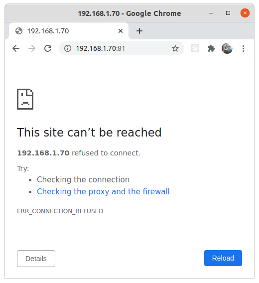

# Iniciar Projetos Backend (Node.js), Frontend (React) e Mobile (React Native) usando Docker e Docker Compose. 

Leia em outros idiomas (Read in other languages): [English](README.en.md), [Portuguese](README.md).

Esse projeto foi baseado no Projeto `Ecoleta` da :rocket:[Rocketseact](https://github.com/rocketseat-education/nlw-01-omnistack) :wave:, projeto **Show**. Muito felizmente bate com o projeto da minha monografia, que trata sobre como usar tecnologia, como Apps, IoT, Big Data para melhorar o processo de reciclágem no Brasil.

# Contribua

Compartilhem e contribuam, #ConhecimentoÉParaSerCompartilhado

- Faça um fork desse repositório;
- Cria uma branch com a sua feature: `git checkout -b minha-feature`;
- Faça commit das suas alterações: `git commit -m 'feat: Minha nova feature'`;
- Faça push para a sua branch: `git push origin minha-feature`.

<p align="center">
  
</p>

Projeto Desenvolvido com as seguintes tecnologias, feito do zero, tendo algumas diferenças do projeto inicial:

- [Node.js](https://nodejs.org/en/)
- [React](https://reactjs.org)
- [React Native](https://facebook.github.io/react-native/)
- [Expo](https://expo.io/)
- [NPM (Gerenciador de Pacotes)](https://www.npmjs.com/)
- [Typescript]()

Adicional para quem está aprendendo Docker.

- [Docker](https://www.docker.com/) - **Nova Feature** (Rodo todo o projeto usando Docker, instalando somente o `Docker` na sua máquina)
- [SQL Server using Docker](https://hub.docker.com/_/microsoft-mssql-server/) - **Nova Feature** (SQL Server em segundos com apenas alguns comandos)

O objetivo the projeto é criar um ambiente **backend Node.js conectando com banco de dados SQL Server, Web com React, e mobile com React Native**. Para não termos a necessidade de ter que criar o ambiente completo em sua máquina, como instalar plataformas, frameworks e outros, utilizaremos somente o  [Docker](https://www.docker.com/) e [Docker-compose](https://docs.docker.com/compose), supondo que você já tenha o mesmo instalado em sua máquina. 

Esse projeto serve tanto para Linux, Mac e Windows, although para Windows, caso você tenha algum problema com a instalação, como configuração de BIOS, você pode consultar o link:

* https://docs.docker.com/docker-for-windows/troubleshoot/#virtualization

O Docker nos permite criar imagens compactas de variados tipos de sistemas com funções especificas, veja em pouco mais nesse outro artigo/projeto do Github [Docker-Sql-Server](https://github.com/lexvieira/Docker-Sql-Server) que explica mias sobre docker e mostra na prática como subir e restaurar um banco de dados SQL Server usando docker. Disponível em Inglês e em Português. 

Sinta-se à vontade para testar e contribuir.

Nosso projeto será criado utilizando as seguintes tecnologias: 

* [Docker](https://www.docker.com/) - Cria container e rode projetos sem precisar criar todo o ambiente na sua máquina. 
* [Docker-compose](https://docs.docker.com/compose) - Suba todo o ambiente com somente comando `docker-compose up`. 
* [Node.js](https://nodejs.org/en/) - Backend da nossa aplicação, responsável pela parte de negócios
* [React](https://reactjs.org) - Frontend, responsável pela interação com o usuário. 
* [React Native](https://facebook.github.io/react-native/) - Mobile app desenvolvido para multiplataforma, Android e IOS. 
* [Expo](https://expo.io/), responsável por compilar o projeto mobile.
* [SQL Server](https://hub.docker.com/_/microsoft-mssql-server/) Banco de dados relacional da Microsoft.
* [NPM (Gerenciador de Pacotes)](https://www.npmjs.com/) para instalarmos os pacotes nas nossas 3 aplicações.
* [KNEX Query Builder for Node.js](http://knexjs.org/)

## Agora, mãos na massa. 

## [Summary](#summary)

1. [Criar Dockerfile para rodar os projetos Backend, Frontend e Mobile.](#createdockerfile) `Create Docker File`
2. [Projeto Backend usando Docker](#initiatebackendproject).
   
    2.1 [Iniciando projeto backend com NPM](#createbackendwithdocker) 

    2.2. [Crie docker-compose.yml e adicione configuração de back-end](#createdockercomposebackend). 

    2.3. [Configurar docker com SQL Server](#createdockerwithsqlserver).

    2.4. [Adicionar SQL Server ao Docker Compose](#createdockercomposesql).
  
3. [Iniciar FrontEnd com React usando Dockerfile](#initiatefrontendproject)
   
    3.1. [Adicionando configuração de Frontend ao docker-compose.yml.](#createdockercomposefrontend). 

4. [Iniciar Projeto Mobile com Expo`](#initiatemobileproject), 
    
    4.1. [Adicionando configuração de Mobile ao docker-compose.yml e Rodar todos os projetos juntos](#createdockercomposemobile).     

5. [Conectar Projeto Backend (server) com o SQL Server e retornar dados para o Frontend (web)](#connectallprojects)

    5.1. [Configurar conexão com o banco de dados usando Knex](#configureconectionusingknex).   

    5.2. [Retornando dados do Banco de dados usando uma API](#returndatausingapi)

    5.3. [Acessando API com Front End](#acessingapiwithfrontend)

    5.4. [Acessando API com o Mobile App](#acessingapiwithmobile)

<br>

---
## 1 - <a id="createdockerfile">Criar DockerFile para rodar os projetos Backend, Frontend e Mobile.</a> 
[Comeback](#summary)

Crie um arquivo na pasta raiz do seu projeto com o nom `Dockerfile` e insira o código abaixo.

* Obs: O Dockerfile será utilizado a principio para rodar os 3 projetos, porque é mais fácil para executar os commandos e ambos os projetos utilizam **Node.js** e o **NPM** na mesma versão, porém ao final será a base somente para o projeto mobile que necessita utilizar o **expo-cli**.Para ambos Backend e Frontend nós vamos utilizar o **docker-compose** para rodar nosso projeto. 

```
FROM node:12.20.2

WORKDIR /opt/ui

RUN apt-get update 

RUN npm install -g expo-cli

ENV PATH="$(npm global bin):$PATH"

USER 1000

CMD ["node", "-v"]
```

Rodar o comando para construir a imagem docker do projeto. Nome da imagem deve ser em minúsculo [DockerFile](https://docs.docker.com/engine/reference/builder/).

```
➜  NLW1_Ecoleta_Docker_SQLServer git:(master) ✗ docker build -t nlw1ecoleta:v01 .
```

Output

```
Sending build context to Docker daemon  10.75kB
Step 1/7 : FROM node:12.20.2
 ---> af3e1e2da75b
Step 2/7 : WORKDIR /opt/ui
 ---> Using cache
 ---> d139b0c48358
Step 3/7 : RUN apt-get update
 ---> Using cache
 ---> fe2d5cd6fc01
Step 4/7 : RUN npm install -g expo-cli
 ---> Using cache
 ---> a95f322dcf24
Step 5/7 : ENV PATH="$(npm global bin):$PATH"
 ---> Using cache
 ---> 6547d56efeda
Step 6/7 : USER 1000
 ---> Using cache
 ---> be5fba657587
Step 7/7 : CMD ["node", "-v"]
 ---> Using cache
 ---> 9a595b4dbf07
Successfully built 9a595b4dbf07
Successfully tagged nlw1ecoleta:v01
```

Crie 3 pastas para as aplicações backend (server), web (web), mobile (mobile). É importante criar as pastas antes de rodar os comandos no docker para que a pasta não fique com permissões de root, não permitindo criar novos arquivos dentro delas.

```
➜  NLW1_Ecoleta_Docker_SQLServer mkdir server & mkdir web & mkdir mobile 
[1]  - 173992 done       mkdir server
[2]  + 173993 done       mkdir web    
[3]  + 173994 done       mkdir mobile                                                                                         
➜  NLW1_Ecoleta_Docker_SQLServer ls
Dockerfile  mobile/  README.md  server/  web/
```

Para criarmos/iniarmos cada um dos projetos **backend, web e mobile**, rodaremos alguns comandos para cada tipo de projeto, sendo: 

* **backend** - Iniciar projeto backend
```
  npm init -y 
```
* **frontend** - Iniciar projeto frontend com React
```
   npx create-react-app web --template typescript --use-npm
```
* **mobile** - Iniciar projeto mobile com React Native and Expo
```
   expo init mobile --npm 
```

Basicamente com esses 3 comandos você pode iniciar um projeto Backend, Frontend e Mobile com Node.js, React e React Native

Não se preocupe, vamos passar por cada um dos ambientes detalhadamente rodando os comandos dentro de um **docker container** :)

---
## 2 - <a id="initiatebackendproject">Projeto Backend usando Docker</a>
[Come Back](#summary)

Nesse caso vamos executer o **docker run** para criar um container temporário e rodar nossos comandos.

```
  docker run -ti -v "$(pwd)":/opt/ui nlw1ecoleta:v01 /bin/bash
  node@70184f946a9a:/opt/ui$
```
* **docker run** - Cria um container temporário e roda os comandos dentro dele e para o container quando terminado.
* **-ti** - Modo interativo, permite rodar comandos de texto no terminal.
* **-v "$(pwd)":/opt/ui** - Cria um volume dividido em duas partes. Antes do :(colon), pasta na sua máquina. Depois dos :, pasta dentro do container. $(pwd), retorna o seu diretório atual (word directory). 
* **nlw1ecoleta:v01** - Nome da imagem (sempre em minúsculo) e tag, depois dos :(dois pontos). [Tags](https://docs.docker.com/engine/reference/commandline/tag/) podem indicar versões, como :v01 ou *:latest, :latest, :v01.test*. 
* **/bin/bash** -  **shell** - Mais comum usado como shell padrão para login do usuário do sistema linux. O nome do shell é um acrônimo para **Bourne-again shell**.

### 2.1 - <a id="createbackendwithdocker">Iniciando projeto backend com NPM</a> 
[Comeback](#summary)

* **npm vs yarn** (https://stackoverflow.com/questions/62806728/how-to-tell-if-a-project-uses-yarn)

Como saber se um projeto usa Yarn ou NPM? Ambos contêm um arquivo package.json, embora as dependências do Yarn contenham um arquivo na pasta chamada yarn.lock.

Ambos usam package.json com o mesmo formato JSON, mas o NPM 5 gera um arquivo package-lock.json, enquanto o Yarn gera um arquivo yarn.lock.

Se você ainda não acessou seu docker container, acesse com o seguinte comando na **pasta root do seu projeto**:

```
  docker run -ti -v "$(pwd)":/opt/ui nlw1ecoleta:v01 /bin/bash
  node@70184f946a9a:/opt/ui$
```

* `npm init -y` - Cria um projeto com as opções padrão.

```
node@70184f946a9a:/opt/ui$ ls
Dockerfile  README.md  mobile  server  web

node@70184f946a9a:/opt/ui$ cd server
node@70184f946a9a:/opt/ui/server$ ls

node@70184f946a9a:/opt/ui/server$ npm init -y
Wrote to /opt/ui/server/package.json:

{
  "name": "server",
  "version": "1.0.0",
  "description": "",
  "main": "index.js",
  "scripts": {
    "test": "echo \"Error: no test specified\" && exit 1"
  },
  "keywords": [],
  "author": "",
  "license": "ISC"
}

```

Para conseguirmos rodar nosso **backend** com sucesso precisaremos instalar mais alguns pacotes(packages). Não se preocupe, para cada pacote instalado teremos uma pequena explicação.

Agora que você iniciou seu projeto você pode sair do terminal digitando **exit**.

```Shell
node@70184f946a9a:/opt/ui$ exit
➜  NLW1_Ecoleta_Docker_SQLServer git:(master) ✗
```

Acesse a **pasta server** dentro do seu projeto. Access the **server folder** within your project. Existem outras formas de executar os comandos direto da pasta root, mas nesse para facilitar vamos rodar os comandos dentro da pasta de cada projeto, **Backend (server), Web e Mobile**. Access the ** server folder ** within your project. Access the ** server folder ** within your project. There are other ways to execute the commands directly from the root folder, but in this one we will run the commands inside the folder of each project, **Backend (server), Web and Mobile**. 

```
  ➜  NLW1_Ecoleta_Docker_SQLServer git:(master) ✗ cd server
  ➜  server git:(master) ✗ ls
```

Agora conseguimos subir nosso servidor com apenas um comando, alem disso podemos rodar outros comandos e adicionar novos pacotes da mesma forma. somente adicionando o comando necessário como último **parametro** do commando.

No exemplo abaixo já estariamos rodando o nosso servidor, adicionando a porta de entrada e saída, o volume e o comando **npm run dev** para rodar o servidor. 

```
➜  docker run -ti -p 81:3333 -v "$(pwd)/server":/opt/ui nlw1ecoleta:v01 npm run dev 
```

Nesse caso, o container é iniciado, executa os comandos necessários e depois **encerra o container**. Veja mais em: [Docker Exec Command With Examples](https://devconnected.com/docker-exec-command-with-examples/#:~:text=The%20difference%20between%20%E2%80%9Cdocker%20run,container%20when%20it%20is%20done).

Vamos simplificar os comandos usando docker, uma vez que os comandos começarão ficarão um pouco grandes, quando começarmos a adicionar, volume, portas, envio de variaveis etc.

Por exemplo, ser formos adicionar o pacote para trabalhar com o Banco de Dados Sql Server, você precisa usar o `npm install mssql`.

```
docker run -ti -v $(pwd)/server:/opt/ui nlw1ecoleta:v01 npm install mssql
```

OK, o comando é executado, mas é um pouco grande, as vezes podemos esquecer algum parâmetro e por ai vai, porém é bem fácil resolver isso com o  **Alias (nome curto para um comando)** .

Embora você possa sempre repetir esses comandos sempre que precisar :stuck_out_tongue_winking_eye:.

### Usando Alias, veja mais em [Github Semana Omnistack 10 #Alias Bonus](https://github.com/lexvieira/semana-omnistack-10/tree/run_on_docker#alias-bonus target="_blank").

Execute o comando no terminal ou adicione ao seu arquivo **.bashrc | .zshrc** dependendo do seu tipo de terminal.

```
alias dockerNlw1server='docker run -ti -v "$(pwd)":/opt/ui nlw1ecoleta:v01'
```

* Observações: 
  * O commando alias é **temporário**, significa que você terá que rodar o comando novamente quando fazer o login novamente na sua máquina, ou a melhor opção é adicionar o comando ã um dos arquivos **.bashrc | .zshrc**.
  
  * O comando adionado ao alias deve estar com entre (') aspas ou (") aspas duplas.

  * Não incluímos as portas para acessar nosso container no **Alias** porque usaremos o **docker-compose** para fazer isso.

Nesse caso você reduziu o nome do seu comando para apenas o alias **dockerNlw1server** e agora quando precisar executar algum comando é só digitar o nome do **alias** e o comando na frente. Podemos utilizar outro nomo também como **dockerNlw1**, uma vez que vamos utiliza-lo nos projetos Web e Mobile, mas nesse caso o nosso alias será o **dockerNlw1server**.
Exemplo: 

```
cd server
➜  server git:(master) ✗ dockerNlw1server ls                                                           
Output: node_modules  package-lock.json  package.json  src  tsconfig.json
➜  server git:(master) ✗ 
```

Agora você pode instalar os pacotes apenas digitando: `➜  dockerNlw1server npm install [nome do pacote]`.

Vamos continuar nosso projeto e já executando os comandos com o Alias **dockerNlw1server**.

Let's Go!
Na pasta root do seu projeto, acesse a pasta **server**.

```
cd server
➜  server git:(master) ✗ 
```

Vamos falar um pouco mais sobre pacotes nos outros projetos, porém agora vamos executar só dar uma breve explicação sobre os comandos e roda-los na prática. Se tiver dúvidas sobre os comandos, você pode verifcar no link https://www.npmjs.com/package/express, o nome do pacote(package) vai sempre no final.

Comandos no terminal usando o docker: 

* `npm install express` - Microframework para lidar com rotas no Node.js.

```
dockerNlw1server npm install express
``` 

No seu arquivo **/src/server.ts** você terá que importar o **express**.

```Typescript
    import express from 'express';
```

* `npm install @types` - Definition Types Typescript - significa que iremos instalar as *definições de tipos* da biblioteca, trazendo informações da biblioteca/package que você está instalando no seu projeto, como tipos de variáveis, funções, parametros, retornos e outros. Algumas bibliotecas já vem com a definição de tipos instaladas e outras não. para as que não vem é só instalalas usando o comando abaixo sendo que depois da "/" é só informar o nome da biblioteca, ex `npm install @types/express -D`. Veja mais em https://www.typescriptlang.org/docs/handbook/2/type-declarations.html. 

* -D option = () (-D) **DEVELOPER DEPENDENCY** - significa que somente será utilizada durante a fase de desenvolvimento.

`npm install @types/express -D` - Definição de tipos do express.

```
dockerNlw1server npm install @types/express -D
``` 

`npm install typescript -D` - Typescript para trabalhar com Node.js, uma vez que o node somente entende Javascript. 

```
dockerNlw1server npm install typescript -D
``` 

`npx tsc --init` - Cria arquivo de configuração Typescript **tsconfig.ts**, necessário para trabalhar com Typescript no projeto.
  
```
dockerNlw1server npx tsc --init
``` 


`npm install ts-node -D` - Já que o Node somente entende Javascript, você precisa instalar o ts-node como dependência de desenvolvimento para poder rodar seus scripts.ts.

```
dockerNlw1server npm install ts-node -D
``` 

* Primeira rota usando o Express: Arquivo `/src/server.ts`
  
```TypeScript
  import express, {Response} from 'express';

  const app = express();
  dir = [1, 2, 3, 4, 5]
  app.get('/users', (request, response: Response) => {
      response.send(`Server is Running ${dir[2]});
  })

  app.listen(3333);  

  console.log('Server is Running');
```

`npx ts-node src/server.ts` - Este comando irá rodar nosso app. O **npx** tem a função de executar um pacote(package) instalado no nosso projeto, nesse caso o ts-node.

* Nosso Output, servidor está funcionando.

``` 
  dockerNlw1server npx ts-node src/server.ts
  Server is Running  
``` 

 `npm install ts-node-dev -D` - Serve para ficar observando o codigo e caso tenha uma alteração, reinicia o serviço.

``` 
  dockerNlw1server npm install ts-node-dev -D
``` 

* `package.json` - Adicione a linha ao arquivo package.json na pasta raiz do seu projeto.

```json
"scripts": { "dev": "ts-node-dev src/server.ts" } () => {
    //Add the line "dev" to the script flag inside of package.json
}
```

`npm run dev` -  Uma vez que você adicionou a linha no arquivo **package.json** para rodar o script para rodar agora você pode rodar o servidor apenas com o comando **npm run dev**, `dev` é referente à referência dev que você adicionou ao seu package.json.

```
  dockerNlw1server npm run dev
  [INFO] 10:17:56 Restarting: /opt/ui/src/server.ts has been modified
  Server is Running   
```

* Expondo portas no Docker.

Nesse momento se você tentar acessar o site, a resposta será negativa porque quando executamos o comando Run, nos não falamos que portas estavamos expondo para o usuário adicionando a opção **-p 81:3333**, Note que a porta que estamos usando externamente é a porta *81* e internamente é *3333*, logo podemos enxergar desssa forma *-p foradocontainer:dentrodocontainer*, fora do container e dentro do container.
Veja mais em: https://docs.docker.com/config/containers/container-networking/. 



Para resolver isso vamos sair do nosso docker container com o comando **exit** e adicionar uma nova configuração para ao rodar comando **docker run**.

Como disse anteriormente vamos usar o **docker-compose** para rodar o nosso servidor backend. Da mesma maneira os outros projetos Web e Mobile. As I said before, we will use **docker-compose** to run our back-end server. Likewise the other Web and Mobile projects.

Contudo, caso não queiram utilizar o docker-compose vocês também podem rodar o seu servidor executando o comando abaixo dentro da pasta **server**.

```
➜  NLW1_Ecoleta_Docker_SQLServer git:(master) ✗ cd server
➜  docker run -ti -p 81:3333 -v "$(pwd)":/opt/ui nlw1ecoleta:v01 npm run dev
Server is Running
```

O último parâmetro **dev** diz respeito à linha que você adicionou no **package.json**, minutos atrás: `scripts": { "dev": ....}`

* Note que você continua informando no **volume** do docker container somente $(pwd):/opt/ui, mas para isso agora você precisa acessar a pasta **server** dentro da pasta do seu projeto.

Em qualquer momento se você quiser acessar o docker container para executar um ou mais comandos você apenas precisar executar o **docker run** e adicionar como parametro final **/bin/bash**. Nesse caso adicionamos também o parâmetro **-p 81:3333** para poder executar o servidor web e visualizar a página na sua máquina.

```
➜  server git:(master) ✗ docker run -ti -p 81:3333 -v "$(pwd)":/opt/ui nlw1ecoleta:v01 /bin/bash 
  node@62dd1fb8db48:/opt/ui$ ls
  Output node_modules/  package.json  package-lock.json  src/  tsconfig.json

> server@1.0.0 dev /opt/ui
> ts-node-dev src/server.ts

node@62dd1fb8db48:/opt/ui$ npm run dev
[INFO] 20:25:49 ts-node-dev ver. 1.1.6 (using ts-node ver. 9.1.1, typescript ver. 4.2.3)
Server is Running
```


Nesse caso rodamos o comando completo porque tivemos que adicionar o parâmetro com a **porta de entrada e saída** `-p 81:3333` ao nosso comando **docker run**. Nosso Alias não tem o parâmetro de porta disponível porque vamos configurar o docker-compose e utilizaremos as configurações de porta lá. Se adicionarmos no Alias e estivermos utilizando em qualquer um dos casos, receberemos uma mensagem de que a porta já está sendo utilizada por outro serviço ou container.

* Exemplo Terminal 1:


* Exemplo Terminal 2:


Para trabalharmos com a questão das portas de uma maneira mais fácil, vamos utilizar o docker-compose para configurar nossos serviços e deixa-los ativos enquanto estivermos utilizando-os, inclundo o serviço do SQL Server que usamos com o nosso Backend para retornar os dados para os usuários.

## OK, GENIAL! OK, GREAT!

Bacana, servidor web com Docker funcionado 100%.

### 2.2. <a id="createdockercomposebackend">Crie docker-compose.yml e adicione configuração de back-end.</a> 
[Comeback](#summary)

Crie o arquivo **docker-compose.yml** na pasta raiz do seu projeto. Abra o arquivo e inclua as seguintes linhas:

```Dockerfile
version: "3.5"
services: 
  nlw1_backend:
    container_name: nlw1_backend
    image: node:12.20.2
    ports: 
      - 81:3333
    volumes: 
      - ${PWD}/server:/opt/ui
    command: npm run dev
    working_dir: /opt/ui
    user: "1000"
```

Como falamos anteriormente, as configurações de porta estão adicionadas no docker-compose.yml que ficará ativo enquanto criamos o código do nosso projeto.

Salve o arquivo e na pasta raiz do seu projeto digite:

```
➜  NLW1_Ecoleta_Docker_SQLServer git:(master) ✗ docker-compose up --build 
```


Agora seu servidor Web está rodando sem parar em um terminal e você pode continuar com o código em outro terminal tranquilamente.

No seu terminal clique no sinal de **+** ou na opção para dar um split no terminal para abrir um novo terminal e poder digitar novos comandos.


### 2.3 - <a id="createdockerwithsqlserver">Configurar docker com SQL Server</a>
[Come back](#summary) 

O conteúdo com o Docker SQL Server já está disponível no Github no link <a href="https://github.com/lexvieira/Docker-Sql-Server" target="_blank">https://github.com/lexvieira/Docker-Sql-Server</a>, inclusive com a opção de **restauração de base de dados** com docker.

Aqui vamos rodar os comandos básicos para configurar o banco de dados sql server e acessa-lo com nossa aplicação backend.

Em outro terminal, dentro da pasta root do projeto digite ou <kbd>Ctrl</kbd> + <kbd>C</kbd>, <kbd>Ctrl</kbd> + <kbd>V</kbd>:

```
sudo docker run -e "ACCEPT_EULA=Y" -e "SA_PASSWORD=YOUR_PASSWORD" -p 1433:1433 --name sqlserverV2017 -v $(pwd)/data:/var/opt/mssql -d mcr.microsoft.com/mssql/server:2017-latest
```

Escolha uma senha e adicione o caminho para a pasta que pretende armazenar os arquivos do banco de dados.
Por exemplo se deseja adicionar um caminho absoluto, você pode incluir na opção:

* `-v /home/myuser/data:/var/opt/mssql`. lembrando que do lado esquerdo do ":" é o diretório na sua máquina ou servidor de arquivos e o endereço no lado direito é o endereço dentro do container. **Não altere no lado direito pois está é a pasta default do SQL Server**.
* `-v ../data:/var/opt/mssql ` - **../data:** Nesse caso informamos que queremos voltar um nível na hierarquia das pastas e adicionar os dados do banco de dados dentro da pasta **data** disponível nesse nível anterior. 

* Na opção **name** adicionamos um nome que é fácil de relacionar com a imagem existem, nesse caso **sqlserverV2017**.

## START|STOP SQL SERVER

Depois de rodar o primeiro comando você pode iniciar ou parar o serviço quando desejar com o comando: *docker start|stop*. Ainda é possível criar um Alias para rodar esses comandos, como foi explicado anteriormente.

```
docker start sqlserverV2017
docker stop sqlserverV2017
```

## 2.4 - <a id="createdockercomposesql">Adicionar SQL Server ao Docker Compose `Configure Docker with SQL Server`</a>
[Come back](#summary) 

Agora que aprendemos como configurar o docker para subir um container com o SQL Server, agora vamos subir os dois serviços simultâneamente usando o **docker-compose.yml**.

Pare o serviço do docker-compose que está rodando o seu backend com um <kbd>Ctrl</kbd> + <kbd>C</kbd>. 

No seu arquivo **docker-compose.yml** adicione as seguintes linhas:

```Dockerfile
  sqlserver:
    image: "mcr.microsoft.com/mssql/server:2017-latest"
    container_name: sqlserverV2017
    environment:
        SA_PASSWORD: "YOUR_PASSWORD"
        ACCEPT_EULA: "Y"
    ports:
      - "1433:1433"      
    volumes: 
      - ${PWD}/data/sqlserver:/var/opt/mssql    
```

No **volume**, a opção **${PWD}**, indica seu **diretório atual**

* IMPORTANTE!
  
Da mesma forma que fizemos nos projetos backend, web e mobile, será necessário criar a **pasta data**, **sqlserver**, ou outro qualquer fora do container. Por quê? 

Quando você criar a pasta dentro do container, a pasta virá com **permissões de root** (permissões administrativas), logo quando você precisar criar algum arquivo dentro da pasta não consiguirá. 


Você também pode optar por salvar os dados em outra pasta como por exemplo, como a de outro projeto, como no exemplo abaixo:

```
    volumes: 
      - ../DockerSqlserver/data/sqlserver:/var/opt/mssql
```

Nesse caso, estavamos voltando um diretório e salvando na pasta **DockerSqlserver**, você pode usar essa opção caso tenha vários projetos e queira disponibilizar a mesmo container SQL Server para todos os projetos que você tenha usando **SQL Server, MySQL** ou outros banco de dados. A localização dos arquivos é indiferente para o banco de dados e para o container, contanto que ambos tenham permissão de escrita nas pastas.

### SQL Password validation 

Ao criar a senha do SQL Server ou qualquer outro banco de dados, sempre utilize senhas fortes para que não recebe uma mensagem de erro de **Password Validation**, informando que sua senha não cumpre os requerimentos necessários.  

```sql
2021-03-29 01:01:19.69 spid21s     ERROR: Unable to set system administrator password: Password validation failed. The password does not meet SQL Server password policy requirements because it is not complex enough. The password must be at least 8 characters long and contain characters from three of the following four sets: Uppercase letters, Lowercase letters, Base 10 digits, and Symbols..
2021-03-29 01:01:19.74 spid21s     An error occurred during server setup. See previous errors for more information.
2021-03-29 01:01:19.74 spid21s     SQL Trace was stopped due to server shutdown. Trace ID = '1'. This is an informational message only; no user action is required.
sqlserverV2017 exited with code 1
```

## Voltando um pouco ao Backend.

No serviço de backend, adicione a opção **depends_on sqlserver** no arquivo **docker-compose.yml**, que indica que o serviço de backend depende do serviço de banco de dados, da mesma forma que o serviço de **frontend** dependerá do serviço de **backend**. 

```Dockerfile
    depends_on: 
      - "sqlserver"
```

O arquivo ficará dessa forma:


Execute novamente o `docker-compose up --build`:

``` 
  ➜  NLW1_Ecoleta_Docker_SQLServer git:(master) ✗ docker-compose up --build
```


Show, agora você tem Backend e Banco de dados configurados e rodando sem problemas.

Nas próximas etapas faremos algumas inclusões de dados e conectaremos o **backend** ao banco de dados **sql server**, mas por agora, vamos proseguir iniciando o **Frontend** e **Mobile**. 

---
## 3 - <a id="initiatefrontendproject">Iniciar FrontEnd com React usando Dockerfile</a>
[Come Back](#summary)

Estamos a 2 passos de subir um projeto completo com Docker com Node.js, SQL Server, React e React Native. Então, Let's Go!.

Agora para criar o projeto Web e mobile será mais simples, somente teremos que alterar alguns parâmetros para rodar nosso Docker relacionado com cada um dos projetos, web e mobile. 

Iniciando projeto com o Docker container.

* MODO FÁCIL, EASYWAY! 

Nosso Alias **dockerNlw1server** que após tanto digitar eu notei que poderia se chamar somente **dockerNlw1** ou o nome mais significante dependendo do seu projeto :D.

Então vamos usar nosso **alias** aqui para iniciar nosso projeto React com apenas um comando na pasta raiz. Se você não criou, somente não se esqueça de criar a pasta **web**, com `mkdir web` na raiz do projeto, novamente por questões de permissões de usuário.

```
  dockerNlw1server npx create-react-app web --template typescript --use-npm
```

 

* MODO NÃO TÃO DIFÍCIL :D,  NOT SO HARD WAY :D 

Se você estiver logado em algum container, saia com o comando **exit**

```
node@392c8d1638ba:/opt/ui$ exit
exit
```

Na pasta raiz do projeto rodo o comando abaixo, esse é o mesmo comando que rodamos para criar o **projeto backend**.

```
  docker run -ti -v "$(pwd)":/opt/ui nlw1ecoleta:v01 /bin/bash
  node@62dd1fb8db48:/opt/ui$ ls
  Dockerfile  README.md  mobile  server  web  
```

Note que você continua visualizando as mesmas pastas de quando iniciamos o projeto, **server, web e mobile**.

Então agora rode o comando dentro do docker:

```
node@62dd1fb8db48:/opt/ui$ npx create-react-app web --template typescript --use-npm
```

* npx create-react-app - Comando para criar o projeto
* web - Pasta de instalação 
* --template typescript - Modelo do projeto
* --use-npm - Usando npm como gerenciador de pacotes


O nosso output é o mesmo, tanto usando o alias **dockerNlw1server** ou o comando completo, que também **recomendo** para aprendizado.


Saia do container com o comando **exit**

```
Happy hacking!
node@392c8d1638ba:/opt/ui$ exit
exit
```

* IMPORTANT!
  
  Como estamos utilizando somente um **Alias** para rodar os comandos dentro dos projetos, você só precisa se lembrar que temos que: 
  * **iniciar o projeto sempre na pasta root do projeto** 

  E depois do projeto iniciado com a configuração inicial, podemos: 
  * **executar os comandos dentro das pastas dos projetos** ***backend, web e mobile*** 

### Executando Web Server React usando o Alias que acabamos de criar

Como Alias não aceita parametros no meio do comando, como por exemplo **adicionar uma porta**, então não vamos poder expor as portas do nosso projeto usando o nosso dockerNlw1server 

```
➜  cd web
dockerNlw1server npm start
```

Receberemos o retorno de que o projeto está rodando, porém no nosso navegador teremos o famoso:


Resolvemos isso rodando o comando diretamente no nosso terminal:

```
➜  NLW1_Ecoleta_Docker_SQLServer git:(master) ✗ cd web 
➜  docker run -ti -v $(pwd):/opt/ui -p 80:3000 nlw1ecoleta:v01 npm start
```

**ET VOILÀ**


React Web app rodando na porta **80**. Você não irá ver **http://localhost:80** porque a **porta 80** é a porta padrão para qualquer site **HTTP**, logo seu navegador traduz como **http://localhost** ou somente **localhost**.


### 3.1. <a id="createdockercomposefrontend">Adicionando configuração de Frontend ao docker-compose.yml.</a>
[Come Back](#summary)

Edite o arquivo **docker-compose.yml** na pasta raiz do seu projeto. Adicione as seguintes linhas referente ao seu **Frontend**. 

```Dockerfile
  nlw1_frontend:
    container_name: nlw1_frontend
    image: node:12.20.2 
    ports:
      - 80:3000
    volumes: 
      - ${PWD}/web:/opt/ui
    command: npm run start
    depends_on: 
      - "nlw1_backend"  
    working_dir: /opt/ui
    user: "1000"    
```

Como falamos anteriormente, as configurações de porta estão adicionadas no docker-compose.yml que ficará ativo enquanto criamos o código do nosso projeto.

Salve o arquivo e na pasta raiz do seu projeto digite:

```
➜  NLW1_Ecoleta_Docker_SQLServer git:(master) ✗ docker-compose up --build 
```


Agora seu servidor Web está rodando sem parar em um terminal e você pode continuar com o código em outro terminal tranquilamente.

No seu terminal clique no sinal de <kbd>+<kbd> ou na opção para dar um split no terminal para abrir um novo terminal e poder digitar novos comandos.


## 4. <a id="initiatemobileproject">Iniciando Projeto Mobile com React Native e Typescript.</a> 
[Come Back](#summary)

O último e não menos importante projeto, que é o nosso mobile app vai seguir os mesmos parametros dos anteriores com algumas excessões.

Normalmente na sua máquina você necessita instalar o **expo-cli globalmente** com o comando `npm install -g expo-cli`. nesse caso não precisaremos fazer isso pois já adicionamos essa etapa ao arquivo **Dockerfile**. 

```Dockerfile
  RUN apt-get update 

  RUN npm install -g expo-cli

  ENV PATH="$(npm global bin):$PATH"
```

Logo nesse caso a única coisa que necessitamos fazer é iniciar nosso container e criar nosso projeto **React Native** com Typescript.

Iniciando projeto com o Docker container.

E novamente:

* MODO FÁCIL, EASYWAY! :D 

Nosso Alias **dockerNlw1server** que após tanto digitar eu notei que poderia se chamar somente **dockerNlw1** ou o nome mais significante dependendo do seu projeto :D.

Então vamos usar nosso alias aqui para iniciar nosso projeto React com apenas um comando na pasta raiz. Se você não criou, somente não se esqueça de criar a pasta **mobile**, com `mkdir mobile` na raiz do projeto, novamente por questões de permissões de usuário.

```
  dockerNlw1server expo init mobile --npm
```


Selecione a opção blank **Typescript** para trabalharmos com o mesmo no projeto.


Seu **React Native** project será criado na pasta **mobile**.

* MODO NÃO TÃO DIFÍCIL :D,  NOT SO HARD WAY :D 

Se você estiver logado em algum container, saia com o comando **exit**

```
node@392c8d1638ba:/opt/ui$ exit
exit
```

Novamente, na pasta raiz do projeto rodo o comando abaixo, esse é o mesmo comando que rodamos para criar o projeto backend e frontend.

```
  docker run -ti -v "$(pwd)":/opt/ui nlw1ecoleta:v01 /bin/bash
  node@d468a50ba3f4:/opt/ui$ ls
  Dockerfile  README.md  mobile  server  web  
```

Note que você continua visualizando as mesmas pastas de quando iniciamos o projeto, **server, web e mobile**.

Então agora rode o comando dentro do docker (utilizaremos a opção **--npm** porque estamos trabalhando com o gerenciador de pacotes **NPM** ao invés do **YARN**).:

```
node@d468a50ba3f4:/opt/ui$ expo init mobile --npm
```

Se o projeto demorar muito para ser criado, cancele usando <kbd>Ctrl</kbd> + <kbd>C</kbd> e rode novamente o comando. Caso necessário exclua o conteúdo da pasta. Talvez por questões de internet lenta ou algo do tipo.

Saia do container com o comando **exit**

```
node@392c8d1638ba:/opt/ui$ exit
exit
```

Para rodar qualquer comando dentro do projeto mobile, somente precisamos acessar a pasta e usar o mesmo Alias que criamos para o projeto Backend. Por exemplo, podemos adicionar o **@react-navigation/native** com o comando: 

```
  ➜  mobile git:(master) ✗ dockerNlw1server npm install @react-navigation/native
```

## Rodando projeto Mobile usando **docker run**

Já para rodar o projeto **mobile** no nosso celular e carregar o **Expo** no nosso Navegador, temos mais alguns parametros, como as **portas** e o arquivo **.env**.

A porta padrão para o projeto mobile, no caso para carregar o Expo no navegador é a porta **19002**. 

* Criando nosso **.env file** para conseguirmos passar variáveis de ambiente para nosso container Mobile. Crie um arquivo .env file na pasta root do projeto e adicione as informações abaixo.

Note que no seu **.env** file você tem o endereço de ip que deve ser substituído pelo ip da sua máquina. No **Linux e Mac** você pode usar o **ifconfig** para encontrar o ip e no **Windows** você pode usar o **ipconfig** 

**.env File**
```
REACT_NATIVE_PACKAGER_HOSTNAME=192.168.1.70
EXPO_DEBUG=true
EXPO_DEVTOOLS_LISTEN_ADDRESS=0.0.0.0
``` 

``` 
cd mobile 
docker run -ti -p 19000:19000 -p 19001:19001 -p 19002:19002 -p 19006:19006 --env-file "../.env" -v "$(pwd)":/opt/ui nlw1ecoleta:v01 npm start
```


Agora seu React Native web está rodando e você pode acessa-lo usando o App do Expo instalado no seu Smartphone, se você não tem instalado, você pode baixa-lo na [PlayStore](https://play.google.com/store/apps/details?id=host.exp.exponent&hl=en_US&gl=US) ou na [Apple Store](https://apps.apple.com/us/app/expo-go/id982107779) 

No seu navegador no endereço do seu local ip, na porta **19002** você conseguirá acessar o emulador do Expo. 


## React Native App funcionando em Android com Expo Emulator


### 4.1. <a id="createdockercomposemobile">Adding Mobile configuration in the docker-compose.yml</a>
[Come Back](#summary)

Observações ao rodar Serviço React Native Expo.
   > Usando o Docker Expo Developer Tools para emular o mobile app Android ou IOS, no caso do React Native. Este docker não será utilizado em produção.
  - Para podermos rodar a aplicação no celular e usar o *Expo Developer Tools* em nosso navegador temos que adicionar algumas configurações extras que poderiam estar em nosso *DockerFile*, porem teriamos maiores problemas para altera-lo tendo que fazer o rebuild toda vez que trocassemos de IP por exemplo.
  - Para lidar com isso, podemos usar o **.env** arquivo e adicionar as variáveis que precisamos acessar dentro do container.

Edite o arquivo **docker-compose.yml** na pasta raiz do seu projeto. Adicione as seguintes linhas referente ao seu **Mobile**. Você pode adiciona-lo antes do serviço do **SQL Server**.

```Dockerfile
  nlw1_expo:
    container_name: nlw1_expo
    build: 
      context: .
      dockerfile: Dockerfile
    env_file: .env
    ports: 
      - 19000:19000
      - 19001:19001
      - 19002:19002
      - 19006:19006
    volumes:
      - ${PWD}/mobile:/opt/ui
    command: npm run start
    depends_on: 
      - "nlw1_backend"
```


Nesse caso o serviço **Mobile** depende do serviço **backend**, devido as APIs que estamos utilizando.  

* `Dockerfile` - Note que diferente dos outros serviços que utilizam o parâmetro image, nós estamos utilizando o parâmetro build e utilizando nosso **Dockerfile** como base para nosso serviço, isso é porque estamos adicionado algumas configurações adicionais no nosso Dockerfile que não existe na image do **node:12.20.2** que utilizamos para o serviço **backend** e **frontend**.

```
    build: 
      context: .
      dockerfile: Dockerfile
```

Como foi dito anteriormente, estamos adicionando o **expo-cli** *globalmente* que nos permite rodar o nosso projeto **React Native**.

```Dockerfile
  RUN apt-get update 

  RUN npm install -g expo-cli

  ENV PATH="$(npm global bin):$PATH"
```

OK, agora com os 4 docker containers rodando e funcionando temos que simplicar as coisas para não ter que ficar rodando varios comandos para subir as 4 instâncias, logo temos o **docker-compose.yml**. Um unico arquivo com a nossa estrutura inteira rodando.

### Building e rodando o docker-compose

```
  docker-compose up --build
```
OU
```
  docker-compose up --build -d
```

>--build - Build images before starting containers.
> -d, --detach - Detached mode: Run containers in the background, the termianl is released and you can use it. But if you want to stop the services you need to type:

```
docker-compose down
```

Próxima vez, somente.

```
docker-compose up
```

Claro que se mudar alguma configuração você pode executar o **--build** novamente.

Finalmente.


Com certeza, depois de criar as imagens utilizando o **docker-compose --build** você precisará rodar novos commandos, adicionar novos pacotes em sua aplicação, então você pode rodar os commandos dentro do docker acessando o *bash* com o *docker run*. Contudo, agora você pode acessar também as imagens geradas pelo **docker-compose**.

Se quiser, você também pode ver as imagens geradas utilizando o comando **docker images**:

```
➜  NLW1_Ecoleta_Docker_SQLServer git:(master) ✗  docker images 
REPOSITORY                                    TAG                 IMAGE ID            CREATED             SIZE
nlw1_ecoleta_docker_sqlserver_nlw1_expo       latest              9a595b4dbf07        6 days ago          1.15GB
nlw1_ecoleta_docker_sqlserver_nlw1_backend    latest              9a595b4dbf07        6 days ago          1.15GB
sqlhtml                                       v01                 9a595b4dbf07        6 days ago          1.15GB
nlw1_ecoleta_docker_sqlserver_nlw1_frontend   latest              5cf07abc153a        6 days ago          1.16GB
<none>                                        <none>              cdc439acf93c        2 weeks ago         1.22GB
node                                          12.20.2             af3e1e2da75b        5 weeks ago         918MB
node                                          12.14.1             839a5e8f04b4        13 months ago       913MB
mcr.microsoft.com/mssql/server                2017-latest         d9b9b96627b7        20 months ago       1.36GB
mysql                                         5.7.22              6bb891430fb6        2 years ago         372MB
```

Você pode chegar que as imagens foram geradas pelo **docker-compose** são compostas por parte do nome da **pasta do seu projeto** e parte no dado a imagem no arquivo **docker-compose.yml**.  

Se você quiser verificar se suas aplicações estão rodando corretamente você também pode rodar o comando:

```
sudo lsof -i -P -n | grep LISTEN
```

Ou criar um Alias para o mesmo:

```
alias ListenPorts='sudo lsof -i -P -n | grep LISTEN'
ListenPorts
```


Veja a documentação completa do dockers em:
https://docs.docker.com/engine/reference/commandline/start/
https://docs.docker.com/compose/gettingstarted/

## 5. <a id="connectallprojects">Conectar Projeto Backend (server) com o SQL Server e retornar dados para o Frontend (web)</a>.
[Come Back](#summary)

Os próximos passos serão retornar dados para o frontend e mobile utilizando uma Api criada no backend. Para isso teremos que adicionar e configurar alguns componentes no nosso projeto, começando pelo [knex](http://knexjs.org/), query builder, utilizado para retornar dados de banco de dados relacionais no **Node.js**. Depois configurando **Axios** no frontend, [CORS](https://developer.mozilla.org/en-US/docs/Web/HTTP/CORS) para permitir acesso do frontend a nossa API entre outros. 

No entanto isso só é uma introdução, exite muito mais para explorar, mas você pode acessar outros projetos com mais informações nos links abaixo: 

Projeto completo com App disponível no Github https://github.com/lexvieira/NLW1_Ecoleta_Docker_SQLServer. Baseado no projeto da Rocketseat https://github.com/rocketseat-education/nlw-01-omnistack. 
Também em https://github.com/lexvieira/TSQLtoHTMLTable, projeto que permite retornar dados do SQL Server em formato HTML e renderizar no React. 

## Let's Go!

### 5.1. <a id="configureconectionusingknex">[Configurar conexão com o banco de dados usando Knex]</a>. 
[Come Back](#summary)

    Para accessarmos os dados no nosso banco de dados vamos utilizar um pacote(package) para Node.js chamado **Knex**, que permite construir consultas(queries) e retornar dados de forma amigável para o nosso backend.

`npm install knex` - Usando o nosso docker dentro da pasta de **backend(server)**, digite o comando:
```
➜  NLW1_Ecoleta_Docker_SQLServer git:(master) ✗ cd server
   dockerNlw1server npm install knex --save
```     

Uma observação sobre o Knex. No projeto [NLW1 Ecoleta Docker SQL Server](https://github.com/lexvieira/NLW1_Ecoleta_Docker_SQLServer), baseado no [NLW1 Ecoleta](https://github.com/rocketseat-education/nlw-01-omnistack) da Rocketseat, estamos trabalhando com o `"knex": "^0.21.17"` e nesse projeto, estamos trabalhando com o `"knex": "^0.95.4"`. Na versão `^0.95.0` e superiores, temos que adicionar o pacote(package) [tediousjs](https://tediousjs.github.io/tedious/installation.html) para lidar com conexões do SQL Server. Caso tenha problemas de conexão, verifique as versões dos pacotes(packages). 

`npm install mssql` - Também instale o SQL Server :
```
   dockerNlw1server npm install mssql --save
```     

`npm install --save tedious`
```
   dockerNlw1server npm install tedious --save
```

### Configurando a Conexão

Primeiro para facilitar nosso acesso ao IP do servidor que as vezes pode mudar dependendo da nossa rede, vamos criar uma módulo chamado **environment** que terá algumas informação úteis, como **IP**, **porta do servidor** e **endereço do servidor**. Crie o arquivo `index.ts` na pasta *src/environments/* e insira o seguinte código:

```Typescript
export const apiAddr = () => {
    return `${environment.protocol}${environment.ipServer}:${environment.port}`; 
}

export const environment = {
    ipServer: '192.168.1.70',
    protocol:  'http://',
    port: '81'    
};
```

O módulo acima nos permitirá acessar as informação do servidor de uma forma mais fácil, sem ter que ficar alterando em vários arquivos toda vez que o **IP do servidor** mudar. Para acessar os dados do servidor somente importe nosso módulo enrironment e retorne o ip chamando a variável `environment.ipServer` ou por exemplo a função `apiAddr` que retorna o endereço completo do servidor.

```Typescript 
import { environment } from './src/environments/index';
      
const ip = `${environment.ipServer}`,
```

Quando utilizamos o Knex, temos que criar um arquivo de configuração chamado **knexfile.ts** que fica na pasta root do projeto, com a seguinte código:

```Typescript
import { environment } from './src/environments/index';
import path from 'path';

module.exports = {
    client: 'mssql',
    connection: {
      host : `${environment.ipServer}`,
      user : 'SA',
      password : 'Q5zA4@5?25wCy8',
      database : 'DB_NLW1'        
    },
    migrations: {
      directory: path.resolve(__dirname, 'src', 'database', 'migrations')
    },
    seeds: {
      directory: path.resolve(__dirname, 'src', 'database', 'seeds')
    }, 
    useNullAsDefault: true,
};
```
Em seguida vamos criar nosso arquivo de conexão que utilizaremos para acessar nosso banco de dados. Note que também estamos importando nosso **módulo environments** e retornando o **ip do servidor**. 

```Typescript
import { environment } from './../environments/index';
import knex from 'knex';

const connection = knex({
    client: 'mssql',
    connection: {
      host : `${environment.ipServer}`,
      user : 'SA',
      password : 'JHu@hGTWSK@9t63',
      database : 'MY_DB'
    }
});
  
export default connection;
```

Depois de criarmos nosso arquivo de conexão agora nos resta criar nossos arquivos de Migrations e Seeds:

* **Migrations:** Módulo que permite criar, alterar, deletar tabelas, entre outras coisas no banco de dados. Basicamente nós criamos um **script de migração** e depois executamos o comando para rodar a migração no servidor. Se tudo estiver correto as tabelas são criadas no servidor e conseguimos acessa-las tranquilamente. Histórico do banco de ados.

* **Seeds** Script que permite inserir dados nas tabelas do banco de dados. Muito utilizado quando temos valores iniciais padrão para nossa aplicação.

Nosso arquivos de **migration** estão na pasta `src\database\migrations` e os de **seeds** na pasta `src\database\seeds`. Nesse caso podemos criar o arquivos manualmente como qualquer script porém podemos criar o *arquivo inicial das migrations* com o comando: 

```
➜  backend git:(master) ✗ dockerNlw1server npx knex migrate:make initUsers --env development
Requiring external module ts-node/register
Created Migration: /opt/ui/src/database/migrations/20210330145952_initUsers.ts
```

Se você preferir você pode se renomear o inicio do arquivo numerando-o para ficar mais organizado com o comando `mv`, caso não queira não é obrigatório.

```
➜  backend git:(master) ✗ cd src/database/migrations 
➜  migrations git:(master) ✗ mv 20210330145952_initUsers.ts 01_20210330145952_initUsers.ts
```

Nosso arquivo criado com o resultado do comando acima. Para saber os tipos de dados quando estiver criando as tabelas veja: [Schema](https://devhints.io/knex#schema) ou [Knex cheatsheet](https://devhints.io/knex)

```Typescript
import { Knex } from "knex";

export async function up(knex: Knex): Promise<void> {
  await knex.schema.createTable("users", table => {
    table
      .increments("user_id")
      .unsigned()
      .primary();
    table
      .string("email")
      .unique()
      .notNullable();
    table.string("first_name").notNullable();
    table.string("last_name").notNullable();
    table.date("dob").notNullable();
    table.date("age").notNullable();
  });
}

export async function down(knex: Knex): Promise<void> {
  await knex.schema.dropTable("users");
}
```

Para rodar nossa **migration** ou seja, para que nossas tabelas sejam repassadas para o banco de dados utilizaremos o comando. 

```
dockerNlw1server knex --knexfile knexfile.ts migrate:latest
```

ou também com o script que criamos no `package.json`

```json
    "knex:seed": "knex --knexfile knexfile.ts seed:run",
    "knex:migrate": "knex --knexfile knexfile.ts migrate:latest"
```

Nesse caso criamos dois scripts, um para o **migration** e outro para o **seeds**.

Para rodar o nosso migrate somente digite:

```
➜  backend git:(master) ✗ dockerNlw1server npm run knex:migrate

> backend@1.0.0 knex:migrate /opt/ui
> knex --knexfile knexfile.ts migrate:latest

Requiring external module ts-node/register
Batch 1 run: 4 migrations
```

* Lembrando que estamos rodando nossos comandos dentro de um **docker container** logo nosso `dockerNlw1server` é um atalho para `docker run -ti -v $(pwd):/opt/ui nlw1ecoleta:v01 npm run dev`

### Erros com **Migrations**:

Tome cuidado com a ordem e o nome que os arquivos de migração são nomeados, pois podemos nos deparar com erros de migração ou de banco de dados. No caso abaixo tivemos um erro porque nomeei/renomeei os nomes dos arquivos e acidentamente coloquei os nomes dos arquvios de `01_create_points.ts`, `02_create_items.ts`, `03_create_point_items.ts` para  `01_create_point_items.ts`, `02_create_items.ts`, `03_create_points.ts`. Note que o primeiro arquivo é o `01_create_point_items.ts`, nesse caso quando rodamos o nosso migrate recebemos a mensagem que a migração falhou com o erro:  **Could not create constraint or index**. Isso porque as tabelas **points** e **items** ainda não foram criadas.

```sql
➜  backend git:(master) ✗ dockerNlw1server npm run knex:migrate                            

> backend@1.0.0 knex:migrate /opt/ui
> knex --knexfile knexfile.ts migrate:latest

Requiring external module ts-node/register
migration file "02_create_point_items.ts" failed
migration failed with error: 
  CREATE TABLE [point_items] 
    ([id] int identity(1,1) not null primary key,
    [point_id] int not null,
    [item_id] int not null,
    CONSTRAINT [point_items_point_id_foreign] FOREIGN KEY ([point_id]) REFERENCES [points] ([id]),
    CONSTRAINT [point_items_item_id_foreign] FOREIGN KEY ([item_id]) REFERENCES [items] ([id]))
  - Could not create constraint or index. See previous errors.
```

Se rodamos nosso código no banco de dados recebemos o erro: 

```sql
	Msg 1767, Level 16, State 0, Line 1
Foreign key 'point_items_point_id_foreign' references invalid table 'points'. 
	
	Msg 1750, Level 16, State 1, Line 1
Could not create constraint or index. See previous errors. 
``` 


Isso entra um pouco mais na parte de banco de dados, que vamos deixar para outros projetos :D.

### Rollaback 

Você ainda pode dar um Rollback, que significa voltar os passos anteriores, caso tenha se esquecido de algo.  

```
 ➜  backend git:(master) ✗ dockerNlw1server npx knex migrate:rollback
Requiring external module ts-node/register
Batch 1 rolled back: 3 migrations
```

O **rollback** nesse caso executará o código para dar um **DROP** na tabela **users**. Drop nesse caso significa deletar a tabela. 

```typescript
export async function down(knex: Knex): Promise<void> {
  await knex.schema.dropTable("users");
}
```

Nesse caso, se você fez um rollback das suas migrações é só rodar novamente com o comando:

```sql
➜  backend git:(master) ✗ dockerNlw1server npm run knex:migrate 
``` 

### Inserindo dados fictícios no banco de dados para teste.

Nesse caso vamos inserir alguns dados fakes de usuário para testar nossa base de dados utizando o [faker.js](https://github.com/Marak/faker.js). Veja o artigo: [Seeding your Database with Thousands of Users using Knex.js and Faker.js](https://blog.bitsrc.io/seeding-your-database-with-thousands-of-users-using-knex-js-and-faker-js-6009a2e5ffbf).

Agora vamos adicinar o **faker.js** ao nosso projeto, porém com a opção **-D**, que significa *dependência de desenvolvimento*. Também é possível utilizar a versão online em [FakerCloud](https://fakercloud.com/api). Também adicionamos o **date-diff**, uma biblioteca para realizar calculo de datas usando javascript. 

```
dockerNlw1server npm install faker -D 
dockerNlw1server npm install date-diff
```

Basicamente criamos um base de 100 usuários para retornarmos os dados pela nossa API. O código está disponível na pasta `src\database\seeds\create_users.ts`.

E nosso resultado é:


### 5.2. <a id="returndatausingapi">Retornando dados do Banco de dados usando uma API</a>.
[Come Back](#summary)

Agora que nossa base de dados está funcional, já criamos nossas tabelas, e finalmente já incluímos nossos dados, dados ficticios usando o faker. Agora vamos retornar alguns de nossos usuários utilizando nossa API.

Primeiro vamos criar nossa controller para retornar nossos dados e depois criaremos uma rota para retornar os dados para o frontend, no caso essa será a url utilizada para acessar os dados do usuário.

Nossa **Users Controller** está utlizando a conexão a partir do **Knex** que já comentamos e retornando os dados do usuário com um limite de 30 usuários. no nosso caso, inserimos 100 registros no banco de dados, mas não precisamos retornar todos no momento. `usersController.ts` criada na pasta `src\controllers\usersController.ts`:

```typescript
import { Request, Response } from "express";
import knex from "../database/connection"; 

class UsersController {
    async index(request: Request, response: Response) {

        const users = await knex('users').select("*").limit(30);

        const serialItems = users.map(user => {
            return {
                email: user.email,
                first_name: user.first_name,
                last_name: user.last_name,
                dob: user.dob,
                age: user.age,
            };
        });

        return response.json(serialItems);
    }
}

export default UsersController;
```

Depois de criar a controller temos que adicionar uma **rota** para a controller para que possamos retornar os dados no **frontend**. Uma rota é como se fosse o endereço completo para cada solicitação que você precisa fazer na sua aplicação. Toda vez que criamos uma rota para nossa aplicação, temos que pensar na semântica do item que estamos criando, por exemplo, se queremos retornar os **dados do usuário**, näo existe lógica em criarmos uma rota como http://localhost:81/items, o correto seria criar a rota da nossa aplicação como http://localhost:81/users. 

No código abaixo, no arquivo `/src/server.ts` modificamos a nossa primeira rota que anteiormente somente retornava uma mensagem para o usuário, contudo agora estamos retornando os dados do usuário através da rota `app.get('/users',usersController.index)`.

Traduzindo para o usuário final quando escrevemos isso `app.get('/users',usersController.index);` enxergamos `http://localhost:81/users`.

```typescript
import express, {Response} from 'express';
import UsersController from "./controllers/usersController";

const app = express();

const usersController = new UsersController();

app.get('/users',usersController.index);

app.listen(3333);  

console.log('Server is Running');
```

Quando carregarmos a aplicação no endereço web http://localhost:81/users teremos o retorno abaixo.


Não abordarei a questão de APIs Restfull e como testa-las porque irá sair muito do escopo, mas se quiserem testar suas APIs, você podem utilizar o [Insomnia](https://insomnia.rest/) ou o [Postman](https://www.postman.com/). Com eles você pode fazer testar suas APIs, fazendo requests do tipo **GET, POST, PUT, PATCH, DELETE**, além de poder fazer testes com envios de arquivos também.

### 5.3. <a id="acessingapiwithfrontend">Acessando API com Front End</a>.
[Come Back](#summary)

Ok Galera, agora chegou a parte de trazer os dados que geramos para o mundo real. logo vamos fazer nossa aplicação frontend enxergar os dados gerados pelo backend.

Para isso vamos criar um serviço(service) que irá se conectar com o nosso backend e retornar os dados em Json para que possamos utiliza-lo.

Primeiro vamos adicionar o **axios**, biblioteca ou pacote(package) para realizar requisições http para Rest Endpoints para realizar operações CRUD (Create, Read, Update e Delete).

`npm install axios`
```typescript  
➜  web git:(master) ✗ dockerNlw1server npm install axios
npm WARN @babel/plugin-bugfix-v8-spread-parameters-in-optional-chaining@7.13.12 requires a peer of @babel/core@^7.13.0 but none is installed. You must install peer dependencies yourself.
npm WARN optional SKIPPING OPTIONAL DEPENDENCY: fsevents@2.3.2 (node_modules/fsevents):
npm WARN notsup SKIPPING OPTIONAL DEPENDENCY: Unsupported platform for fsevents@2.3.2: wanted {"os":"darwin","arch":"any"} (current: {"os":"linux","arch":"x64"})
npm WARN optional SKIPPING OPTIONAL DEPENDENCY: fsevents@1.2.13 (node_modules/webpack-dev-server/node_modules/fsevents):
npm WARN notsup SKIPPING OPTIONAL DEPENDENCY: Unsupported platform for fsevents@1.2.13: wanted {"os":"darwin","arch":"any"} (current: {"os":"linux","arch":"x64"})
npm WARN optional SKIPPING OPTIONAL DEPENDENCY: fsevents@1.2.13 (node_modules/watchpack-chokidar2/node_modules/fsevents):
npm WARN notsup SKIPPING OPTIONAL DEPENDENCY: Unsupported platform for fsevents@1.2.13: wanted {"os":"darwin","arch":"any"} (current: {"os":"linux","arch":"x64"})

+ axios@0.21.1
added 1 package from 1 contributor and audited 1960 packages in 15.323s

135 packages are looking for funding
  run `npm fund` for details

found 0 vulnerabilities
```

Depois de adicionar o **axios** vamos criar nosso service na pasta `/src/services/api.tsx` com o código:

```typescript
import axios from 'axios';

const api = axios.create({
    baseURL: process.env.REACT_APP_API_ADDR,
});

export default api;
```

A variável de ambiente `process.env.REACT_APP_API_ADDR` que você está vendo está vindo do arquivo `.env` na pasta raiz do nosso projeto:

```typescript
REACT_APP_API_ADDR='http://192.168.1.70:81'
```

Nesse caso, a(s) variável(is) de ambiente são carregadas assim que o projeto é iniciado. Facilita muito para que você não tenha que ficar trocando o IP do site em desenvolvimento toda vez que trocar de IP na sua máquina, logo, você só precisa alterar em um único lugar.

Adicionamos o **Axios** e o arquivo **.env**, agora vamos criar nossa página para retornar os dados para o frontend.

Primeiro vamos criar nossa página UserList em `scr/pages/UserList/index.tsx` e também vamos incluir o arquivo `styles.css` na mesma pasta. Posteriormente o `UserList` pode virar um componente reutilizável por várias páginas na aplicação.


`react-router-dom` e `npm install @types/react-router-dom` - Roteador de transações entre componentes do React - Router way to do the transitions between components
`npm install react-icons` - Variedade de icones disponíveis para usar em Aplicações React.
```
➜  web git:(master) ✗ dockerNlw1server npm install react-router-dom
➜  web git:(master) ✗ dockerNlw1server npm install @types/react-router-dom -D
➜  web git:(master) ✗ dockerNlw1server npm install react-icons
```

Criamos nossa simples home page na pasta `src/pages/home/index.tsx` e nossa Lista de Usuários na pasta `src/pages/UserList/index.tsx`. Da mesma forma que no **backend**, no **frontend** com React também temos que criar Rotas para as nossas páginas. Nesse casso criamos um arquivo de rotas dentro da nossa pasta `src/routes.tsx`.

`src/pages/home/index.tsx` - Aqui criamos nossa home page que será acessada através do endereço **http://localhost** ou **http://ip_da_sua_maquina**
```typescript
import React from "react";
import { Link } from "react-router-dom";
import { FiLogIn } from "react-icons/fi";

const Home = () => {
    return (
        <>
            <h1>
                Home Page Ecoleta / RecycleMinds
            </h1>
            <Link to="/user-list">
                <span>
                    <FiLogIn />
                </span>
                <strong>
                    Acesse a lista de usuários
                </strong>               
            </Link>
        </>
    )
}

export default Home;
```

<a id="apiusersweb">src/pages/UserList/index.tsx</a> [come back to mobile api](#apiusersmobile) - E aqui é o ponto crucial do nosso projeto, onde acessamos os dados dos usuários e retornamos para o **frontend**. Não vou colocar o código todo aqui para não ficar muito grande, mas básicamente o que estamos utilizando aqui é o **UseEffect** que irá fazer a chamada da nossa api somente quando a página for inicializada. O **UseState** para armazenar e alterar os dados recebidos da nossa **Api backend** na constante **users**. Posteriormente discutiremos mais sobre useEffect e UseState e como eles interagem com a aplicação. Acesse o arquivo completo disponível na pasta da aplicação.

```typescript
import React, { useEffect, useState } from "react";
import api from "../../services/api";

const UserList = () => {
    const [users, setUsers] = useState<User[]>([]);

    useEffect(() => {
        api.get('users').then(response => {
            setUsers(response.data);        
        })
    }, []);

}
export default UserList;
```

Acessando dados do usuário utilizando a função `.map`. Usando a função map, conseguimos percorrer os dados dos usuários retornados pela nossa Api e apresenta-los em tela. 

A imagem abaixo mostra como usamos uma `Arrow Function` para fazer um `loop`(laço de repetição) e gerar uma tabela `html` com os dados do usuário. 


Depois que criamos nossa **Home** e **Lista de Usuários**, temos que fazer as páginas ficarem disponíveis para os usuários, para isso vamos criar nosso arquivo de rotas, como já disse antes, basicamente no mesmo formato que no nosso backend. Nesse caso o nosso arquivo é bem compacto, então podemos adiciona-lo aqui.

`src/routes.tsx`
```typescript
import React from "react";
import { Route, BrowserRouter } from "react-router-dom";

import Home from "./pages/Home";
import UserList from "./pages/UserList";

const Routes = () => {
    return (
        <BrowserRouter>
            <Route component={Home} path="/" exact />
            <Route component={UserList} path="/user-list" />
        </BrowserRouter>
    )
}

export default Routes;
```
Feito isso, rodamos nosso **backend**, **frontend** e **banco de dados**, você pode roda-los com o `docker-compose up` ou um a um com os comandos:

```
➜  backend git:(master) ✗ docker run -ti -v $(pwd):/opt/ui -p 81:3333 nlw1ecoleta:v01 npm run dev
➜  web git:(master) ✗ docker run -ti -v $(pwd):/opt/ui -p 80:3000 nlw1ecoleta:v01 npm start
```

O banco de dados, como já criamos a nossa imagem, podemos apenas iniciar o `container` em qualquer pasta que estivermos com o commando:

```
➜  Docker-Init-Nodejs-React-React-Native-SQLServer git:(master) ✗ docker start sqlserverv2017
```


Quando rodamos nossos serviços frontend, backend e database podemos notar que conseguimos acessar nossa aplicação sem problemas e também retornar os dados da nossa Api.


Contudo se prestarmos atenção a tela de Usuários, notaremos que os dados não foram renderizados na nossa aplicação. Isso é porque **aplicação backend** não está utilizando o CORS(Cross-Origin Resource Sharing) para permitir aplicações externas acessarem as api criadas.


Nesse caso instalaremos o `CORS` na nossa aplicação com o comando:
```
➜  backend git:(master) ✗ dockerNlw1server npm install cors
➜  backend git:(master) ✗ dockerNlw1server npm install @types/cors -D
```
Isso irá permitir que nosso frontend se comunique com o backend. Talvez seja necessário reiniciar o servidor backend para que as alterações tenham efeito.

```
➜  backend git:(master) ✗ dockerNlw1server npm install cors
npm WARN backend@1.0.0 No description
npm WARN backend@1.0.0 No repository field.
npm WARN optional SKIPPING OPTIONAL DEPENDENCY: fsevents@2.3.2 (node_modules/fsevents):
npm WARN notsup SKIPPING OPTIONAL DEPENDENCY: Unsupported platform for fsevents@2.3.2: wanted {"os":"darwin","arch":"any"} (current: {"os":"linux","arch":"x64"})

+ cors@2.8.5
added 1 package from 1 contributor and audited 289 packages in 3.415s

11 packages are looking for funding
  run `npm fund` for details

found 0 vulnerabilities

➜  backend git:(master) ✗ dockerNlw1server npm install @types/cors -D
npm WARN backend@1.0.0 No description
npm WARN backend@1.0.0 No repository field.
npm WARN optional SKIPPING OPTIONAL DEPENDENCY: fsevents@2.3.2 (node_modules/fsevents):
npm WARN notsup SKIPPING OPTIONAL DEPENDENCY: Unsupported platform for fsevents@2.3.2: wanted {"os":"darwin","arch":"any"} (current: {"os":"linux","arch":"x64"})

+ @types/cors@2.8.10
added 1 package from 2 contributors and audited 290 packages in 3.126s

11 packages are looking for funding
  run `npm fund` for details

found 0 vulnerabilities
```

Após a instalação teremos que adicionar uma linha de código à nossa **aplicação backend** no arquivo `src/server.ts`. Depois da linha `const app = express();` adicione o código `app.use(cors());`. Se necessário reinicie o servidor e teste sua aplicação. 

```typescript
import express, {Response} from 'express';
import UsersController from "./controllers/usersController";
import cors from "cors";

const app = express();

app.use(cors());
```

E novamente **Et Voilà**


E agora só falta acessar os dados com a nossa aplicação Mobile.

### 5.4. <a id="acessingapiwithmobile">Acessando API com o Mobile App</a>.
[Come Back](#summary)

Para começar, da mesma forma que no React e no Node.js, vamos instalar alguns componentes que utilizaremos em nossa aplicação.

Veja: https://reactnative.dev/, https://reactnavigation.org/docs/getting-started/

```
➜  mobile git:(master) ✗ dockerNlw1server npm install @react-navigation/native
npm WARN @babel/plugin-bugfix-v8-spread-parameters-in-optional-chaining@7.13.12 requires a peer of @babel/core@^7.13.0 but none is installed. You must install peer dependencies yourself.
npm WARN optional SKIPPING OPTIONAL DEPENDENCY: fsevents@1.2.13 (node_modules/fsevents):
npm WARN notsup SKIPPING OPTIONAL DEPENDENCY: Unsupported platform for fsevents@1.2.13: wanted {"os":"darwin","arch":"any"} (current: {"os":"linux","arch":"x64"})

+ @react-navigation/native@5.9.3
added 11 packages from 3 contributors and audited 1043 packages in 17.803s
```

O próximo passo é fazer a instalação do pacote(package) `axios` que nos permitirá fazer as chamadas para as nossas APIs.

`npm install axios` 
```
mobile git:(master) ✗ dockerNlw1server npm install axios
+ axios@0.21.1
added 2 packages from 4 contributors and audited 1062 packages in 8.516s
```
Axios instalado, agora podemos retornar os dados da nossa API. 

### Home Screen

Vamos criar uma simples **HOME** que será a porta de entrada para o nosso app e de lá criar um rota para a nossa página de usuários.

Nos Apps React Native da mesma forma quando estamos desenvolvendo apps com **Android Studio** não utilizamos tags HTML, logo no caso do **React Native** vamos utilizar tags exclusivas do mesmo. Por examplo, ao invés de utilizarmos a tag `img` do `HTML` vamos importar o componente [Image](https://reactnative.dev/docs/image) do `react-native`. Da mesma forma com o componente [Text](https://reactnative.dev/docs/text) que substitui tags como `H1, H2...H6` entre outras tags de texto que utilizariamos  no HTML, nesse caso o `Text` cumpre bem sua tarefa e com a estilização, você pode fazer maravilhas. No caso da [View](https://reactnative.dev/docs/view), totalmente important para qualquer projeto **React Native**, onde a mesma se comporta como uma `Div` html, flexível e simples de trabalhar com estilos [CSS](https://www.w3.org/Style/CSS/Overview.en.html).  

Arquivo completo em [src/pages/Home/index.tsx](mobile/src/pages/Home/index.tsx).

```javascript
import { Text, Image, View } from "react-native";
...
const Home = () => {
...
return (
        <View>
            <Text style={styles.title}>Seu marketplace de coleta de resíduos</Text>
            <Text style={styles.description}>Recicle conosco, encontre um ponto de reciclágem próximo</Text>                    
        </View>
...
...
...
)}

const styles = StyleSheet.create({

    title: {
      color: '#322153',
      fontSize: 32,
    },
  
    description: {
      color: '#6C6C80',
      fontSize: 16,
    },

```

No caso da nossa Home vamos ter um botão que nos dará acesso a nossa lista de usuários. Para isso vamos utilizar adicionar um `ReactButton` com o evento `onPress` que irá nos redirecionar para a nossa lista de usuários. 

```javascript
        <View style={styles.footer}>
            <RectButton style={styles.button}  onPress={handleNavigateToUsers}> 
                <View style={styles.buttonIcon}>
                    <Text>
                        <Icon name="users" color="#FFF" size={24} />                        
                    </Text>
                </View>
                <Text style={styles.buttonText}>
                    Users List
                </Text>
            </RectButton>            
        </View>
```

A função `onPress` chamará a funcão `handleNavigateToUsers` que simplesmente nos redirecioná para a tela, a tela de usuários.

```typescript
import { useNavigation } from "@react-navigation/native";
...
const navigation = useNavigation();
...
  function handleNavigateToUsers(){
    navigation.navigate('Users');
  }
```

Quando utilizamos o navigation, temos que importar o `useNavigation` para nos direcionar para a tela de usuários. No caso o `Users` que estamos chamando é uma rota para a página ou tela(screen) **Users** em [src/pages/Users/index.tsx](mobile/src/pages/Users/index.tsx).

### Routes - Configurando nossas rotas para acessar as próximas telas Configuring our routes to access the next screens

Da mesma forma que fizamos no projeto **Web**, aqui também temos que configurar nossas rotas para que possamos transitar entre nossas telas e quando tocarmos(clicarmos) no botão para acessar nossa próxima tela, o arquivo de **routes** fará o trabalho para nós. 

Primeiro vamos criar nosso arquivo de [routes](mobile/src/routes.tsx), importaremos o **createStackNavigator** do `@react-navigation/stack` e o **NavigationContainer** `@react-navigation/native` para nos ajudar a criar nossas rotas. Basicamente importamos nossas páginas dentro do nosso arquivos de rotas. O próximo passo é criar um **NavigatorContainer** e adicionar nossas rotas lá usando o **AppStack.Navigator**. No AppStack.Navigator, incluímos o AppStack.Screen com dois(2) parâmetros(attibutos), name(nome da rota) e component(nome do componente que criamos). O componente Home será o primeiro a ser acessado, uma vez que é o primeiro da lista, veja em [Navigation](https://reactnative.dev/docs/navigation). Você pode inverter a ordem dos componentes para ver como se comportam.

```javascript
import React from "react";
import { NavigationContainer } from "@react-navigation/native";
import { createStackNavigator } from "@react-navigation/stack";


import Home from "./pages/Home";
import Users from "./pages/Users";
import UserDetail from "./pages/UserDetail";

const AppStack = createStackNavigator();

const Routes = () => {
    return (
        <NavigationContainer>
            <AppStack.Navigator headerMode="none"
                screenOptions={{
                    cardStyle: {
                        backgroundColor:"#FFF"
                    }
                }}
            >
            <AppStack.Screen name="Home" component={Home} />
            <AppStack.Screen name="Users" component={Users} />
            <AppStack.Screen name="UserDetail" component={UserDetail} />              
            </AppStack.Navigator>
        </NavigationContainer>
    )
}

export default Routes;
```

Com o arquivo de rotas completo será mais fácil gerenciar os componentes e também criar novas rotas quando necessário.

Agora a partir da nossa acessaremos a tela **Users** para visualizar os dados dos usuários e de lá vamos para a UserDetail.

Podemos fazer um teste com nosso App subindo nosso servido do Expo. Agora não vamos precisar rodar nosso backend porque só mostraresmos a tela de apresentação do app. No terminal rode o comando:

```
cd mobile
docker run -ti -p 19000:19000 -p 19001:19001 -p 19002:19002 -p 19006:19006 --env-file "../.env" -v "$(pwd)":/opt/ui nlw1ecoleta:v01 npm start
```


### Tela de Usuários Users Screen

Agora temos nosso App com o botão para acessar nossa lista de usuários e é isso que vamos trabalhar agora.

Ah. Se quiser você pode parar o servidor do **expo** por enquanto! :D

Além dos componentes habituais, vamos utilizar um novo componente chamado `react-native-table-component` que nos ajudará a trabalhar com tabelas no mobile, uma vez que o **React Native** não dispõe de uma tabela nativa.

Já temos a maioria dos nossos componentes instalados, então só vamos instalar o `react-native-table-component` e o `@types/react-native-table-component`. 

Note que no comando rodadmos `npm i` or invés de `npm install`, mas significa a mesma coisa. 

```
cd mobile 
➜  mobile git:(master) ✗ dockerNlw1server npm i react-native-table-component  
➜  mobile git:(master) ✗ dockerNlw1server npm i @types/react-native-table-component  
```

Instalados os componentes, mãos à obra!

Vamos criar o nosso `Users` na pasta `src/pages/Users/index.tsx`. Como o arquivo é um pouco grande não vamos coloca-lo todo aqui, mas explicar os conceitos e o que utilizamos para cria-lo. Let's go!

```typescript
import React, { useState, useEffect} from "react";
import { StyleSheet, View, ImageBackground, TouchableOpacity ,Text, Image } from "react-native";
import { Table, TableWrapper, Row, Rows, Col, Cols, Cell } from 'react-native-table-component';
import api from "../../services/api";
```

Nas importações temos basicamente os componentes normais que já utilizamos na `Home Screen`, como Text, StyleSheet, ImageBackground e etc, além do React, useState, useEffect e useNavigation. No nosso componente de tabela `react-native-table-component`, temos alguns itens como **Table, Rows, Cells** onde no caso do **Table**, acaba sendo muito comum no **HTML**, mas **Rows** e **Cells** são mais comuns com Asp.Net e outros por exemplo. Contudo no fim, são muito similares.

```javascript
  const Users = () => {

   //DataExample 
    const tableState = {
      tableHead: ['Head', 'Head2', 'Head3', 'Head4'],
      tableData: [
        ['1', '2', '3', '4'],
        ['a', 'b', 'c', 'd'],
        ['1', '2', '3', '456\n789'],
        ['a', 'b', 'c', 'd']
      ]
    }
```

Acima temos um exemplo de como gerar dados para nossa tabela. Disponível no link https://www.npmjs.com/package/react-native-table-component. Se verificarmos o objeto **tableState** no **Chrome Dev Tools** vamos notar que temos o **objeto tableState**, o mesmo tem 2 arrays, o primeiro **tablehead**, contém 4 posições com o cabeçalho da tabela, o segundo é o **tableData** com os dados da tabela, num **Array com 4 posições** também e em casa posição, outro Array com 4 posições.


Para retornar os dados para a tabela, primeiro no atribuito **data** do elemento **Row** adicionamos o array `tableState.tableHead` com os dados de cabeçalho. No atributo **data** do elemento **Rows**, retornamos os valores do `tableState.tableData`, nesse caso o elemento Rows irá gerar o número de linhas necessárias para a tabela.

```javascript
    return (

      <View style={styles.container}>
        <Table borderStyle={{borderWidth: 2, borderColor: '#c8e1ff'}}>
          <Row data={tableState.tableHead} style={styles.head} textStyle={styles.text}/>
          <Rows data={tableState.tableData} textStyle={styles.text}/>
        </Table>
      </View>

    )
  }
```

No caso da código da nossa aplicação vamos declarar os dados do cabeçalho em um Array, mas os dados dos usuários vamos retornar da nossa <a id="apiusersmobile">Api</a> exatamente como fizemos no [frontend](#apiusersweb). Nesse caso quando retornarmos os dados do **backend** vamos converte-los em um Array, caso quisermos utilizar da mesma forma que no exemplo acima, porém como vamos adicionar um botão para acessar cada usuário individualmente, vamos usar o `map` e o componente `Cell` do `react-native-table-component` polular os dados da tabela.  

```javascript
const Users = () => {
    const navigation = useNavigation();    
    const [users, setUsers] = useState<Users[]>([]);
    const [dataUser,setDataUser] = useState([]);

    //DataExample 
    const tableHead = ["First Name","Last Name","Email","Age", "Detail"];

    useEffect(() => {
        api.get('users').then(response => {
            setUsers(response.data);
            const userData:any = [];
            response.data.map((user: Users ) => {
              userData.push([
                  user.first_name,
                  user.last_name,
                  user.email,
                  user.age                
              ]);
            });
            setDataUser(userData);
        });
    },[])
```

No caso acima, como usamos o `useEffect` para carregar os dados dos usuários somente no `onload` da tela de usuários. Retornamos os dados no da **Api users**, definimos o valor da variável `users` chamdno o `setUsers`, veja mais sobre [imutabilidade no react](https://blog.logrocket.com/immutability-in-react-ebe55253a1cc/) ou em [React Hooks](https://reactjs.org/docs/hooks-state.html).

Também vamos usar o `map` para gerar um array com os valores referente aos usuários e armazena-los na variável `userData`. Assim, se quisermos retornar todos dos dados do usuários na tabela domente o elemento `Rows` e adicionamos os dados do array `userData`, dessa forma: 

```javascript
  <Rows data={userData} textStyle={styles.text}/>
``` 

Seu retorno será uma tabela como essa:


Esse exemplo é basicamente o mesmo do [react-native-table-component](https://www.npmjs.com/package/react-native-table-component). No caso da nossa tabela, vamos utilizar o elemento `Cell` para retornar com um **botão** para acessar os dados do usuário na tela de **Detalhes do usuário**. O exemplo abaixo é componente de tabela completo:

```javascript
        <Table borderStyle={{borderWidth: 2, borderColor: '#c8e1ff'}}>
          <Row data={tableHead} style={styles.head} textStyle={styles.text}/>
            {                    
              users.map((user, userIndex) => {
                return (
                  <TableWrapper key={user.id} style={styles.row}>
                    <Cell data={user.first_name} textStyle={styles.text} />
                    <Cell data={user.last_name} textStyle={styles.text} />
                    <Cell data={user.email} textStyle={styles.text} />
                    <Cell data={user.age} textStyle={styles.text} />
                    <Cell textStyle={styles.text}
                      data={
                        <TouchableOpacity onPress={() => handleNavigateToDetail(user.id)}>
                          <View style={styles.btn}>
                            <Icon name="user" size={20} color="#34cb79" />
                          </View>
                        </TouchableOpacity>                                  
                      }
                    >
                    </Cell>
                  </TableWrapper>
                )
              })
            }
        </Table>

```

Acima utilizamos o `TableWrapper` como se fosse as linhas da tabela e o `Cell` para retornar os dados dos usuários utilizando o `users.map`. Para cada que criamos utilizando o **TableWrapper**, adicionamos o atributo `key` como identificação única identificação de cada linha. Nossa tabela é composta de 4 colunas com dados e uma última com um **botão** para acessar os dados do usuário, logo no último elemento `Cell` no atribuito `data` retornamos o componente `TouchableOpacity` com o evento `onPress` que nos permitirá tocar no botão e executar a funcão `handleNavigateToDetail`.

```javascript
      <TouchableOpacity onPress={() => handleNavigateToDetail(user.id)}>
```

Note que para chamarmos a funcão que tem um parâmetro, temos que transformar a função em uma `Arrow function`. 

Na funcão abaixo estamos navegando para a tela UserDetail e enviando os parâmetros `id`, e nesse exemplo qualquer outro parâmetro que você ache necessário. Os mesmos serão visualizados na próxima tela com o `useRoute`.  

```typescript
function handleNavigateToDetail(id: number){
  navigation.navigate('UserDetail', { 
      user_id: id,
      myAnyOtherParam: ["item 1", "item 2..."]
    });
}     
``` 

Quando carregamos a nosso app podemos ver que o mesmo está exibindo a lista de usuários. A próxima etapa é visualizar os **detalhes do usuário**.


### Criando Api para retornar detalhes do usuário

Na parte final do nosso código vamos trazer os detalhes de cada usuário usando a `Api` que criamos no backend, porém enviando o parâmetro com o Id do usuário, logo temos que adicionar mais uma funcão no backend da aplicação no arquivo [usersController.ts](backend/src/controllers/usersController.ts).

Basicamente, usaremos um método [HTTP get](https://www.w3schools.com/tags/ref_httpmethods.asp), mas nesse caso retornaremos somente **um registro** chamando o `métódo show`, veja mais em [Restful Api](https://restful-api-design.readthedocs.io/en/latest/methods.html).

```typescript
    async show(request: Request, response: Response) {
        const { id } = request.params;

        const user = await knex('users').where('id', id).first();

        if (!user) 
            return response.status(400)
            .json({ message: "User Not Found"});

        return response.json( user );
    }
```
Nesse caso, se o registro é encontrado na nossa base de dados, os dados do usuário é retornado em formato json, caso o contrário retorna o código de **erro 400** com a informação que o usuário não foi encontrado.

Para que a `Api` funcione temos que acionar uma rota para a mesma, nessa rota vamos adicionar a linha `  app.get('/users/:id',usersController.show);` abaixo da rota **users**. Essa rota tera o parâmetro `/:id`, que nesse caso é o id do usuário que queremos retornar do banco de dados. 

```typescript
  app.get('/users',usersController.index);
  app.get('/users/:id',usersController.show);
```

Se rodamos nosso backend server e tentarmos dar um get dos dados do usuário com o `id 2` na url: [http://localhost:81/users/2], teremos o retorno abaixo:


### Tela de Detalhes do Usuário User Detail Screen

Agora que já temos nossa `Api` funcionando, só precisamos retornar os dados do usuário para a tela de detalhes do usuário [UserDetail](mobile/src/pages/UserDetail/index.tsx).

Essa tela será mais básica, além disso, a maioria dos componentes já utilizamos nas telas anteriores, então vamos lá, que vamos pegar os detalhes mais importantes, como receber os dados do usuário da tela anterior e visualizar os dados de um único usuário na tela.

Vamos começar com a `interface Params` e o `useRoute`. 

Criamso a interface `Params` onde conseguimos indentificar que tipo de dados temos. Nesse caso temos o `user_id: number` que é um número e esse segundo `myAnyOtherParam: any` que não estamos utilizando é somente um exemplo para qualquer outro parametros que queiramos enviar de uma tela para outra.

Um pouco mais abaixo, uma funcão `hook` do tipo `useRoute()` que nos dará acesso ao objeto routes que contém os parâmetros que recebemos da outra tela.

```typescript
import { useNavigation, useRoute } from "@react-navigation/native";
import api from "../../services/api";

interface Params {
    user_id: number,
    myAnyOtherParam: any
}
...
const UserDetail = () => {
const [user, setUser] = useState<User>({} as User); 

const route = useRoute();
const routeParams = route.params as Params;

```

Abaixo temos o `useEffect` que será chamado no `onLoad` da tela. O mesmo recebe o parâmetro da tela de users e retorna na chamada da `Api` com o parâmetro `${routeParams.user_id}`.  

```typescript
useEffect(() => {
    //console.log(routeParams.user_id);
    api.get(`users/${routeParams.user_id}`).then(response => {
        setUser(response.data);
    })
},[]);
```

No código que será exibido em tela para o usuário estamos utilizando o componente `Text` basicamente, que por sua vez está recebendo os dados da variável `user` que na está declarada dessa vez somente como um objeto do tipo `User`, dessa forma `const [user, setUser] = useState<User>({} as User)`, dessa forma **não utilizaremos** o `map` para retornar os dados, apenas chamaremos os dados diretamente dessa forma `{user.first_name}`.

```javascript
interface User {
    id: number,
    first_name: string,
    last_name: string,
    email: string,
    dob: string,    
    age: number,
    user_url: string,    
}
...
const UserDetail = () => {
const [user, setUser] = useState<User>({} as User); 
...
return (
    
    <ImageBackground 
        source={require('../../assets/home-background.png')}
        style={styles.container}
        imageStyle={{ width: 274, height: 368}}>
            <View style={styles.container}>
                <View>
                  <Text style={styles.label}>Avatar: </Text>
                  <Image style={styles.avatar} source={{ uri: user.user_url }}/>
                </View>
                <View>
                    <Text style={styles.label}>Nome: </Text>
                    <Text style={styles.description}>{user.first_name} {user.last_name}</Text>
                    <Text style={styles.label}>Idade: </Text>
                    <Text style={styles.description}>{user.age}</Text>
                    <Text style={styles.label}>Email: </Text>                    
                    <Text style={styles.description}>{user.email}</Text>
                </View>                   
            </View>
            
    </ImageBackground>
)
```

Pronto, finalizamos o nosso App, temos que colocar um pouco de perfumaria para dar um trato nas telas, mas com isso já é possível enviar, receber dados e interagir com o usuário tranquilamente.

Agora, vamos rodar nosso **servidor backend** e **mobile**, para ver o resultado final. Rode os comandos abaixo para carregar nossos projetos.

```
cd server
➜  server git:(master) ✗ docker run -ti -v $(pwd):/opt/ui -p 81:3333 nlw1ecoleta:v01 npm run dev    

...

cd mobile
➜  mobile git:(master) ✗ docker run -ti -p 19000:19000 -p 19001:19001 -p 19002:19002 -p 19006:19006 --env-file "../.env" -v "$(pwd)":/opt/ui teste:v01 npm start
```

Adicionei um pequeno bonus, mamão com açúcar, colocando uma imagem `fake` no avatar do usúario. Só dar uma olhada no `userController` no **backend server** para encontrar :D.


Espero que tenham gostado :D

# CREDITOS

Como normalmente, as vezes temos alguns problemas para configurar um ambiente, e com Docker não foi diferente, então aqui vai os creditos para os camaradas que ajudaram um pouco com esse pequeno projeto com **Docker**, **Node.js**, **React** e **React Native**. 

### Rocketseat

- [rocketseat-education-semana-omnistack-10](https://github.com/rocketseat-education/semana-omnistack-10)

- [rocketseat-education/nlw-01-omnistack](https://github.com/rocketseat-education/nlw-01-omnistack)

### Docker

- [Running Expo/React Native in Docker - Haseeb Majid - Nov 1, 2018](https://hmajid2301.medium.com/running-expo-react-native-in-docker-ff9c4f2a4388)

- [Running React Native in Docker — Part 1/2 - Pavan Welihinda - Dec 9, 2019](https://medium.com/@pavan168/pavanwelihinda-running-react-native-in-docker-a0fe0b0c776e)

- [How to Run React Native Expo Web in a Docker Container - rockyourcode - 2020-10-20](https://www.rockyourcode.com/how-to-run-react-native-expo-web-in-a-docker-container/)

- [Metro bundler with Expo dockerized app is not working](https://stackoverflow.com/questions/59638451/metro-bundler-with-expo-dockerized-app-is-not-working)

- [Securing WebSocket API prevents use of Expo DevTools](https://github.com/expo/expo-cli/issues/1081)

- [MDBootstrap Angular Project with Dockers](https://github.com/lexvieira/mdbootstrapangular)

### Alias

- [Linux and Unix alias command tutorial with examples](https://shapeshed.com/unix-alias/)
- [How to set and save an alias in Windows Command Line using doskey](https://www.youtube.com/watch?v=E_6Lklnakew)
- [Your Must-Have PowerShell Aliases for Docker](https://blog.sixeyed.com/your-must-have-powershell-aliases-for-docker/)

### Readme Format and Other Stuff ;)

- [GitHub Cheat Sheet](https://github.com/tiimgreen/github-cheat-sheet/blob/master/README.md)
- [Get started with Docker Compose](https://docs.docker.com/compose/gettingstarted/)
- [Dockerfile reference](https://docs.docker.com/engine/reference/builder/)
- [Basic writing and formatting syntax](https://docs.github.com/en/github/writing-on-github/basic-writing-and-formatting-syntax#headings)